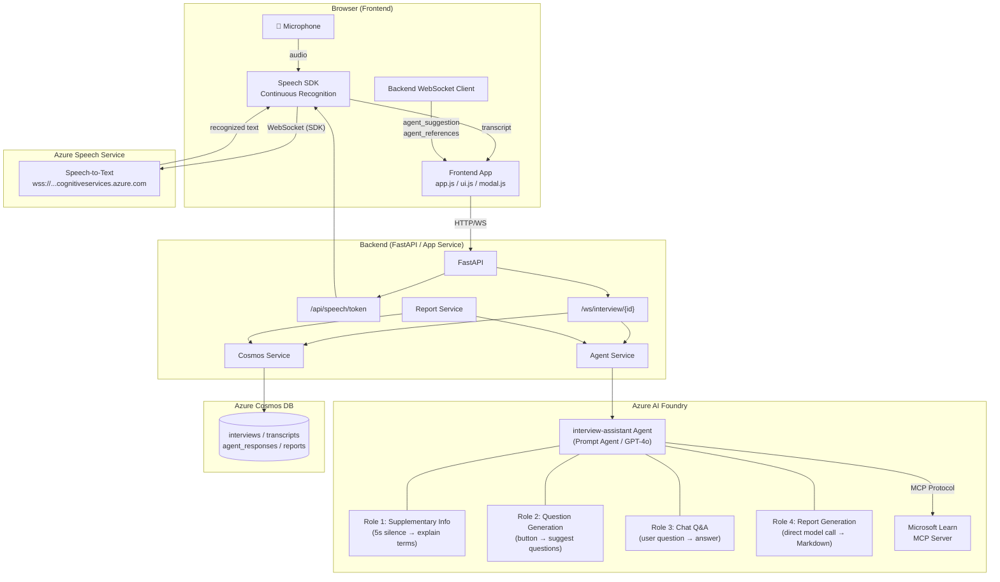
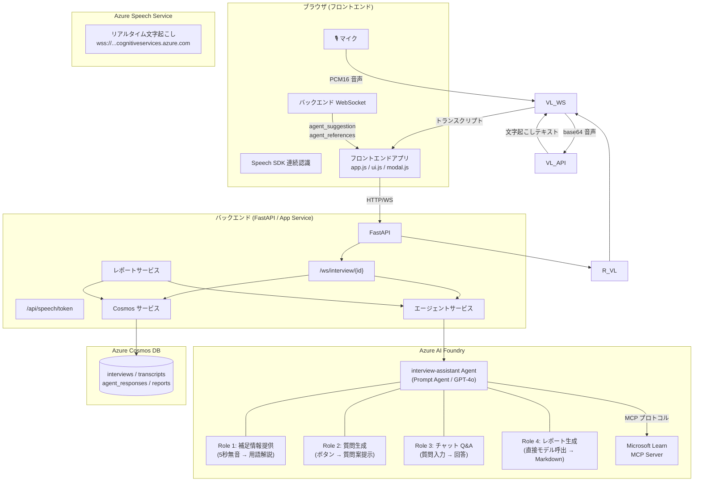

# Interview Assistant AI

A browser-based interview assistant web application. It supports the Interviewer through real-time transcription, related information presented by an AI agent, and suggested next questions.

## Overview

An AI-powered tool designed to help an Interviewer effectively elicit tacit knowledge from an expert Interviewee.

- **Real-time Transcription**: Azure AI Speech SDK (continuous recognition, Japanese/English support)
- **Supplementary Information**: Detects pauses in conversation, automatically searches for technical terms and concepts, and provides beginner-friendly explanations
- **Question Generation**: Suggests effective next questions based on transcript history at the click of a button
- **Chat Q&A**: The Interviewer can ask the AI questions in real time
- **Report Generation**: Automatically generates a Markdown report focused on tacit knowledge extraction after the interview ends
- **MCP Server**: Provides vector search tools over interview data via Azure Functions (Flex Consumption) for AI agents and GitHub Copilot
- **JP/EN Language Toggle**: Switch between Japanese and English UI and agent output via a toggle button in the header

## Architecture

| Layer | Technology |
|---|---|
| Frontend | JavaScript (Vanilla JS) + Vite |
| Backend | Python (FastAPI) on Azure App Service |
| Real-time Transcription | Azure AI Speech SDK (continuous recognition) |
| AI Agent | Microsoft Foundry Agent Service (azure-ai-projects v2) |
| Agent Tool | Microsoft Learn MCP Server |
| Data Store | Azure Cosmos DB for NoSQL (Serverless) + Vector Search |
| Embedding | text-embedding-3-small (1536 dimensions) |
| MCP Server | Azure Functions (Flex Consumption) - Streamable MCP Trigger |
| Authentication | Managed Identity (DefaultAzureCredential) |
| User Authentication | App Service Easy Auth (Microsoft Entra ID) |
| Infrastructure | Bicep (New Foundry: CognitiveServices/accounts + projects) |



## Prerequisites

- [Azure CLI](https://learn.microsoft.com/cli/azure/install-azure-cli)
- [Azure Developer CLI (azd)](https://learn.microsoft.com/azure/developer/azure-developer-cli/install-azd)
- [Node.js](https://nodejs.org/) >= 18
- [Python](https://www.python.org/) >= 3.12

## Deployment

```bash
azd auth login
azd up
```

`azd up` automatically performs the following:
1. Create Entra ID App Registration + client secret (preprovision hook)
2. Build the frontend (`npm ci && npm run build`) → copy to `backend/static/`
3. Provision Azure resources including Easy Auth configuration (Bicep)
4. Set redirect URI on the App Registration (postprovision hook)
5. Create Cosmos DB vector search container with retry (postprovision hook)
6. Deploy the backend (App Service) and MCP server (Function App)

After deployment, the app is protected by Microsoft Entra ID authentication. Only users in the same tenant can access the application.

## Local Development

### Backend

```bash
cd backend
pip install -r requirements.txt

export AZURE_COSMOS_DB_ENDPOINT="https://<your-cosmos>.documents.azure.com:443/"
export AZURE_AI_PROJECT_ENDPOINT="https://<resource>.services.ai.azure.com/api/projects/<project>"
export AZURE_SPEECH_ENDPOINT="https://<resource>.services.ai.azure.com"

uvicorn app:app --reload --port 8000
```

### Frontend

```bash
cd frontend
npm install
npm run dev
```

## Project Structure

```
├── azure.yaml              # azd configuration (preprovision/postprovision/prepackage hooks)
├── infra/                   # Bicep infrastructure definitions (New Foundry)
│   ├── main.bicep
│   ├── scripts/
│   │   ├── auth-preprovision.ps1/sh   # Entra ID App Registration creation
│   │   ├── auth-postprovision.ps1/sh  # Redirect URI + vector container creation
│   │   └── create-vector-container.ps1/sh  # Cosmos DB vector container (with retry)
│   └── modules/
│       ├── ai-foundry.bicep    # CognitiveServices/accounts + projects + embedding model
│       ├── ai-rbac.bicep
│       ├── app-service.bicep   # App Service + Easy Auth (authsettingsV2)
│       ├── cosmos-db.bicep     # Cosmos DB + containers + vector search capability
│       ├── cosmos-rbac.bicep
│       └── function-app.bicep  # Azure Functions (Flex Consumption) MCP Server
├── mcp-server/              # MCP Server (Azure Functions)
│   ├── function_app.py      # 3 MCP tool triggers (vector search)
│   ├── host.json
│   └── requirements.txt
├── backend/
│   ├── app.py               # FastAPI entry point
│   ├── startup.sh            # App Service startup script
│   ├── config.py
│   ├── routers/
│   │   ├── interviews.py     # REST API
│   │   ├── speech.py         # Speech Service token issuance
│   │   └── websocket.py      # WebSocket (3 agent roles)
│   ├── services/
│   │   ├── agent_service.py   # Foundry Agent + MCP + report generation
│   │   ├── cosmos_service.py
│   │   └── report_service.py
│   └── models/
├── frontend/
│   ├── index.html
│   ├── js/
│   │   ├── app.js
│   │   ├── i18n.js           # JP/EN internationalization
│   │   ├── speech.js         # Azure Speech SDK continuous recognition
│   │   ├── websocket.js      # Backend communication + silence detection
│   │   ├── ui.js
│   │   └── modal.js
│   ├── css/
├── spec/
│   ├── app-specification.md
│   └── architecture.md
└── .github/
    └── workflows/deploy.yml
```

## Three Roles of the Assistant Agent

| Role | Trigger | Behavior |
|---|---|---|
| **Supplementary Info** | Pause in conversation (5s silence) | Detects technical terms, searches via MCP Server, displays beginner-friendly explanations |
| **Question Generation** | "Generate Questions" button | Generates up to 3 question suggestions from the last 5,000 characters of transcript |
| **Chat** | Send from the chat box | Provides answers and references based on transcript context |

Each role uses an independent conversation to prevent context bloat.

## Azure Resources

| Resource | Purpose |
|---|---|
| App Service (Linux, Python 3.12) | Application hosting |
| AI Foundry (CognitiveServices/accounts) | Agent Service / Speech ASR / Embedding |
| Foundry Project (CognitiveServices/accounts/projects) | Agent management |
| Cosmos DB for NoSQL (Serverless) | Data persistence + Vector search |
| Azure Functions (Flex Consumption) | MCP Server (interview vector search tools) |
| Storage Account | Function App deployment storage |
| Entra ID App Registration | Easy Auth user authentication (auto-created by `azd up`) |

All inter-resource authentication uses **Managed Identity** (key-based authentication is prohibited).
User authentication is handled by **App Service Easy Auth** with Microsoft Entra ID.

## MCP Server

The MCP server provides 3 tools for AI agents to search and retrieve interview data via the Model Context Protocol.

### Tools

| Tool | Arguments | Description |
|---|---|---|
| `search_interviews` | `query` (string, required), `top_n` (number) | Vector search for related interviews. Returns interviewee name, affiliation, date, start time, and ID |
| `get_interview_report` | `id` (string, required) | Returns the interview report with basic metadata |
| `get_interview_details` | `id` (string, required) | Returns full details: curated transcript, interview metadata, dates, and report |

### Endpoint

```
https://<function-app-name>.azurewebsites.net/runtime/webhooks/mcp
```

### Authentication (System Key)

The MCP endpoint requires the `mcp_extension` system key. Retrieve it with:

```bash
az functionapp keys list \
  --resource-group <RESOURCE_GROUP> \
  --name <FUNCTION_APP_NAME> \
  --query systemKeys.mcp_extension \
  --output tsv
```

You can find the function app name from `azd` environment:

```bash
azd env get-value AZURE_MCP_FUNCTION_NAME
```

### VS Code / GitHub Copilot Configuration

Create `.vscode/mcp.json` in your workspace:

```json
{
    "inputs": [
        {
            "type": "promptString",
            "id": "mcp-system-key",
            "description": "MCP Server System Key (mcp_extension)",
            "password": true
        },
        {
            "type": "promptString",
            "id": "function-app-host",
            "description": "Function App hostname (e.g. func-xxxxx.azurewebsites.net)"
        }
    ],
    "servers": {
        "interview-assistant-mcp": {
            "type": "http",
            "url": "https://${input:function-app-host}/runtime/webhooks/mcp",
            "headers": {
                "x-functions-key": "${input:mcp-system-key}"
            }
        }
    }
}
```

After creating this file, use GitHub Copilot Agent mode to query your interview data:

```
@interview-assistant-mcp Search for interviews about Azure architecture
```

## Technical Notes

- **Speech SDK Authentication**: Uses `SpeechConfig.fromEndpoint(URL, TokenCredential)` with Entra ID bearer token. The `services.ai.azure.com` domain is converted to `cognitiveservices.azure.com` for Speech SDK WebSocket compatibility
- **Noise Suppression**: Browser WebRTC (default `getUserMedia`). Speech SDK's Microsoft Audio Stack (MAS) is not available in JavaScript
- **Report Generation**: Uses a direct model call instead of going through the agent (to avoid JSON output constraints)
- **Noise Removal**: Large transcripts are chunked at 90K tokens + 10K overlap and processed by the LLM
- **Transcript Curation**: Before report generation, a dedicated curation agent removes noise and duplicate context while preserving content
- **Vectorization**: After report generation, curated transcript + details + report are embedded with `text-embedding-3-small` and stored in Cosmos DB for vector search

---

# Interview Assistant AI (日本語)

ブラウザベースのインタビュー補助 Web アプリケーション。リアルタイム文字起こし・AI エージェントによる関連情報提示・次の質問案提示を通じて Interviewer をサポートします。

## 概要

エキスパート（Interviewee）の暗黙知をInterviewerが効果的に引き出すための AI 補助ツールです。

- **リアルタイム文字起こし**: Azure AI Speech SDK（連続認識、日本語・英語対応）
- **補足情報提示**: 会話の途切れを検出し、専門用語・技術概念を自動検索して素人向けに解説
- **質問案生成**: ボタンクリックで文字起こし履歴に基づく効果的な次の質問を提案
- **チャット Q&A**: Interviewer がリアルタイムに AI に質問可能
- **レポート生成**: インタビュー終了後、文字起こし内容に基づく暗黙知・ノウハウ抽出に特化したマークダウンレポートを自動生成
- **MCP Server**: Azure Functions (Flex Consumption) でインタビューデータのベクトル検索ツールを AI エージェントや GitHub Copilot に提供
- **JP/EN 言語切替**: ヘッダーのトグルボタンで日本語・英語の UI およびエージェント出力を切替可能

## アーキテクチャ

| レイヤー | 技術 |
|---|---|
| フロントエンド | JavaScript (Vanilla JS) + Vite |
| バックエンド | Python (FastAPI) on Azure App Service |
| リアルタイム文字起こし | Azure AI Speech SDK (連続認識) |
| AI エージェント | Microsoft Foundry Agent Service (azure-ai-projects v2) |
| エージェントツール | Microsoft Learn MCP Server |
| データストア | Azure Cosmos DB for NoSQL (Serverless) + ベクトル検索 |
| Embedding | text-embedding-3-small (1536次元) |
| MCP Server | Azure Functions (Flex Consumption) - Streamable MCP Trigger |
| 認証 | Managed Identity (DefaultAzureCredential) |
| ユーザー認証 | App Service Easy Auth (Microsoft Entra ID) |
| インフラ | Bicep (New Foundry: CognitiveServices/accounts + projects) |



## 前提条件

- [Azure CLI](https://learn.microsoft.com/cli/azure/install-azure-cli)
- [Azure Developer CLI (azd)](https://learn.microsoft.com/azure/developer/azure-developer-cli/install-azd)
- [Node.js](https://nodejs.org/) >= 18
- [Python](https://www.python.org/) >= 3.12

## デプロイ

```bash
azd auth login
azd up
```

`azd up` により以下が自動実行されます：
1. Entra ID App Registration + クライアントシークレットの作成 (preprovision フック)
2. フロントエンドのビルド（`npm ci && npm run build`）→ `backend/static/` にコピー
3. Azure リソースのプロビジョニング（Bicep / Easy Auth 構成含む）
4. App Registration のリダイレクト URI 設定 + Cosmos DB ベクトルコンテナ作成 (postprovision フック)
5. バックエンドのデプロイ（App Service）+ MCP Serverのデプロイ（Function App）

デプロイ後、アプリは Microsoft Entra ID 認証で保護されます。同一テナントのユーザーのみアクセス可能です。

## ローカル開発

### バックエンド

```bash
cd backend
pip install -r requirements.txt

export AZURE_COSMOS_DB_ENDPOINT="https://<your-cosmos>.documents.azure.com:443/"
export AZURE_AI_PROJECT_ENDPOINT="https://<resource>.services.ai.azure.com/api/projects/<project>"
export AZURE_SPEECH_ENDPOINT="https://<resource>.services.ai.azure.com"

uvicorn app:app --reload --port 8000
```

### フロントエンド

```bash
cd frontend
npm install
npm run dev
```

## プロジェクト構成

```
├── azure.yaml              # azd 構成（preprovision/postprovision/prepackage フック付き）
├── infra/                   # Bicep インフラ定義 (New Foundry)
│   ├── main.bicep
│   ├── scripts/
│   │   ├── auth-preprovision.ps1/sh   # Entra ID App Registration 作成
│   │   ├── auth-postprovision.ps1/sh  # リダイレクト URI 設定 + ベクトルコンテナ作成
│   │   └── create-vector-container.ps1/sh  # Cosmos DB ベクトルコンテナ（リトライ付き）
│   └── modules/
│       ├── ai-foundry.bicep    # CognitiveServices/accounts + projects + Embeddingモデル
│       ├── ai-rbac.bicep
│       ├── app-service.bicep   # App Service + Easy Auth (authsettingsV2)
│       ├── cosmos-db.bicep     # Cosmos DB + コンテナ + ベクトル検索 capability
│       ├── cosmos-rbac.bicep
│       └── function-app.bicep  # Azure Functions (Flex Consumption) MCP Server
├── mcp-server/              # MCP Server (Azure Functions)
│   ├── function_app.py      # 3つのMCPツールトリガー (ベクトル検索)
│   ├── host.json
│   └── requirements.txt
├── backend/
│   ├── app.py               # FastAPI エントリーポイント
│   ├── startup.sh            # App Service 起動スクリプト
│   ├── config.py
│   ├── routers/
│   │   ├── interviews.py     # REST API
│   │   ├── speech.py         # Speech Service トークン発行
│   │   └── websocket.py      # WebSocket (3つのエージェント役割)
│   ├── services/
│   │   ├── agent_service.py   # Foundry Agent + MCP + レポート生成
│   │   ├── cosmos_service.py
│   │   └── report_service.py
│   └── models/
├── frontend/
│   ├── index.html
│   ├── js/
│   │   ├── app.js
│   │   ├── i18n.js           # JP/EN 国際化
│   │   ├── speech.js         # Azure Speech SDK 連続認識
│   │   ├── websocket.js      # バックエンド通信 + 無音検出
│   │   ├── ui.js
│   │   └── modal.js
│   └── css/
├── spec/
│   ├── app-specification.md
│   └── architecture.md
└── .github/
    └── workflows/deploy.yml
```

## 補助エージェントの3つの役割

| 役割 | トリガー | 動作 |
|---|---|---|
| **補足情報** | 会話の途切れ（5秒無音） | 専門用語を検出しMCP Serverで検索、素人向け解説を表示 |
| **質問生成** | 「次の質問を生成」ボタン | 直近5000文字の文字起こしから質問案を最大3個生成 |
| **チャット** | チャットボックスで送信 | 文字起こし文脈を踏まえた回答と参照情報を提示 |

各役割は独立した会話（conversation）を使用し、コンテキストの肥大化を防止しています。

## Azure リソース

| リソース | 用途 |
|---|---|
| App Service (Linux, Python 3.12) | アプリホスティング |
| AI Foundry (CognitiveServices/accounts) | Agent Service / Speech ASR / Embedding |
| Foundry Project (CognitiveServices/accounts/projects) | エージェント管理 |
| Cosmos DB for NoSQL (Serverless) | データ永続化 + ベクトル検索 |
| Azure Functions (Flex Consumption) | MCP Server（インタビューベクトル検索ツール） |
| Storage Account | Function App デプロイメントストレージ |
| Entra ID App Registration | Easy Auth ユーザー認証（`azd up` で自動作成） |

すべてのリソース間認証は **Managed Identity** を使用しています（キーベース認証は禁止）。
ユーザー認証は **App Service Easy Auth** (Microsoft Entra ID) で保護されています。

## MCP Server

MCP Server は Model Context Protocol 経由でインタビューデータの検索・取得を提供する 3 つのツールを提供します。

### ツール一覧

| ツール | 引数 | 説明 |
|---|---|---|
| `search_interviews` | `query` (string, 必須), `top_n` (number) | クエリをベクトル検索し、関連インタビューの対象者・所属・日時・開始時間・IDを返却 |
| `get_interview_report` | `id` (string, 必須) | IDに対応するレポート + 基本情報を返却 |
| `get_interview_details` | `id` (string, 必須) | キュレーション結果・インタビュー詳細・日時・レポートの全情報を返却 |

### エンドポイント

```
https://<function-app-name>.azurewebsites.net/runtime/webhooks/mcp
```

### 認証（システムキー）

MCP エンドポイントには `mcp_extension` システムキーが必要です。以下のコマンドで取得できます:

```bash
# Function App 名を確認
azd env get-value AZURE_MCP_FUNCTION_NAME

# システムキーを取得
az functionapp keys list \
  --resource-group <RESOURCE_GROUP> \
  --name <FUNCTION_APP_NAME> \
  --query systemKeys.mcp_extension \
  --output tsv
```

### VS Code / GitHub Copilot での接続設定

ワークスペースに `.vscode/mcp.json` を作成してください:

```json
{
    "inputs": [
        {
            "type": "promptString",
            "id": "mcp-system-key",
            "description": "MCP Server システムキー (mcp_extension)",
            "password": true
        },
        {
            "type": "promptString",
            "id": "function-app-host",
            "description": "Function App ホスト名 (e.g. func-xxxxx.azurewebsites.net)"
        }
    ],
    "servers": {
        "interview-assistant-mcp": {
            "type": "http",
            "url": "https://${input:function-app-host}/runtime/webhooks/mcp",
            "headers": {
                "x-functions-key": "${input:mcp-system-key}"
            }
        }
    }
}
```

作成後、GitHub Copilot の Agent モードでインタビューデータを検索できます:

```
@interview-assistant-mcp Azure アーキテクチャに関するインタビューを検索して
```

## 技術的な注意事項

- **Speech SDK 認証**: `SpeechConfig.fromEndpoint(URL, TokenCredential)` でEntra IDトークンを使用。`services.ai.azure.com` ドメインは Speech SDK WebSocket 互換性のため `cognitiveservices.azure.com` に変換
- **ノイズ抑制**: ブラウザ WebRTC ノイズ抑制（`getUserMedia` のデフォルト動作）。Speech SDK の Microsoft Audio Stack (MAS) は JavaScript 環境では利用不可
- **ブラウザ WebSocket 認証**: `authorization` クエリパラメータで Bearer トークンを送信
- **レポート生成**: エージェント経由ではなく直接モデル呼び出し（JSON 出力制約を回避）
- **ノイズ除去**: 大量の文字起こしは90Kトークン+10K重複でチャンク分割してLLMで処理
- **トランスクリプトキュレーション**: レポート生成前に専用キュレーションエージェントがノイズ・重複コンテキストを除去（内容は保持）
- **ベクトル化**: レポート生成後、キュレーション結果 + 詳細 + レポートを `text-embedding-3-small` でベクトル化しCosmos DBに保存
