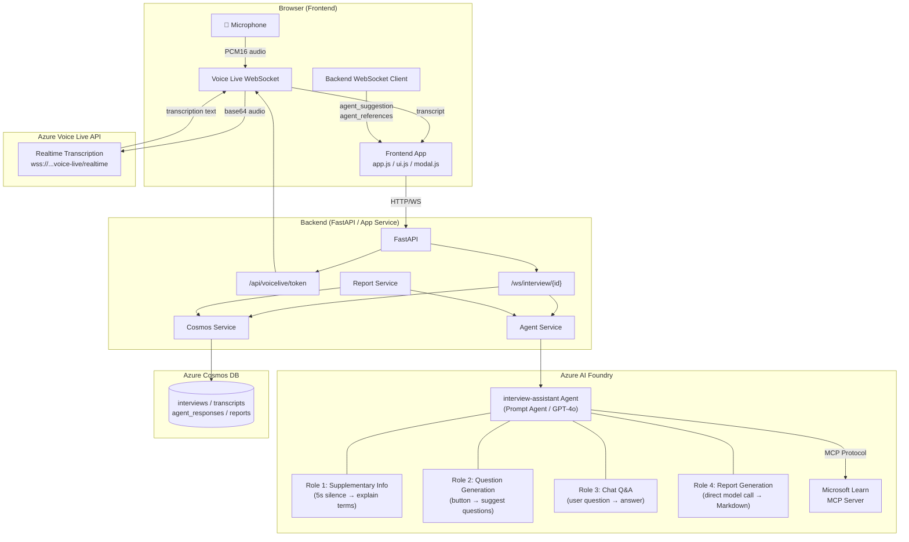
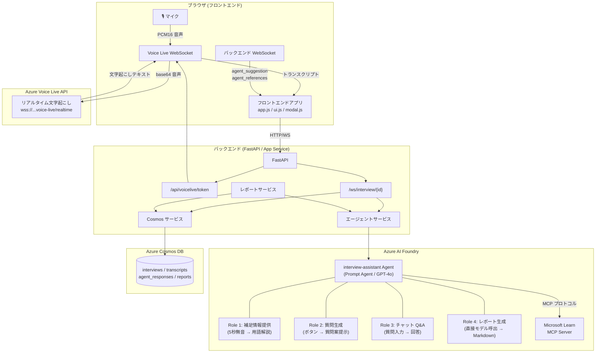

# Interview Assistant AI

A browser-based interview assistant web application. It supports the Interviewer through real-time transcription, related information presented by an AI agent, and suggested next questions.

## Overview

An AI-powered tool designed to help an Interviewer effectively elicit tacit knowledge from an expert Interviewee.

- **Real-time Transcription**: Azure Voice Live API (direct WebSocket connection, Japanese/English support
- **Supplementary Information**: Detects pauses in conversation, automatically searches for technical terms and concepts, and provides beginner-friendly explanations
- **Question Generation**: Suggests effective next questions based on transcript history at the click of a button
- **Chat Q&A**: The Interviewer can ask the AI questions in real time
- **Report Generation**: Automatically generates a Markdown report based on transcript content after the interview ends
- **JP/EN Language Toggle**: Switch between Japanese and English UI and agent output via a toggle button in the header

## Architecture

| Layer | Technology |
|---|---|
| Frontend | JavaScript (Vanilla JS) + Vite |
| Backend | Python (FastAPI) on Azure App Service |
| Real-time Transcription | Azure Voice Live API (direct WebSocket connection) |
| AI Agent | Microsoft Foundry Agent Service (azure-ai-projects v2) |
| Agent Tool | Microsoft Learn MCP Server |
| Data Store | Azure Cosmos DB for NoSQL (Serverless) |
| Authentication | Managed Identity (DefaultAzureCredential) |
| User Authentication | App Service Easy Auth (Microsoft Entra ID) |
| Infrastructure | Bicep (New Foundry: CognitiveServices/accounts + projects) |



## Prerequisites

- [Azure CLI](https://learn.microsoft.com/cli/azure/install-azure-cli)
- [Azure Developer CLI (azd)](https://learn.microsoft.com/azure/developer/azure-developer-cli/install-azd)
- [Node.js](https://nodejs.org/) >= 18
- [Python](https://www.python.org/) >= 3.12

## Deployment

```bash
azd auth login
azd up
```

`azd up` automatically performs the following:
1. Create Entra ID App Registration + client secret (preprovision hook)
2. Build the frontend (`npm ci && npm run build`) → copy to `backend/static/`
3. Provision Azure resources including Easy Auth configuration (Bicep)
4. Set redirect URI on the App Registration (postprovision hook)
5. Deploy the backend (App Service)

After deployment, the app is protected by Microsoft Entra ID authentication. Only users in the same tenant can access the application.

## Local Development

### Backend

```bash
cd backend
pip install -r requirements.txt

export AZURE_COSMOS_DB_ENDPOINT="https://<your-cosmos>.documents.azure.com:443/"
export AZURE_AI_PROJECT_ENDPOINT="https://<resource>.services.ai.azure.com/api/projects/<project>"
export AZURE_VOICELIVE_ENDPOINT="https://<resource>.services.ai.azure.com"
export AZURE_VOICELIVE_MODEL="gpt-4o-mini"

uvicorn app:app --reload --port 8000
```

### Frontend

```bash
cd frontend
npm install
npm run dev
```

## Project Structure

```
├── azure.yaml              # azd configuration (preprovision/postprovision/prepackage hooks)
├── infra/                   # Bicep infrastructure definitions (New Foundry)
│   ├── main.bicep
│   ├── scripts/
│   │   ├── auth-preprovision.ps1/sh   # Entra ID App Registration creation
│   │   └── auth-postprovision.ps1/sh  # Redirect URI configuration
│   └── modules/
│       ├── ai-foundry.bicep    # CognitiveServices/accounts + projects
│       ├── ai-rbac.bicep
│       ├── app-service.bicep   # App Service + Easy Auth (authsettingsV2)
│       ├── cosmos-db.bicep
│       └── cosmos-rbac.bicep
├── backend/
│   ├── app.py               # FastAPI entry point
│   ├── startup.sh            # App Service startup script
│   ├── config.py
│   ├── routers/
│   │   ├── interviews.py     # REST API
│   │   ├── voicelive.py      # Voice Live token issuance
│   │   └── websocket.py      # WebSocket (3 agent roles)
│   ├── services/
│   │   ├── agent_service.py   # Foundry Agent + MCP + report generation
│   │   ├── cosmos_service.py
│   │   └── report_service.py
│   └── models/
├── frontend/
│   ├── index.html
│   ├── js/
│   │   ├── app.js
│   │   ├── i18n.js           # JP/EN internationalization
│   │   ├── voicelive.js      # Voice Live direct WebSocket connection
│   │   ├── websocket.js      # Backend communication + silence detection
│   │   ├── ui.js
│   │   └── modal.js
│   ├── public/js/
│   │   └── pcm-processor.js  # AudioWorklet
│   └── css/
├── spec/
│   └── app-specification.md
└── .github/
    └── workflows/deploy.yml
```

## Three Roles of the Assistant Agent

| Role | Trigger | Behavior |
|---|---|---|
| **Supplementary Info** | Pause in conversation (5s silence) | Detects technical terms, searches via MCP Server, displays beginner-friendly explanations |
| **Question Generation** | "Generate Questions" button | Generates up to 3 question suggestions from the last 5,000 characters of transcript |
| **Chat** | Send from the chat box | Provides answers and references based on transcript context |

Each role uses an independent conversation to prevent context bloat.

## Azure Resources

| Resource | Purpose |
|---|---|
| App Service (Linux, Python 3.12) | Application hosting |
| AI Foundry (CognitiveServices/accounts) | Agent Service / Voice Live API |
| Foundry Project (CognitiveServices/accounts/projects) | Agent management |
| Cosmos DB for NoSQL (Serverless) | Data persistence |
| Entra ID App Registration | Easy Auth user authentication (auto-created by `azd up`) |

All inter-resource authentication uses **Managed Identity** (key-based authentication is prohibited).
User authentication is handled by **App Service Easy Auth** with Microsoft Entra ID.

## Technical Notes

- **Voice Live SDK Limitation**: `@azure/ai-voicelive` v1.0.0-beta.3 does not serialize `input_audio_transcription`, so a direct WebSocket connection is used instead
- **Browser WebSocket Authentication**: Bearer token is sent via the `authorization` query parameter
- **Report Generation**: Uses a direct model call instead of going through the agent (to avoid JSON output constraints)
- **Noise Removal**: Large transcripts are chunked at 90K tokens + 10K overlap and processed by the LLM

---

# Interview Assistant AI (日本語)

ブラウザベースのインタビュー補助 Web アプリケーション。リアルタイム文字起こし・AI エージェントによる関連情報提示・次の質問案提示を通じて Interviewer をサポートします。

## 概要

エキスパート（Interviewee）の暗黙知をInterviewerが効果的に引き出すための AI 補助ツールです。

- **リアルタイム文字起こし**: Azure Voice Live API（WebSocket 直接接続、日本語・英語対応）
- **補足情報提示**: 会話の途切れを検出し、専門用語・技術概念を自動検索して素人向けに解説
- **質問案生成**: ボタンクリックで文字起こし履歴に基づく効果的な次の質問を提案
- **チャット Q&A**: Interviewer がリアルタイムに AI に質問可能
- **レポート生成**: インタビュー終了後、文字起こし内容に基づくマークダウンレポートを自動生成
- **JP/EN 言語切替**: ヘッダーのトグルボタンで日本語・英語の UI およびエージェント出力を切替可能

## アーキテクチャ

| レイヤー | 技術 |
|---|---|
| フロントエンド | JavaScript (Vanilla JS) + Vite |
| バックエンド | Python (FastAPI) on Azure App Service |
| リアルタイム文字起こし | Azure Voice Live API (直接 WebSocket 接続) |
| AI エージェント | Microsoft Foundry Agent Service (azure-ai-projects v2) |
| エージェントツール | Microsoft Learn MCP Server |
| データストア | Azure Cosmos DB for NoSQL (Serverless) |
| 認証 | Managed Identity (DefaultAzureCredential) |
| ユーザー認証 | App Service Easy Auth (Microsoft Entra ID) |
| インフラ | Bicep (New Foundry: CognitiveServices/accounts + projects) |



## 前提条件

- [Azure CLI](https://learn.microsoft.com/cli/azure/install-azure-cli)
- [Azure Developer CLI (azd)](https://learn.microsoft.com/azure/developer/azure-developer-cli/install-azd)
- [Node.js](https://nodejs.org/) >= 18
- [Python](https://www.python.org/) >= 3.12

## デプロイ

```bash
azd auth login
azd up
```

`azd up` により以下が自動実行されます：
1. Entra ID App Registration + クライアントシークレットの作成 (preprovision フック)
2. フロントエンドのビルド（`npm ci && npm run build`）→ `backend/static/` にコピー
3. Azure リソースのプロビジョニング（Bicep / Easy Auth 構成含む）
4. App Registration のリダイレクト URI 設定 (postprovision フック)
5. バックエンドのデプロイ（App Service）

デプロイ後、アプリは Microsoft Entra ID 認証で保護されます。同一テナントのユーザーのみアクセス可能です。

## ローカル開発

### バックエンド

```bash
cd backend
pip install -r requirements.txt

export AZURE_COSMOS_DB_ENDPOINT="https://<your-cosmos>.documents.azure.com:443/"
export AZURE_AI_PROJECT_ENDPOINT="https://<resource>.services.ai.azure.com/api/projects/<project>"
export AZURE_VOICELIVE_ENDPOINT="https://<resource>.services.ai.azure.com"
export AZURE_VOICELIVE_MODEL="gpt-4o-mini"

uvicorn app:app --reload --port 8000
```

### フロントエンド

```bash
cd frontend
npm install
npm run dev
```

## プロジェクト構成

```
├── azure.yaml              # azd 構成（preprovision/postprovision/prepackage フック付き）
├── infra/                   # Bicep インフラ定義 (New Foundry)
│   ├── main.bicep
│   ├── scripts/
│   │   ├── auth-preprovision.ps1/sh   # Entra ID App Registration 作成
│   │   └── auth-postprovision.ps1/sh  # リダイレクト URI 設定
│   └── modules/
│       ├── ai-foundry.bicep    # CognitiveServices/accounts + projects
│       ├── ai-rbac.bicep
│       ├── app-service.bicep   # App Service + Easy Auth (authsettingsV2)
│       ├── cosmos-db.bicep
│       └── cosmos-rbac.bicep
├── backend/
│   ├── app.py               # FastAPI エントリーポイント
│   ├── startup.sh            # App Service 起動スクリプト
│   ├── config.py
│   ├── routers/
│   │   ├── interviews.py     # REST API
│   │   ├── voicelive.py      # Voice Live トークン発行
│   │   └── websocket.py      # WebSocket (3つのエージェント役割)
│   ├── services/
│   │   ├── agent_service.py   # Foundry Agent + MCP + レポート生成
│   │   ├── cosmos_service.py
│   │   └── report_service.py
│   └── models/
├── frontend/
│   ├── index.html
│   ├── js/
│   │   ├── app.js
│   │   ├── i18n.js           # JP/EN 国際化
│   │   ├── voicelive.js      # Voice Live WebSocket 直接接続
│   │   ├── websocket.js      # バックエンド通信 + 無音検出
│   │   ├── ui.js
│   │   └── modal.js
│   ├── public/js/
│   │   └── pcm-processor.js  # AudioWorklet
│   └── css/
├── spec/
│   └── app-specification.md
└── .github/
    └── workflows/deploy.yml
```

## 補助エージェントの3つの役割

| 役割 | トリガー | 動作 |
|---|---|---|
| **補足情報** | 会話の途切れ（5秒無音） | 専門用語を検出しMCP Serverで検索、素人向け解説を表示 |
| **質問生成** | 「次の質問を生成」ボタン | 直近5000文字の文字起こしから質問案を最大3個生成 |
| **チャット** | チャットボックスで送信 | 文字起こし文脈を踏まえた回答と参照情報を提示 |

各役割は独立した会話（conversation）を使用し、コンテキストの肥大化を防止しています。

## Azure リソース

| リソース | 用途 |
|---|---|
| App Service (Linux, Python 3.12) | アプリホスティング |
| AI Foundry (CognitiveServices/accounts) | Agent Service / Voice Live API |
| Foundry Project (CognitiveServices/accounts/projects) | エージェント管理 |
| Cosmos DB for NoSQL (Serverless) | データ永続化 |
| Entra ID App Registration | Easy Auth ユーザー認証（`azd up` で自動作成） |

すべてのリソース間認証は **Managed Identity** を使用しています（キーベース認証は禁止）。
ユーザー認証は **App Service Easy Auth** (Microsoft Entra ID) で保護されています。

## 技術的な注意事項

- **Voice Live SDK の制限**: `@azure/ai-voicelive` v1.0.0-beta.3 は `input_audio_transcription` をシリアライズしないため、直接 WebSocket 接続を使用
- **ブラウザ WebSocket 認証**: `authorization` クエリパラメータで Bearer トークンを送信
- **レポート生成**: エージェント経由ではなく直接モデル呼び出し（JSON 出力制約を回避）
- **ノイズ除去**: 大量の文字起こしは90Kトークン+10K重複でチャンク分割してLLMで処理
