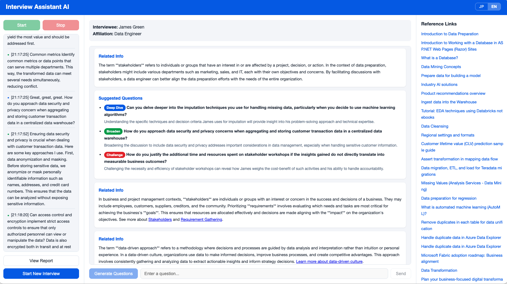
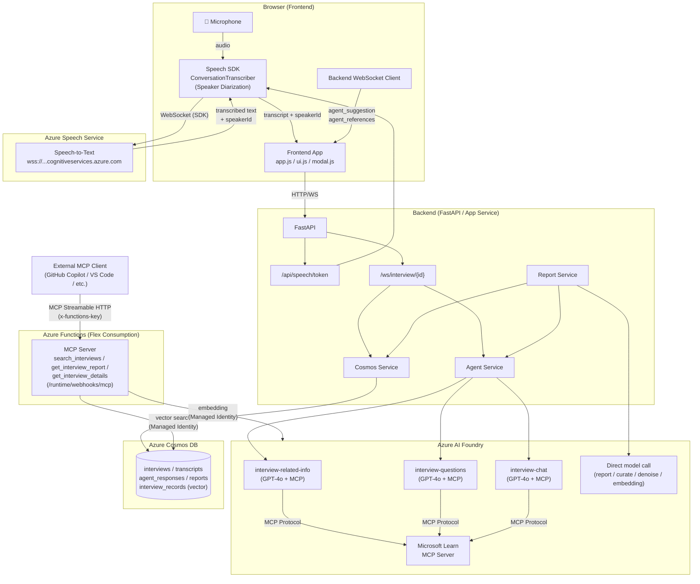
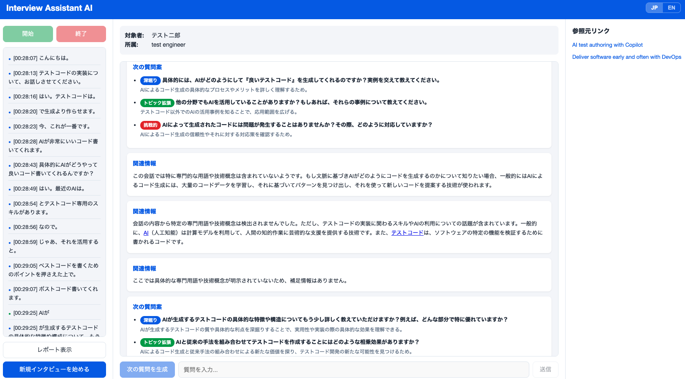
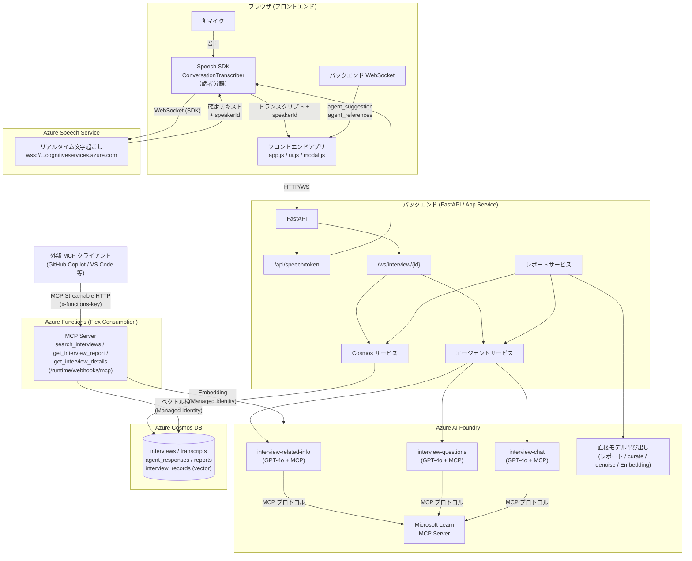

# Interview Assistant AI

A browser-based interview assistant web application. It supports the Interviewer through real-time transcription, related information presented by an AI agent, and suggested next questions.



## Overview

An AI-powered tool designed to help an Interviewer effectively elicit tacit knowledge from an expert Interviewee.

- **Real-time Transcription**: Azure AI Speech SDK (`ConversationTranscriber`, Japanese/English support) with **speaker diarization** — each transcript line is tagged with a speaker ID (`Guest-1`, `Guest-2`, ..., `Unknown`) and displayed with a colored dot indicator in the UI
- **Supplementary Information**: Detects pauses in conversation, automatically searches for technical terms and concepts, and provides beginner-friendly explanations
- **Question Generation**: Suggests effective next questions based on transcript history at the click of a button
- **Chat Q&A**: The Interviewer can ask the AI questions in real time
- **Report Generation**: Automatically generates a Markdown report focused on tacit knowledge extraction after the interview ends
- **MCP Server**: Provides vector search tools over interview data via Azure Functions (Flex Consumption) for AI agents and GitHub Copilot
- **JP/EN Language Toggle**: Switch between Japanese and English UI and agent output via a toggle button in the header

## Architecture

| Layer | Technology |
|---|---|
| Frontend | JavaScript (Vanilla JS) + Vite |
| Backend | Python (FastAPI) on Azure App Service |
| Real-time Transcription | Azure AI Speech SDK (`ConversationTranscriber`, continuous conversation transcription with speaker diarization) |
| AI Agent | Microsoft Foundry Agent Service (azure-ai-projects v2) |
| Agent Tool | Microsoft Learn MCP Server |
| Data Store | Azure Cosmos DB for NoSQL (Serverless) + Vector Search |
| Embedding | text-embedding-3-small (1536 dimensions) |
| MCP Server | Azure Functions (Flex Consumption) - Streamable MCP Trigger |
| Authentication | Managed Identity (DefaultAzureCredential) |
| User Authentication | App Service Easy Auth (Microsoft Entra ID) |
| Infrastructure | Bicep (New Foundry: CognitiveServices/accounts + projects) |



## Prerequisites

- [Azure CLI](https://learn.microsoft.com/cli/azure/install-azure-cli)
- [Azure Developer CLI (azd)](https://learn.microsoft.com/azure/developer/azure-developer-cli/install-azd)
- [Node.js](https://nodejs.org/) >= 18
- [Python](https://www.python.org/) >= 3.12

## Speaker Diarization

Real-time transcription uses Azure AI Speech's **`ConversationTranscriber`**, which clusters voices from a single microphone input and assigns a speaker ID to every finalized phrase.

- **Speaker IDs**: `Guest-1`, `Guest-2`, ... (assigned automatically; no voice enrollment required). While the service is still learning the voices, early phrases may be labeled `Unknown`.
- **UI**: Each transcript line is prefixed with a small colored dot (`●`). The color is derived from the speaker ID so that different speakers can be visually distinguished at a glance. Speaker names themselves are not shown in the UI.
- **Agent input & reports**: Transcripts are passed to the agent (question suggestion, supplementary info, chat, report generation) in `[Guest-1] text` format so that the AI can reason about who said what. The service does not distinguish Interviewer vs. Interviewee — this is inferred from the conversational context.
- **Storage**: Each transcript document in Cosmos DB carries a `speakerId` field. Documents saved before this feature was introduced remain backward-compatible (empty speaker tag).

## Deployment

```bash
azd auth login
azd up
```

`azd up` automatically performs the following:
1. Create Entra ID App Registration + client secret (preprovision hook)
2. Build the frontend (`npm ci && npm run build`) → copy to `backend/static/`
3. Provision Azure resources including Easy Auth configuration (Bicep)
4. Set redirect URI on the App Registration (postprovision hook)
5. Create Cosmos DB vector search container with retry (postprovision hook)
6. Deploy the backend (App Service) and MCP server (Function App)

After deployment, the app is protected by Microsoft Entra ID authentication. Only users in the same tenant can access the application.

## Changing the Default Model

The agent model (default: `gpt-4o`) and embedding model (default: `text-embedding-3-small`) can be changed via Bicep parameters:

```bash
azd env set AZURE_AGENT_MODEL gpt-4o-mini
azd env set AZURE_EMBEDDING_MODEL text-embedding-3-large
azd up
```

This updates both the AI Services model deployment and the App Service environment variables.

## Changing the Agent MCP Server

All three role-specialized agents (`interview-related-info`, `interview-questions`, `interview-chat`) share the same MCP tool set. The list of MCP servers is defined as a **single source of truth** in `backend/config.py`:

```python
# backend/config.py
MCP_SERVERS: list[dict] = [
    {"label": "microsoft_learn", "url": "https://learn.microsoft.com/api/mcp"},
]
```

On application startup, `agent_service.ensure_agent()` reads `MCP_SERVERS`, builds an `MCPTool` list via `_build_mcp_tools()`, and applies the **same tool list to every role agent** via `create_version()`. To change MCP wiring you only need to edit this list and run `azd deploy` — every agent is updated automatically.

Use [Foundry Agent Service](https://learn.microsoft.com/azure/foundry/agents/how-to/tools/model-context-protocol)-supported remote MCP servers.

### MCPTool Parameters

| Parameter | Required | Description |
|---|---|---|
| `server_label` | Yes | Unique identifier for the MCP server (e.g., `"github"`, `"my_kb"`) |
| `server_url` | Yes | URL of the remote MCP server endpoint |
| `require_approval` | No | `"always"` (default), `"never"`, or dict like `{"never": ["tool1"]}` |
| `allowed_tools` | No | List of tool names the agent can use. If omitted, all tools are available |
| `project_connection_id` | No | Foundry project connection ID for servers requiring authentication |
| `headers` | No | Custom HTTP headers (e.g., `{"Authorization": "Bearer <token>"}`) |

### Example: GitHub MCP Server (with authentication)

```python
mcp_tool = MCPTool(
    server_label="github",
    server_url="https://api.githubcopilot.com/mcp",
    require_approval="always",
    project_connection_id="my-github-connection",
)
```

### Example: Custom MCP Server on Azure Functions

```python
mcp_tool = MCPTool(
    server_label="my_custom_tools",
    server_url="https://<function-app>.azurewebsites.net/runtime/webhooks/mcp",
    require_approval="never",
    allowed_tools=["search_documents", "get_summary"],
    headers={"x-functions-key": "<system-key>"},
)
```

After changing the MCP server, also review the **role-specific SYSTEM_PROMPTs** (`RELATED_INFO_SYSTEM_PROMPT`, `QUESTIONS_SYSTEM_PROMPT`, `CHAT_SYSTEM_PROMPT` in `agent_service.py`) so that any tool-specific guidance (e.g. `microsoft_docs_search`) matches the new MCP server's tools.

For authenticated MCP servers, create a project connection in the [Foundry portal](https://ai.azure.com) and set the `project_connection_id`. See the [official documentation](https://learn.microsoft.com/azure/foundry/agents/how-to/tools/model-context-protocol) for details.

## Local Development

### Backend

```bash
cd backend
pip install -r requirements.txt

export AZURE_COSMOS_DB_ENDPOINT="https://<your-cosmos>.documents.azure.com:443/"
export AZURE_AI_PROJECT_ENDPOINT="https://<resource>.services.ai.azure.com/api/projects/<project>"
export AZURE_SPEECH_ENDPOINT="https://<resource>.services.ai.azure.com"

uvicorn app:app --reload --port 8000
```

### Frontend

```bash
cd frontend
npm install
npm run dev
```

## Project Structure

```
├── azure.yaml              # azd configuration (preprovision/postprovision/prepackage hooks)
├── infra/                   # Bicep infrastructure definitions (New Foundry)
│   ├── main.bicep
│   ├── scripts/
│   │   ├── auth-preprovision.ps1/sh   # Entra ID App Registration creation
│   │   ├── auth-postprovision.ps1/sh  # Redirect URI + vector container creation
│   │   └── create-vector-container.ps1/sh  # Cosmos DB vector container (with retry)
│   └── modules/
│       ├── ai-foundry.bicep    # CognitiveServices/accounts + projects + embedding model
│       ├── ai-rbac.bicep
│       ├── app-service.bicep   # App Service + Easy Auth (authsettingsV2)
│       ├── cosmos-db.bicep     # Cosmos DB + containers + vector search capability
│       ├── cosmos-rbac.bicep
│       └── function-app.bicep  # Azure Functions (Flex Consumption) MCP Server
├── mcp-server/              # MCP Server (Azure Functions)
│   ├── function_app.py      # 3 MCP tool triggers (vector search)
│   ├── host.json
│   └── requirements.txt
├── backend/
│   ├── app.py               # FastAPI entry point
│   ├── startup.sh            # App Service startup script
│   ├── config.py
│   ├── routers/
│   │   ├── interviews.py     # REST API
│   │   ├── speech.py         # Speech Service token issuance
│   │   └── websocket.py      # WebSocket (3 agent roles)
│   ├── services/
│   │   ├── agent_service.py   # Foundry Agent + MCP + report generation
│   │   ├── cosmos_service.py
│   │   └── report_service.py
│   └── models/
├── frontend/
│   ├── index.html
│   ├── js/
│   │   ├── app.js
│   │   ├── i18n.js           # JP/EN internationalization
│   │   ├── speech.js         # Azure Speech SDK ConversationTranscriber (speaker diarization)
│   │   ├── websocket.js      # Backend communication + silence detection
│   │   ├── ui.js
│   │   └── modal.js
│   ├── css/
├── spec/
│   ├── app-specification.md
│   └── architecture.md
└── .github/
    └── workflows/deploy.yml
```

## Three Roles of the Assistant Agent

The app uses **three role-specialized Foundry agents** so that each role has a focused SYSTEM_PROMPT that does not interfere with the others. All three agents share the same MCP tool set (Microsoft Learn).

| Agent | Trigger | Behavior |
|---|---|---|
| `interview-related-info` | Pause in conversation (5s silence) | Detects technical terms / proper nouns / important keywords from the **last 5 transcript chunks**, normalizes Speech-to-Text mis-recognitions (e.g. "foh-rag" → "RAG"), excludes already-explained keywords, and provides beginner-friendly explanations with references |
| `interview-questions` | "Generate Questions" button + initial greeting on connect | Identifies the current central topic from the recent dialogue (last 2,000 chars) and produces 3 questions (deepdive / broaden / challenge) with type-specific scopes over the **last 30,000 chars** of history. On the first WebSocket connection, generates the initial greeting and first question |
| `interview-chat` | Send from the chat box | Q&A mode: directly answers the interviewer's question (definitional, meta-question like "what should I dig into?", summary, etc.) using the **last 20,000 chars** of transcript history. Does NOT auto-explain terms unless asked |

Report generation, transcript curation, denoising and embedding use **direct model calls** (no agent), to keep Markdown / curated text outputs free from JSON output constraints.

Each call uses an independent conversation (stateless) to prevent context bloat across roles.

## Azure Resources

| Resource | Purpose |
|---|---|
| App Service (Linux, Python 3.12) | Application hosting |
| AI Foundry (CognitiveServices/accounts) | Agent Service / Speech ASR / Embedding |
| Foundry Project (CognitiveServices/accounts/projects) | Agent management |
| Cosmos DB for NoSQL (Serverless) | Data persistence + Vector search |
| Azure Functions (Flex Consumption) | MCP Server (interview vector search tools) |
| Storage Account | Function App deployment storage |
| Entra ID App Registration | Easy Auth user authentication (auto-created by `azd up`) |

All inter-resource authentication uses **Managed Identity** (key-based authentication is prohibited).
User authentication is handled by **App Service Easy Auth** with Microsoft Entra ID.

## MCP Server

The MCP server provides 3 tools for AI agents to search and retrieve interview data via the Model Context Protocol.

### Tools

| Tool | Arguments | Description |
|---|---|---|
| `search_interviews` | `query` (string, required), `top_n` (number) | Vector search for related interviews. Returns interviewee name, affiliation, date, start time, and ID |
| `get_interview_report` | `id` (string, required) | Returns the interview report with basic metadata |
| `get_interview_details` | `id` (string, required) | Returns full details: curated transcript, interview metadata, dates, and report |

### Endpoint

```
https://<function-app-name>.azurewebsites.net/runtime/webhooks/mcp
```

### Authentication (System Key)

The MCP endpoint requires the `mcp_extension` system key. Retrieve it with:

```bash
az functionapp keys list \
  --resource-group <RESOURCE_GROUP> \
  --name <FUNCTION_APP_NAME> \
  --query systemKeys.mcp_extension \
  --output tsv
```

You can find the function app name from `azd` environment:

```bash
azd env get-value AZURE_MCP_FUNCTION_NAME
```

### VS Code / GitHub Copilot Configuration

Create `.vscode/mcp.json` in your workspace:

```json
{
    "inputs": [
        {
            "type": "promptString",
            "id": "mcp-system-key",
            "description": "MCP Server System Key (mcp_extension)",
            "password": true
        },
        {
            "type": "promptString",
            "id": "function-app-host",
            "description": "Function App hostname (e.g. func-xxxxx.azurewebsites.net)"
        }
    ],
    "servers": {
        "interview-assistant-mcp": {
            "type": "http",
            "url": "https://${input:function-app-host}/runtime/webhooks/mcp",
            "headers": {
                "x-functions-key": "${input:mcp-system-key}"
            }
        }
    }
}
```

After creating this file, use GitHub Copilot Agent mode to query your interview data:

```
@interview-assistant-mcp Search for interviews about Azure architecture
```

## Technical Notes

- **Speech SDK Authentication**: Uses `SpeechConfig.fromEndpoint(URL, TokenCredential)` with Entra ID bearer token. The `services.ai.azure.com` domain is converted to `cognitiveservices.azure.com` for Speech SDK WebSocket compatibility
- **Noise Suppression**: Browser WebRTC (default `getUserMedia`). Speech SDK's Microsoft Audio Stack (MAS) is not available in JavaScript
- **Report Generation**: Uses a direct model call instead of going through the agent (to avoid JSON output constraints)
- **Noise Removal**: Large transcripts are chunked at 90K tokens + 10K overlap and processed by the LLM
- **Transcript Curation**: Before report generation, a dedicated curation agent removes noise and duplicate context while preserving content
- **Vectorization**: After report generation, curated transcript + details + report are embedded with `text-embedding-3-small` and stored in Cosmos DB for vector search

---

# Interview Assistant AI (日本語)

ブラウザベースのインタビュー補助 Web アプリケーション。リアルタイム文字起こし・AI エージェントによる関連情報提示・次の質問案提示を通じて Interviewer をサポートします。



## 概要

エキスパート（Interviewee）の暗黙知をInterviewerが効果的に引き出すための AI 補助ツールです。

- **リアルタイム文字起こし**: Azure AI Speech SDK（`ConversationTranscriber`、日本語・英語対応）を使用し、**話者分離（Speaker Diarization）** により各文字起こしに話者ID（`Guest-1`, `Guest-2`, ..., `Unknown`）を付与。UIでは話者ごとに色分けしたドットアイコンで表示
- **補足情報提示**: 会話の途切れを検出し、専門用語・技術概念を自動検索して素人向けに解説
- **質問案生成**: ボタンクリックで文字起こし履歴に基づく効果的な次の質問を提案
- **チャット Q&A**: Interviewer がリアルタイムに AI に質問可能
- **レポート生成**: インタビュー終了後、文字起こし内容に基づく暗黙知・ノウハウ抽出に特化したマークダウンレポートを自動生成
- **MCP Server**: Azure Functions (Flex Consumption) でインタビューデータのベクトル検索ツールを AI エージェントや GitHub Copilot に提供
- **JP/EN 言語切替**: ヘッダーのトグルボタンで日本語・英語の UI およびエージェント出力を切替可能

## アーキテクチャ

| レイヤー | 技術 |
|---|---|
| フロントエンド | JavaScript (Vanilla JS) + Vite |
| バックエンド | Python (FastAPI) on Azure App Service |
| リアルタイム文字起こし | Azure AI Speech SDK（`ConversationTranscriber`、連続会話文字起こし・話者分離）|
| AI エージェント | Microsoft Foundry Agent Service (azure-ai-projects v2) |
| エージェントツール | Microsoft Learn MCP Server |
| データストア | Azure Cosmos DB for NoSQL (Serverless) + ベクトル検索 |
| Embedding | text-embedding-3-small (1536次元) |
| MCP Server | Azure Functions (Flex Consumption) - Streamable MCP Trigger |
| 認証 | Managed Identity (DefaultAzureCredential) |
| ユーザー認証 | App Service Easy Auth (Microsoft Entra ID) |
| インフラ | Bicep (New Foundry: CognitiveServices/accounts + projects) |



## 前提条件

- [Azure CLI](https://learn.microsoft.com/cli/azure/install-azure-cli)
- [Azure Developer CLI (azd)](https://learn.microsoft.com/azure/developer/azure-developer-cli/install-azd)
- [Node.js](https://nodejs.org/) >= 18
- [Python](https://www.python.org/) >= 3.12

## 話者分離（Speaker Diarization）

リアルタイム文字起こしには Azure AI Speech の **`ConversationTranscriber`** を使用します。単一マイクのミックス音声から音声クラスタリングにより話者を自動分離し、各確定フレーズに話者IDを付与します。

- **話者ID**: `Guest-1`, `Guest-2`, ...（自動採番、事前の声紋登録は不要）。初期の学習段階では `Unknown` が付くことがあります
- **UI 表示**: 各文字起こし行の先頭に小さな色付きドット（`●`）を表示。色は話者IDから導出されるため、話者が異なれば一目で区別できます。話者名そのものは UI には表示しません
- **エージェント入力・レポート**: 補足情報・質問生成・チャット・レポート生成すべてにおいて、文字起こしを `[Guest-1] text` 形式でエージェントに渡します。これにより AI が誰の発言かを区別できます。ただし Interviewer / Interviewee の属性判別はサービスは行わないため、文脈から推測します
- **保存**: Cosmos DB の各トランスクリプトドキュメントに `speakerId` フィールドを保存。本機能導入前のドキュメントはそのまま互換動作します（空の話者タグ扱い）

## デプロイ

```bash
azd auth login
azd up
```

`azd up` により以下が自動実行されます：
1. Entra ID App Registration + クライアントシークレットの作成 (preprovision フック)
2. フロントエンドのビルド（`npm ci && npm run build`）→ `backend/static/` にコピー
3. Azure リソースのプロビジョニング（Bicep / Easy Auth 構成含む）
4. App Registration のリダイレクト URI 設定 + Cosmos DB ベクトルコンテナ作成 (postprovision フック)
5. バックエンドのデプロイ（App Service）+ MCP Serverのデプロイ（Function App）

デプロイ後、アプリは Microsoft Entra ID 認証で保護されます。同一テナントのユーザーのみアクセス可能です。

## デフォルトモデルの変更

エージェントモデル（デフォルト: `gpt-4o`）と Embedding モデル（デフォルト: `text-embedding-3-small`）は Bicep パラメータで変更できます:

```bash
azd env set AZURE_AGENT_MODEL gpt-4o-mini
azd env set AZURE_EMBEDDING_MODEL text-embedding-3-large
azd up
```

これにより AI Services のモデルデプロイメントと App Service の環境変数の両方が更新されます。

## エージェント MCP サーバーの変更

3 つの役割別エージェント（`interview-related-info` / `interview-questions` / `interview-chat`）はすべて同じ MCP ツールセットを共有します。MCP サーバー定義は **単一の真実の source** として `backend/config.py` に集約されています：

```python
# backend/config.py
MCP_SERVERS: list[dict] = [
    {"label": "microsoft_learn", "url": "https://learn.microsoft.com/api/mcp"},
]
```

アプリ起動時に `agent_service.ensure_agent()` が `MCP_SERVERS` を読み込み、`_build_mcp_tools()` でツールリストを構築し、`create_version()` で**全ての役割エージェントに同一のツールリスト**を割り当てます。MCP の変更はこのリストを編集して `azd deploy` するだけで全エージェントに自動反映されます。

[Foundry Agent Service](https://learn.microsoft.com/azure/foundry/agents/how-to/tools/model-context-protocol) がサポートする任意のリモート MCP サーバーを利用できます。

### MCPTool パラメータ

| パラメータ | 必須 | 説明 |
|---|---|---|
| `server_label` | ○ | MCP サーバーの一意識別子（例: `"github"`, `"my_kb"`） |
| `server_url` | ○ | リモート MCP サーバーのエンドポイント URL |
| `require_approval` | × | `"always"`（デフォルト）、`"never"`、または `{"never": ["tool1"]}` 形式の辞書 |
| `allowed_tools` | × | エージェントが使用できるツール名のリスト。省略時は全ツール利用可能 |
| `project_connection_id` | × | 認証が必要なサーバー用の Foundry プロジェクト接続 ID |
| `headers` | × | カスタム HTTP ヘッダー（例: `{"Authorization": "Bearer <token>"}`) |

### 例: GitHub MCP サーバー（認証あり）

```python
mcp_tool = MCPTool(
    server_label="github",
    server_url="https://api.githubcopilot.com/mcp",
    require_approval="always",
    project_connection_id="my-github-connection",
)
```

### 例: Azure Functions 上のカスタム MCP サーバー

```python
mcp_tool = MCPTool(
    server_label="my_custom_tools",
    server_url="https://<function-app>.azurewebsites.net/runtime/webhooks/mcp",
    require_approval="never",
    allowed_tools=["search_documents", "get_summary"],
    headers={"x-functions-key": "<system-key>"},
)
```

MCP サーバーを変更した後、`agent_service.py` の **役割別 SYSTEM_PROMPT**（`RELATED_INFO_SYSTEM_PROMPT`、`QUESTIONS_SYSTEM_PROMPT`、`CHAT_SYSTEM_PROMPT`）も確認し、ツール固有の記述（例: `microsoft_docs_search`）を新しい MCP サーバーが提供するツール名に合わせてください。

認証が必要な MCP サーバーの場合は、[Foundry ポータル](https://ai.azure.com)でプロジェクト接続を作成し、`project_connection_id` に指定してください。詳細は[公式ドキュメント](https://learn.microsoft.com/azure/foundry/agents/how-to/tools/model-context-protocol)を参照してください。

## ローカル開発

### バックエンド

```bash
cd backend
pip install -r requirements.txt

export AZURE_COSMOS_DB_ENDPOINT="https://<your-cosmos>.documents.azure.com:443/"
export AZURE_AI_PROJECT_ENDPOINT="https://<resource>.services.ai.azure.com/api/projects/<project>"
export AZURE_SPEECH_ENDPOINT="https://<resource>.services.ai.azure.com"

uvicorn app:app --reload --port 8000
```

### フロントエンド

```bash
cd frontend
npm install
npm run dev
```

## プロジェクト構成

```
├── azure.yaml              # azd 構成（preprovision/postprovision/prepackage フック付き）
├── infra/                   # Bicep インフラ定義 (New Foundry)
│   ├── main.bicep
│   ├── scripts/
│   │   ├── auth-preprovision.ps1/sh   # Entra ID App Registration 作成
│   │   ├── auth-postprovision.ps1/sh  # リダイレクト URI 設定 + ベクトルコンテナ作成
│   │   └── create-vector-container.ps1/sh  # Cosmos DB ベクトルコンテナ（リトライ付き）
│   └── modules/
│       ├── ai-foundry.bicep    # CognitiveServices/accounts + projects + Embeddingモデル
│       ├── ai-rbac.bicep
│       ├── app-service.bicep   # App Service + Easy Auth (authsettingsV2)
│       ├── cosmos-db.bicep     # Cosmos DB + コンテナ + ベクトル検索 capability
│       ├── cosmos-rbac.bicep
│       └── function-app.bicep  # Azure Functions (Flex Consumption) MCP Server
├── mcp-server/              # MCP Server (Azure Functions)
│   ├── function_app.py      # 3つのMCPツールトリガー (ベクトル検索)
│   ├── host.json
│   └── requirements.txt
├── backend/
│   ├── app.py               # FastAPI エントリーポイント
│   ├── startup.sh            # App Service 起動スクリプト
│   ├── config.py
│   ├── routers/
│   │   ├── interviews.py     # REST API
│   │   ├── speech.py         # Speech Service トークン発行
│   │   └── websocket.py      # WebSocket (3つのエージェント役割)
│   ├── services/
│   │   ├── agent_service.py   # Foundry Agent + MCP + レポート生成
│   │   ├── cosmos_service.py
│   │   └── report_service.py
│   └── models/
├── frontend/
│   ├── index.html
│   ├── js/
│   │   ├── app.js
│   │   ├── i18n.js           # JP/EN 国際化
│   │   ├── speech.js         # Azure Speech SDK ConversationTranscriber（話者分離）
│   │   ├── websocket.js      # バックエンド通信 + 無音検出
│   │   ├── ui.js
│   │   └── modal.js
│   └── css/
├── spec/
│   ├── app-specification.md
│   └── architecture.md
└── .github/
    └── workflows/deploy.yml
```

## 補助エージェントの3つの役割

本アプリでは、各役割の SYSTEM_PROMPT を独立させて相互干渉を防ぐため、Foundry Agent Service 上に **3 つの役割別エージェント** を作成し使い分けます。3 エージェントは同一の MCP ツールセット（Microsoft Learn）を共有します。

| エージェント | トリガー | 動作 |
|---|---|---|
| `interview-related-info` | 会話の途切れ（5秒無音） | **直近 5 チャンク**から専門用語・固有名詞・重要キーワード等を検出し、Speech-to-Text 誤認識を正規化（例: 「フォラグ」→「RAG」）、既出キーワードを除外したうえで素人向け補足説明と参照リンクを提示 |
| `interview-questions` | 「次の質問を生成」ボタン + WebSocket 初回接続時の声掛け | 直近の対話（末尾2,000字）から中心トピックを内部的に特定し、**末尾30,000字**の履歴を参照して deepdive / broaden / challenge の3質問をタイプ別スコープで生成。初回接続時は挨拶 + 最初の質問を提示 |
| `interview-chat` | チャットボックスから送信 | Q&A モード: Interviewer の質問（用語の意味、メタ質問「どこを深掘りすべき？」、要約依頼等）に**直接回答**する。**末尾20,000字**の履歴を参照。質問が用語解説を求めない限り自動で用語解説に走らない |

レポート生成・トランスクリプトキュレーション・ノイズ除去・Embedding は、Markdown 出力やキュレーション結果の都合上、**直接モデル呼び出し**を使用します（エージェント経由なし）。

各呼び出しは独立した会話（ステートレス）で実行され、役割間のコンテキスト汚染を防止しています。

## Azure リソース

| リソース | 用途 |
|---|---|
| App Service (Linux, Python 3.12) | アプリホスティング |
| AI Foundry (CognitiveServices/accounts) | Agent Service / Speech ASR / Embedding |
| Foundry Project (CognitiveServices/accounts/projects) | エージェント管理 |
| Cosmos DB for NoSQL (Serverless) | データ永続化 + ベクトル検索 |
| Azure Functions (Flex Consumption) | MCP Server（インタビューベクトル検索ツール） |
| Storage Account | Function App デプロイメントストレージ |
| Entra ID App Registration | Easy Auth ユーザー認証（`azd up` で自動作成） |

すべてのリソース間認証は **Managed Identity** を使用しています（キーベース認証は禁止）。
ユーザー認証は **App Service Easy Auth** (Microsoft Entra ID) で保護されています。

## MCP Server

MCP Server は Model Context Protocol 経由でインタビューデータの検索・取得を提供する 3 つのツールを提供します。

### ツール一覧

| ツール | 引数 | 説明 |
|---|---|---|
| `search_interviews` | `query` (string, 必須), `top_n` (number) | クエリをベクトル検索し、関連インタビューの対象者・所属・日時・開始時間・IDを返却 |
| `get_interview_report` | `id` (string, 必須) | IDに対応するレポート + 基本情報を返却 |
| `get_interview_details` | `id` (string, 必須) | キュレーション結果・インタビュー詳細・日時・レポートの全情報を返却 |

### エンドポイント

```
https://<function-app-name>.azurewebsites.net/runtime/webhooks/mcp
```

### 認証（システムキー）

MCP エンドポイントには `mcp_extension` システムキーが必要です。以下のコマンドで取得できます:

```bash
# Function App 名を確認
azd env get-value AZURE_MCP_FUNCTION_NAME

# システムキーを取得
az functionapp keys list \
  --resource-group <RESOURCE_GROUP> \
  --name <FUNCTION_APP_NAME> \
  --query systemKeys.mcp_extension \
  --output tsv
```

### VS Code / GitHub Copilot での接続設定

ワークスペースに `.vscode/mcp.json` を作成してください:

```json
{
    "inputs": [
        {
            "type": "promptString",
            "id": "mcp-system-key",
            "description": "MCP Server システムキー (mcp_extension)",
            "password": true
        },
        {
            "type": "promptString",
            "id": "function-app-host",
            "description": "Function App ホスト名 (e.g. func-xxxxx.azurewebsites.net)"
        }
    ],
    "servers": {
        "interview-assistant-mcp": {
            "type": "http",
            "url": "https://${input:function-app-host}/runtime/webhooks/mcp",
            "headers": {
                "x-functions-key": "${input:mcp-system-key}"
            }
        }
    }
}
```

作成後、GitHub Copilot の Agent モードでインタビューデータを検索できます:

```
@interview-assistant-mcp Azure アーキテクチャに関するインタビューを検索して
```

## 技術的な注意事項

- **Speech SDK 認証**: `SpeechConfig.fromEndpoint(URL, TokenCredential)` でEntra IDトークンを使用。`services.ai.azure.com` ドメインは Speech SDK WebSocket 互換性のため `cognitiveservices.azure.com` に変換
- **ノイズ抑制**: ブラウザ WebRTC ノイズ抑制（`getUserMedia` のデフォルト動作）。Speech SDK の Microsoft Audio Stack (MAS) は JavaScript 環境では利用不可
- **ブラウザ WebSocket 認証**: `authorization` クエリパラメータで Bearer トークンを送信
- **レポート生成**: エージェント経由ではなく直接モデル呼び出し（JSON 出力制約を回避）
- **ノイズ除去**: 大量の文字起こしは90Kトークン+10K重複でチャンク分割してLLMで処理
- **トランスクリプトキュレーション**: レポート生成前に専用キュレーションエージェントがノイズ・重複コンテキストを除去（内容は保持）
- **ベクトル化**: レポート生成後、キュレーション結果 + 詳細 + レポートを `text-embedding-3-small` でベクトル化しCosmos DBに保存
