# Interview Assistant AI — アーキテクチャ詳細ドキュメント

## 1. 全体アーキテクチャ概要

Interview Assistant AI は、インタビュー中のリアルタイム音声文字起こしと AI エージェントによるインタビュー支援を提供するブラウザベースの Web アプリケーションである。エキスパート（Interviewee）の暗黙知を素人（Interviewer）が効果的に引き出すことを目的とし、専門用語の補足説明・次の質問案提示・参照ドキュメントリンク提示を AI エージェントが自動的に行う。

### 1.1 全体構成図

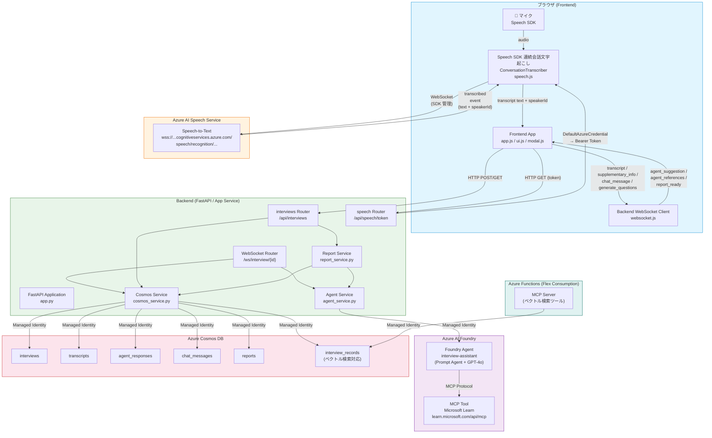
```mermaid
graph TB
    subgraph Browser["ブラウザ (Frontend)"]
        MIC["🎤 マイク<br/>Speech SDK"]
        SPEECH_JS["Speech SDK 連続会話文字起こし<br/>ConversationTranscriber<br/>speech.js"]
        FE["Frontend App<br/>app.js / ui.js / modal.js"]
        BE_WS["Backend WebSocket Client<br/>websocket.js"]
    end

    subgraph Azure_Speech["Azure AI Speech Service"]
        SPEECH_API["Speech-to-Text<br/>wss://...cognitiveservices.azure.com/<br/>speech/recognition/..."]
    end

    subgraph Backend["Backend (FastAPI / App Service)"]
        APP["FastAPI Application<br/>app.py"]
        R_INT["interviews Router<br/>/api/interviews"]
        R_SP["speech Router<br/>/api/speech/token"]
        R_WS["WebSocket Router<br/>/ws/interview/{id}"]
        AGT_SVC["Agent Service<br/>agent_service.py"]
        COS_SVC["Cosmos Service<br/>cosmos_service.py"]
        RPT_SVC["Report Service<br/>report_service.py"]
    end

    subgraph Azure_AI["Azure AI Foundry"]
        AGENT["Foundry Agent<br/>interview-assistant<br/>(Prompt Agent + GPT-4o)"]
        MCP["MCP Tool<br/>Microsoft Learn<br/>learn.microsoft.com/api/mcp"]
    end

    subgraph Azure_Cosmos["Azure Cosmos DB"]
        DB_INT["interviews"]
        DB_TR["transcripts"]
        DB_AR["agent_responses"]
        DB_CM["chat_messages"]
        DB_RP["reports"]
        DB_IR["interview_records<br/>(ベクトル検索対応)"]
    end

    subgraph Azure_Functions["Azure Functions (Flex Consumption)"]
        MCP_SRV["MCP Server<br/>(ベクトル検索ツール)"]
    end

    MIC -->|"audio"| SPEECH_JS
    SPEECH_JS -->|"WebSocket<br/>(SDK 管理)"| SPEECH_API
    SPEECH_API -->|"transcribed<br/>event<br/>(text + speakerId)"| SPEECH_JS
    SPEECH_JS -->|"transcript text + speakerId"| FE

    FE -->|"transcript / supplementary_info /<br/>chat_message / generate_questions"| BE_WS
    BE_WS -->|"agent_suggestion /<br/>agent_references /<br/>report_ready"| FE

    FE -->|"HTTP POST/GET"| R_INT
    FE -->|"HTTP GET (token)"| R_SP

    R_SP -->|"DefaultAzureCredential<br/>→ Bearer Token"| SPEECH_JS

    R_WS --> AGT_SVC
    R_WS --> COS_SVC
    R_INT --> COS_SVC
    R_INT --> RPT_SVC
    RPT_SVC --> AGT_SVC
    RPT_SVC --> COS_SVC

    AGT_SVC -->|"Managed Identity"| AGENT
    AGENT -->|"MCP Protocol"| MCP
    COS_SVC -->|"Managed Identity"| DB_INT
    COS_SVC -->|"Managed Identity"| DB_TR
    COS_SVC -->|"Managed Identity"| DB_AR
    COS_SVC -->|"Managed Identity"| DB_CM
    COS_SVC -->|"Managed Identity"| DB_RP
    COS_SVC -->|"Managed Identity"| DB_IR
    MCP_SRV -->|"Managed Identity"| DB_IR

    style Browser fill:#e1f5fe,stroke:#0288d1
    style Azure_Speech fill:#fff3e0,stroke:#ef6c00
    style Backend fill:#e8f5e9,stroke:#2e7d32
    style Azure_AI fill:#f3e5f5,stroke:#7b1fa2
    style Azure_Cosmos fill:#fce4ec,stroke:#c62828
    style Azure_Functions fill:#e0f2f1,stroke:#00695c
```

---

## 2. 通信プロトコルとデータフロー

本アプリケーションには **2 系統の WebSocket 接続** と **REST API** が存在する。

### 2.1 通信チャネル一覧

| チャネル | プロトコル | 接続元 → 接続先 | 用途 |
|---|---|---|---|
| Speech SDK WebSocket | WSS | ブラウザ (Speech SDK) → Azure Speech Service | 音声データ送信 + 文字起こし受信 (SDK管理) |
| Backend WebSocket | WS/WSS | ブラウザ → FastAPI Backend | 文字起こし転送・エージェント応答受信 |
| REST API | HTTPS | ブラウザ → FastAPI Backend | インタビューCRUD・トークン取得・レポート取得 |
| Agent API | HTTPS | FastAPI Backend → Azure AI Foundry | エージェント会話 |
| Cosmos DB | HTTPS | FastAPI Backend → Azure Cosmos DB | データ永続化 |

### 2.2 全体データフローシーケンス

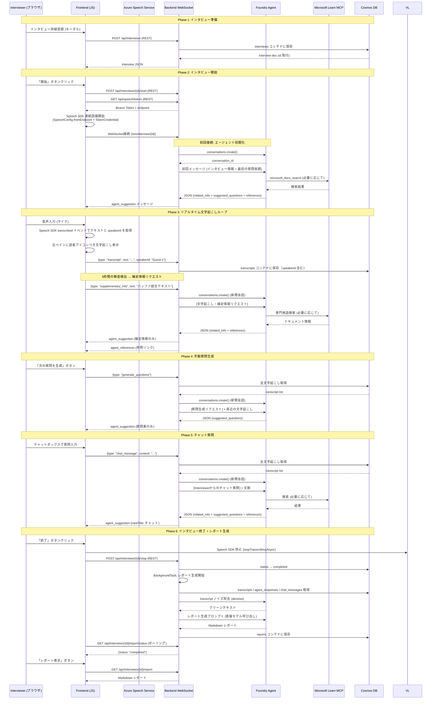
```mermaid
sequenceDiagram
    participant User as Interviewer (ブラウザ)
    participant FE as Frontend (JS)
    participant Speech as Azure Speech Service
    participant BE_WS as Backend WebSocket
    participant AGT as Foundry Agent
    participant MCP as Microsoft Learn MCP
    participant DB as Cosmos DB

    Note over User,DB: Phase 1: インタビュー準備
    User->>FE: インタビュー詳細登録 (モーダル)
    FE->>BE_WS: POST /api/interviews (REST)
    BE_WS->>DB: interviews コンテナに保存
    DB-->>BE_WS: interview doc (id 発行)
    BE_WS-->>FE: interview JSON

    Note over User,DB: Phase 2: インタビュー開始
    User->>FE: 「開始」ボタンクリック
    FE->>BE_WS: POST /api/interviews/{id}/start (REST)
    FE->>BE_WS: GET /api/speech/token (REST)
    BE_WS-->>FE: Bearer Token + endpoint

    FE->>FE: Speech SDK 連続認識開始<br/>(SpeechConfig.fromEndpoint + TokenCredential)

    FE->>BE_WS: WebSocket接続 (/ws/interview/{id})

    Note over BE_WS, AGT: 初回接続: エージェント初期化
    BE_WS->>AGT: conversations.create()
    AGT-->>BE_WS: conversation_id
    BE_WS->>AGT: 初回メッセージ (インタビュー情報 + 最初の質問依頼)
    AGT->>MCP: microsoft_docs_search (必要に応じて)
    MCP-->>AGT: 検索結果
    AGT-->>BE_WS: JSON (related_info + suggested_questions + references)
    BE_WS-->>FE: agent_suggestion メッセージ

    Note over User,DB: Phase 3: リアルタイム文字起こしループ
    User->>FE: 音声入力 (マイク)
    FE->>FE: Speech SDK transcribed イベントでテキストと speakerId を取得
    FE->>FE: 左ペインに話者アイコンつき文字起こし表示
    FE->>BE_WS: {type: "transcript", text: "...", speakerId: "Guest-1"}
    BE_WS->>DB: transcripts コンテナに保存（speakerId 含む）

    Note over FE,BE_WS: 5秒間の無音検出 → 補足情報リクエスト
    FE->>BE_WS: {type: "supplementary_info", text: "バッファ結合テキスト"}
    BE_WS->>AGT: conversations.create() (新規会話)
    BE_WS->>AGT: [文字起こし・補足情報リクエスト]
    AGT->>MCP: 専門用語検索 (必要に応じて)
    MCP-->>AGT: ドキュメント情報
    AGT-->>BE_WS: JSON (related_info + references)
    BE_WS-->>FE: agent_suggestion (補足情報のみ)
    BE_WS-->>FE: agent_references (参照リンク)

    Note over User,DB: Phase 4: 手動質問生成
    User->>FE: 「次の質問を生成」ボタン
    FE->>BE_WS: {type: "generate_questions"}
    BE_WS->>DB: 全文字起こし取得
    DB-->>BE_WS: transcript list
    BE_WS->>AGT: conversations.create() (新規会話)
    BE_WS->>AGT: [質問生成リクエスト] + 直近の文字起こし
    AGT-->>BE_WS: JSON (suggested_questions)
    BE_WS-->>FE: agent_suggestion (質問案のみ)

    Note over User,DB: Phase 5: チャット質問
    User->>FE: チャットボックスで質問入力
    FE->>BE_WS: {type: "chat_message", content: "..."}
    BE_WS->>DB: 全文字起こし取得
    DB-->>BE_WS: transcript list
    BE_WS->>AGT: conversations.create() (新規会話)
    BE_WS->>AGT: [Interviewerからのチャット質問] + 文脈
    AGT->>MCP: 検索 (必要に応じて)
    MCP-->>AGT: 結果
    AGT-->>BE_WS: JSON (related_info + suggested_questions + references)
    BE_WS-->>FE: agent_suggestion (cardTitle: チャット)

    Note over User,DB: Phase 6: インタビュー終了 + レポート生成
    User->>FE: 「終了」ボタンクリック
    FE->>VL: Speech SDK 停止 (stopTranscribingAsync)
    FE->>BE_WS: POST /api/interviews/{id}/stop (REST)
    BE_WS->>DB: status → completed
    BE_WS->>BE_WS: BackgroundTask: レポート生成開始

    BE_WS->>DB: transcripts / agent_responses / chat_messages 取得
    BE_WS->>AGT: transcript ノイズ除去 (denoise)
    AGT-->>BE_WS: クリーンテキスト
    BE_WS->>AGT: レポート生成プロンプト (直接モデル呼び出し)
    AGT-->>BE_WS: Markdown レポート
    BE_WS->>DB: reports コンテナに保存

    FE->>BE_WS: GET /api/interviews/{id}/report/status (ポーリング)
    BE_WS-->>FE: {status: "completed"}
    User->>FE: 「レポート表示」ボタン
    FE->>BE_WS: GET /api/interviews/{id}/report
    BE_WS-->>FE: Markdown レポート
```

---

## 3. フロントエンドアーキテクチャ

### 3.1 モジュール構成

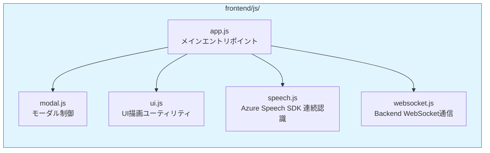
```mermaid
graph LR
    subgraph Frontend["frontend/js/"]
        APP["app.js<br/>メインエントリポイント"]
        MODAL["modal.js<br/>モーダル制御"]
        UI["ui.js<br/>UI描画ユーティリティ"]
        SPEECH["speech.js<br/>Azure Speech SDK 連続認識"]
        WS["websocket.js<br/>Backend WebSocket通信"]
    end

    APP --> MODAL
    APP --> UI
    APP --> SPEECH
    APP --> WS

    style Frontend fill:#e1f5fe,stroke:#0288d1
```

| モジュール | 責務 |
|---|---|
| `app.js` | アプリケーションのメインエントリポイント。各モジュールの初期化、ボタンイベントのバインド、インタビューライフサイクル管理（開始・停止・レポート表示）。レポートポーリング制御 |
| `modal.js` | インタビュー詳細登録モーダルの表示/非表示制御、フォーム送信ハンドリング。`initModal(callback)` で登録完了コールバックを設定 |
| `ui.js` | DOM 操作ユーティリティ。文字起こし表示、AI提案カード描画、参照リンク追加、レポートモーダル描画。Markdown の簡易レンダリング、HTML エスケープ処理 |
| `speech.js` | Azure Speech SDK による連続会話文字起こし（`ConversationTranscriber`）。バックエンドから取得したEntra IDトークンで `SpeechConfig.fromEndpoint(URL, TokenCredential)` を構成。`transcribed` イベントで確定テキストと `speakerId` をコールバックに返す |
| `websocket.js` | バックエンド WebSocket との通信管理。文字起こし転送（バッファリング+無音検出）、補足情報リクエスト、質問生成リクエスト、チャットメッセージ送信。自動再接続機能 |

### 3.2 フロントエンドの状態管理

フロントエンドは Vanilla JS で構成されておりフレームワークを使用しない。状態管理はモジュールスコープのグローバル変数で行う。

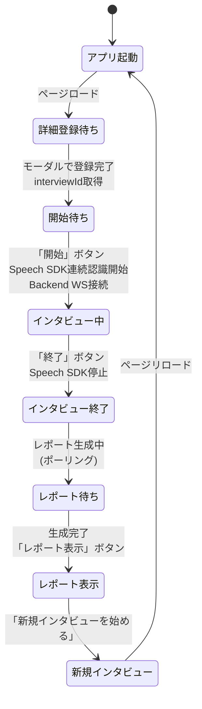
```mermaid
stateDiagram-v2
    [*] --> アプリ起動
    アプリ起動 --> 詳細登録待ち: ページロード
    詳細登録待ち --> 開始待ち: モーダルで登録完了<br/>interviewId取得
    開始待ち --> インタビュー中: 「開始」ボタン<br/>Speech SDK連続認識開始<br/>Backend WS接続
    インタビュー中 --> インタビュー終了: 「終了」ボタン<br/>Speech SDK停止
    インタビュー終了 --> レポート待ち: レポート生成中<br/>(ポーリング)
    レポート待ち --> レポート表示: 生成完了<br/>「レポート表示」ボタン
    レポート表示 --> 新規インタビュー: 「新規インタビューを始める」
    新規インタビュー --> アプリ起動: ページリロード
```

### 3.3 音声キャプチャ

Speech SDK の `AudioConfig.fromDefaultMicrophoneInput()` がブラウザのマイク入力を直接管理する。
AudioWorklet や手動の PCM16 変換は不要（SDK が内部的に処理）。

---

## 4. バックエンドアーキテクチャ

### 4.1 モジュール構成

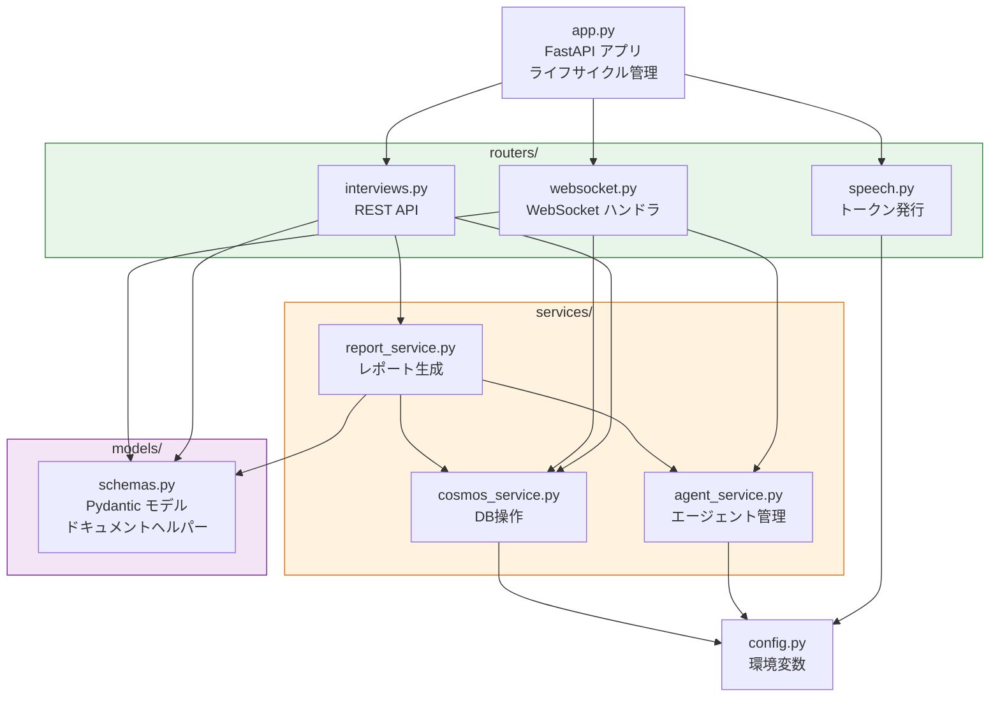
```mermaid
graph TB
    subgraph Routers["routers/"]
        R_INT["interviews.py<br/>REST API"]
        R_SP["speech.py<br/>トークン発行"]
        R_WS["websocket.py<br/>WebSocket ハンドラ"]
    end

    subgraph Services["services/"]
        AGT["agent_service.py<br/>エージェント管理"]
        COS["cosmos_service.py<br/>DB操作"]
        RPT["report_service.py<br/>レポート生成"]
    end

    subgraph Models["models/"]
        SCH["schemas.py<br/>Pydantic モデル<br/>ドキュメントヘルパー"]
    end

    APP_PY["app.py<br/>FastAPI アプリ<br/>ライフサイクル管理"]
    CFG["config.py<br/>環境変数"]

    APP_PY --> R_INT
    APP_PY --> R_SP
    APP_PY --> R_WS

    R_INT --> COS
    R_INT --> RPT
    R_SP --> CFG
    R_WS --> AGT
    R_WS --> COS
    RPT --> AGT
    RPT --> COS

    AGT --> CFG
    COS --> CFG

    R_INT --> SCH
    R_WS --> SCH
    RPT --> SCH

    style Routers fill:#e8f5e9,stroke:#2e7d32
    style Services fill:#fff3e0,stroke:#ef6c00
    style Models fill:#f3e5f5,stroke:#7b1fa2
```

### 4.2 REST API エンドポイント

| メソッド | パス | 説明 |
|---|---|---|
| `POST` | `/api/interviews` | インタビュー作成 |
| `GET` | `/api/interviews/{id}` | インタビュー詳細取得 |
| `POST` | `/api/interviews/{id}/start` | インタビュー開始（status → `in_progress`） |
| `POST` | `/api/interviews/{id}/stop` | インタビュー終了（status → `completed`）+ レポート生成開始 |
| `GET` | `/api/interviews/{id}/report` | レポート取得 |
| `GET` | `/api/interviews/{id}/report/status` | レポート生成状況取得 |
| `GET` | `/api/speech/token` | Azure Speech Service 用 Bearer トークン取得 |

### 4.3 WebSocket メッセージプロトコル

#### クライアント → サーバー（受信メッセージ）

| `type` | ペイロード | 説明 |
|---|---|---|
| `transcript` | `{text, timestamp}` | 文字起こしテキストの保存 |
| `supplementary_info` | `{text}` | 補足情報リクエスト（バッファされた文字起こしテキスト） |
| `generate_questions` | `{}` | 質問生成リクエスト |
| `chat_message` | `{content}` | Interviewer のチャット質問 |

#### サーバー → クライアント（送信メッセージ）

| `type` | ペイロード | 説明 |
|---|---|---|
| `agent_suggestion` | `{relatedInfo, suggestedQuestions, references, cardTitle?}` | エージェントの提案（関連情報・質問案） |
| `agent_references` | `{references}` | 参照リンク（重複なしで右ペインに追加） |
| `report_ready` | `{reportId}` | レポート生成完了通知 |

### 4.4 アプリケーション起動フロー

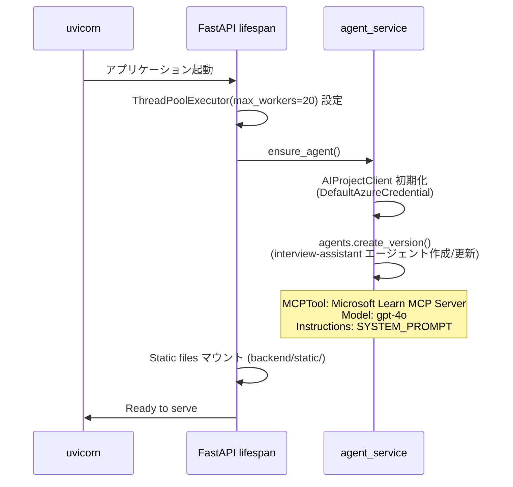
```mermaid
sequenceDiagram
    participant Process as uvicorn
    participant App as FastAPI lifespan
    participant AGT as agent_service

    Process->>App: アプリケーション起動
    App->>App: ThreadPoolExecutor(max_workers=20) 設定
    App->>AGT: ensure_agent()
    AGT->>AGT: AIProjectClient 初期化<br/>(DefaultAzureCredential)
    AGT->>AGT: agents.create_version()<br/>(interview-assistant エージェント作成/更新)
    Note over AGT: MCPTool: Microsoft Learn MCP Server<br/>Model: gpt-4o<br/>Instructions: SYSTEM_PROMPT
    App->>App: Static files マウント (backend/static/)
    App->>Process: Ready to serve
```

---

## 5. エージェントアーキテクチャ

### 5.1 エージェント概要

本アプリケーションは **単一の Foundry Prompt Agent**（`interview-assistant`）を使用するが、機能に応じて **3 つの役割（Role）** を使い分ける。各役割は **毎回新規の会話（conversation）を作成** してコンテキスト汚染を防ぐ。

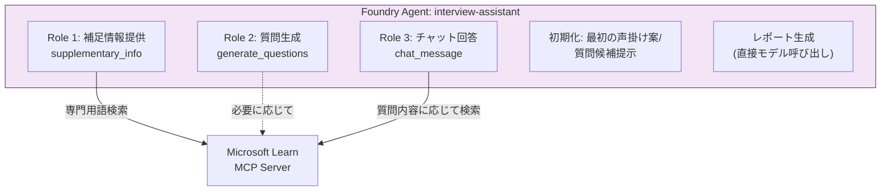
```mermaid
graph TB
    subgraph Agent["Foundry Agent: interview-assistant"]
        ROLE1["Role 1: 補足情報提供<br/>supplementary_info"]
        ROLE2["Role 2: 質問生成<br/>generate_questions"]
        ROLE3["Role 3: チャット回答<br/>chat_message"]
        INIT["初期化: 最初の声掛け案/<br/>質問候補提示"]
        REPORT["レポート生成<br/>(直接モデル呼び出し)"]
    end

    MCP["Microsoft Learn<br/>MCP Server"]

    ROLE1 -->|"専門用語検索"| MCP
    ROLE2 -.->|"必要に応じて"| MCP
    ROLE3 -->|"質問内容に応じて検索"| MCP

    style Agent fill:#f3e5f5,stroke:#7b1fa2
```

### 5.2 各役割の詳細

#### Role 0: 初期化（WebSocket 初回接続時）

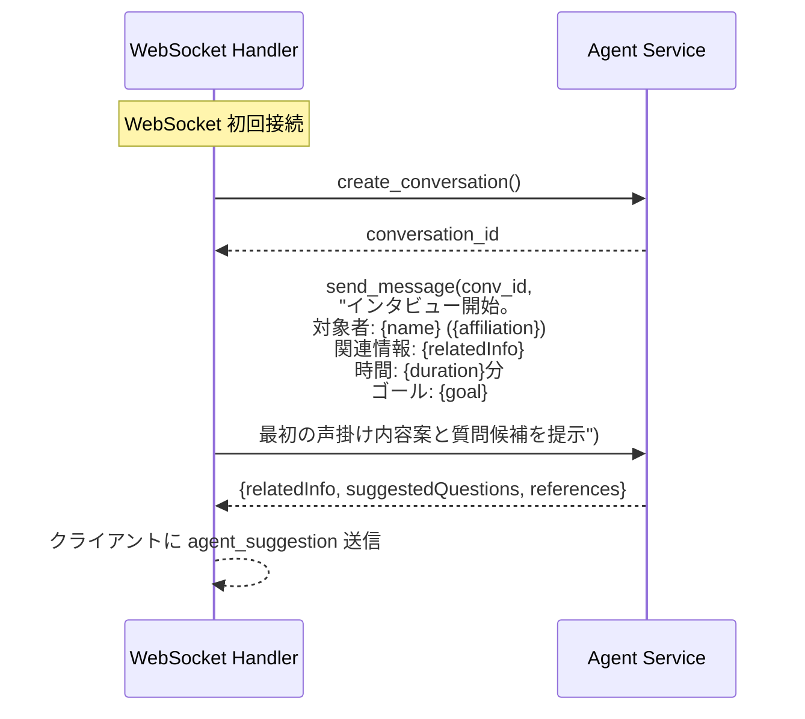
```mermaid
sequenceDiagram
    participant WS as WebSocket Handler
    participant AGT as Agent Service

    Note over WS: WebSocket 初回接続
    WS->>AGT: create_conversation()
    AGT-->>WS: conversation_id
    WS->>AGT: send_message(conv_id, <br/>"インタビュー開始。<br/>対象者: {name} ({affiliation})<br/>関連情報: {relatedInfo}<br/>時間: {duration}分<br/>ゴール: {goal}<br/><br/>最初の声掛け内容案と質問候補を提示")
    AGT-->>WS: {relatedInfo, suggestedQuestions, references}
    WS-->>WS: クライアントに agent_suggestion 送信
```

**トリガー**: WebSocket 初回接続時（`interview_id` が `_initial_done` セットにない場合）
**入力**: インタビュー情報（対象者名、所属、関連情報、時間、ゴール）
**出力**: 最初の声掛け内容案 + 初期質問候補
**会話管理**: 新規 conversation を作成（この conversation は使い捨て）

---

#### Role 1: 補足情報提供（`_handle_supplementary`）

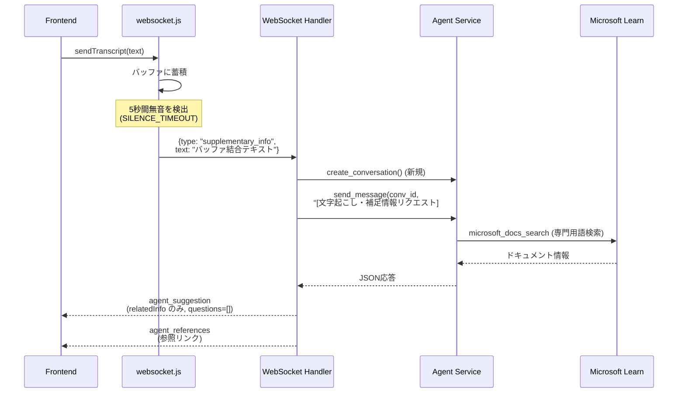
```mermaid
sequenceDiagram
    participant FE as Frontend
    participant WS_CLI as websocket.js
    participant WS_SRV as WebSocket Handler
    participant AGT as Agent Service
    participant MCP as Microsoft Learn

    FE->>WS_CLI: sendTranscript(text)
    WS_CLI->>WS_CLI: バッファに蓄積
    Note over WS_CLI: 5秒間無音を検出<br/>(SILENCE_TIMEOUT)
    WS_CLI->>WS_SRV: {type: "supplementary_info",<br/>text: "バッファ結合テキスト"}
    WS_SRV->>AGT: create_conversation() (新規)
    WS_SRV->>AGT: send_message(conv_id, <br/>"[文字起こし・補足情報リクエスト]<br/>## インタビュー情報<br/>{context}<br/>## 会話内容<br/>{text}<br/><br/>専門用語を検出し補足情報を提供。<br/>suggested_questionsは空配列に。")
    AGT->>MCP: microsoft_docs_search (専門用語検索)
    MCP-->>AGT: ドキュメント情報
    AGT-->>WS_SRV: JSON応答
    WS_SRV-->>FE: agent_suggestion<br/>(relatedInfo のみ, questions=[])
    WS_SRV-->>FE: agent_references<br/>(参照リンク)
```

**トリガー**: フロントエンドの **5秒間の無音検出**（`SILENCE_TIMEOUT = 5000ms`）
- `websocket.js` が文字起こしテキストをバッファに蓄積
- 最後の文字起こしから 5 秒間新しい文字起こしが来なかった場合、バッファを結合して `supplementary_info` メッセージを送信
- バッファはフラッシュ後にクリアされる

**フィルタ条件**: テキストが 10 文字未満の場合はスキップ
**入力**: バッファされた文字起こしテキスト + インタビュー情報コンテキスト
**出力**: 専門用語の補足説明（`relatedInfo`）+ 参照リンク（`references`）。`suggestedQuestions` は空配列
**会話管理**: 毎回新規 conversation（コンテキスト独立）
**非同期**: `asyncio.create_task()` で非同期実行（WebSocket ループをブロックしない）
**タイムアウト**: 60 秒（`AGENT_TIMEOUT`）

---

#### Role 2: 質問生成（`_handle_generate_questions`）

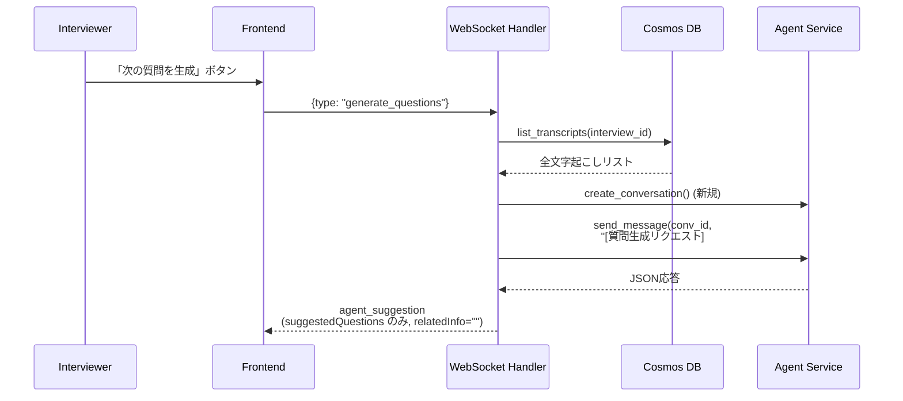
```mermaid
sequenceDiagram
    participant User as Interviewer
    participant FE as Frontend
    participant WS_SRV as WebSocket Handler
    participant DB as Cosmos DB
    participant AGT as Agent Service

    User->>FE: 「次の質問を生成」ボタン
    FE->>WS_SRV: {type: "generate_questions"}
    WS_SRV->>DB: list_transcripts(interview_id)
    DB-->>WS_SRV: 全文字起こしリスト
    WS_SRV->>AGT: create_conversation() (新規)
    WS_SRV->>AGT: send_message(conv_id,<br/>"[質問生成リクエスト]<br/>## インタビュー情報<br/>{context}<br/>## 直近の文字起こし履歴<br/>{last 5000 chars}<br/><br/>次に聞くべき質問案を最大3個提示。<br/>related_infoは空文字列に。")
    AGT-->>WS_SRV: JSON応答
    WS_SRV-->>FE: agent_suggestion<br/>(suggestedQuestions のみ, relatedInfo="")
```

**トリガー**: Interviewer が **「次の質問を生成」ボタン** をクリック
- フロントエンドではクリック後 10 秒間ボタンを無効化（連打防止）

**入力**: Cosmos DB から取得した全文字起こしの **直近 5000 文字** + インタビュー情報コンテキスト
**出力**: 最大 3 個の質問案（`suggestedQuestions`）。`relatedInfo` は空文字列
**会話管理**: 毎回新規 conversation（コンテキスト独立）
**非同期**: `asyncio.create_task()` で非同期実行
**タイムアウト**: 60 秒

---

#### Role 3: チャット回答（`_handle_chat_message`）

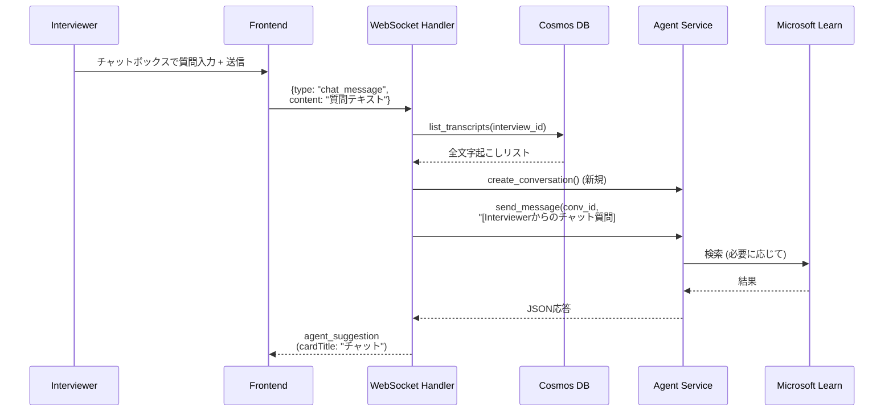
```mermaid
sequenceDiagram
    participant User as Interviewer
    participant FE as Frontend
    participant WS_SRV as WebSocket Handler
    participant DB as Cosmos DB
    participant AGT as Agent Service
    participant MCP as Microsoft Learn

    User->>FE: チャットボックスで質問入力 + 送信
    FE->>WS_SRV: {type: "chat_message",<br/>content: "質問テキスト"}
    WS_SRV->>DB: list_transcripts(interview_id)
    DB-->>WS_SRV: 全文字起こしリスト
    WS_SRV->>AGT: create_conversation() (新規)
    WS_SRV->>AGT: send_message(conv_id,<br/>"[Interviewerからのチャット質問]<br/>## インタビュー情報<br/>{context}<br/>## 直近の文字起こし履歴<br/>{last 5000 chars}<br/>## Interviewerの質問<br/>{content}<br/><br/>文脈を踏まえて回答し<br/>参照情報があれば提供。")
    AGT->>MCP: 検索 (必要に応じて)
    MCP-->>AGT: 結果
    AGT-->>WS_SRV: JSON応答
    WS_SRV-->>FE: agent_suggestion<br/>(cardTitle: "チャット")
```

**トリガー**: Interviewer が **チャットボックスで質問を入力し送信**（Enter キーまたは送信ボタン）
**入力**: 質問内容 + 直近の文字起こし 5000 文字 + インタビュー情報コンテキスト
**出力**: 回答（`relatedInfo`）+ 質問案（`suggestedQuestions`）+ 参照リンク（`references`）。`cardTitle: "チャット"` が付与される
**会話管理**: 毎回新規 conversation
**非同期**: `asyncio.create_task()` で非同期実行
**タイムアウト**: 60 秒

---

#### Role 4: レポート生成（`report_service.generate_report`）

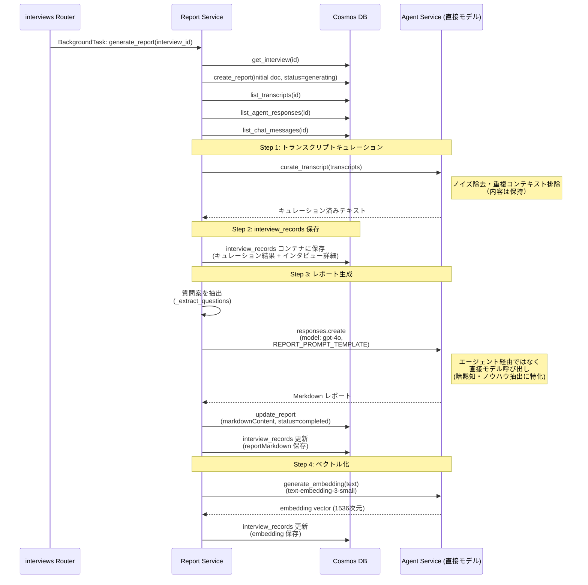
```mermaid
sequenceDiagram
    participant API as interviews Router
    participant RPT as Report Service
    participant DB as Cosmos DB
    participant AGT as Agent Service (直接モデル)

    API->>RPT: BackgroundTask: generate_report(interview_id)
    RPT->>DB: get_interview(id)
    RPT->>DB: create_report(initial doc, status=generating)
    RPT->>DB: list_transcripts(id)
    RPT->>DB: list_agent_responses(id)
    RPT->>DB: list_chat_messages(id)

    Note over RPT,AGT: Step 1: トランスクリプトキュレーション
    RPT->>AGT: curate_transcript(transcripts)
    Note right of AGT: ノイズ除去・重複コンテキスト排除<br/>（内容は保持）
    AGT-->>RPT: キュレーション済みテキスト

    Note over RPT,DB: Step 2: interview_records 保存
    RPT->>DB: interview_records コンテナに保存<br/>(キュレーション結果 + インタビュー詳細)

    Note over RPT,AGT: Step 3: レポート生成
    RPT->>RPT: 質問案を抽出<br/>(_extract_questions)
    RPT->>AGT: responses.create<br/>(model: gpt-4o,<br/>REPORT_PROMPT_TEMPLATE)
    Note right of AGT: エージェント経由ではなく<br/>直接モデル呼び出し<br/>(暗黙知・ノウハウ抽出に特化)
    AGT-->>RPT: Markdown レポート

    RPT->>DB: update_report<br/>(markdownContent, status=completed)
    RPT->>DB: interview_records 更新<br/>(reportMarkdown 保存)

    Note over RPT,AGT: Step 4: ベクトル化
    RPT->>AGT: generate_embedding(text)<br/>(text-embedding-3-small)
    AGT-->>RPT: embedding vector (1536次元)
    RPT->>DB: interview_records 更新<br/>(embedding 保存)
```

**トリガー**: `POST /api/interviews/{id}/stop` 呼び出し時の `BackgroundTasks`
**特徴**:
- エージェント経由ではなく **直接モデル呼び出し**（`openai.responses.create(model="gpt-4o")`）を使用。理由: レポートは Markdown 形式で出力する必要があり、エージェントの JSON 出力制約が不適切なため
- **2段階処理**: (1) ノイズ除去 → (2) レポート生成
- **チャンク処理**: 推定トークン数が 100,000 を超える場合、90,000 トークンごとに分割（10,000 トークンのオーバーラップ付き）
- トークン推定: 日本語テキストは約 3 文字 ≈ 1 トークンとして計算

### 5.3 エージェントのシステムプロンプト

エージェントには以下のシステムプロンプトが設定されている:

| 項目 | 内容 |
|---|---|
| 役割 | インタビュー補助 AI エージェント。素人 Interviewer をサポート |
| 入力プレフィックス認識 | `[文字起こし]` `[Interviewerからの補足質問]` 等のプレフィックスで入力種別を判定 |
| 出力形式 | 有効な JSON のみ（`related_info`, `suggested_questions`, `references`） |
| ツール利用 | 入力テキストに専門用語・技術概念がある場合のみ `microsoft_docs_search` で検索 |
| 制約 | 入力と無関係な情報は返さない。短い/非技術的入力では `related_info` を空にする |

### 5.4 エージェント応答のパース処理

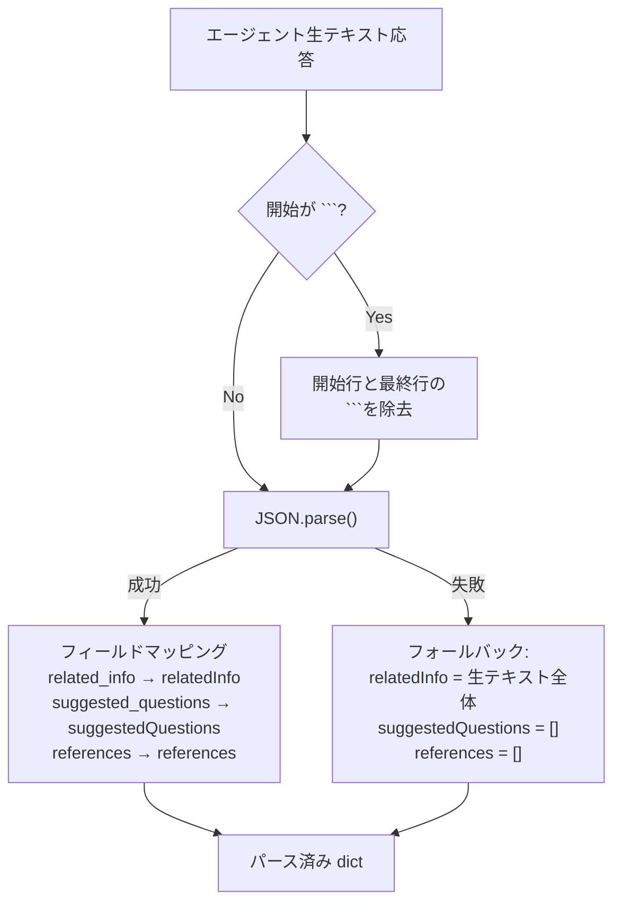
```mermaid
flowchart TD
    RAW["エージェント生テキスト応答"]
    --> FENCE{"開始が ```?"}
    FENCE -->|Yes| STRIP["開始行と最終行の<br/>```を除去"]
    FENCE -->|No| PARSE
    STRIP --> PARSE["JSON.parse()"]
    PARSE -->|成功| MAP["フィールドマッピング<br/>related_info → relatedInfo<br/>suggested_questions → suggestedQuestions<br/>references → references"]
    PARSE -->|失敗| FALLBACK["フォールバック:<br/>relatedInfo = 生テキスト全体<br/>suggestedQuestions = []<br/>references = []"]
    MAP --> RESULT["パース済み dict"]
    FALLBACK --> RESULT
```

### 5.5 リトライ制御

エージェント呼び出しには **指数バックオフリトライ** が実装されている:

| パラメータ | 値 |
|---|---|
| 最大リトライ回数 | 5 回 |
| 初期待機時間 | 10 秒 |
| バックオフ | 指数関数的（10s → 20s → 40s → 80s → 160s） |
| リトライ対象 | HTTP 429（Rate Limit）のみ |

---

## 6. Azure Speech SDK 接続詳細

### 6.1 接続アーキテクチャ

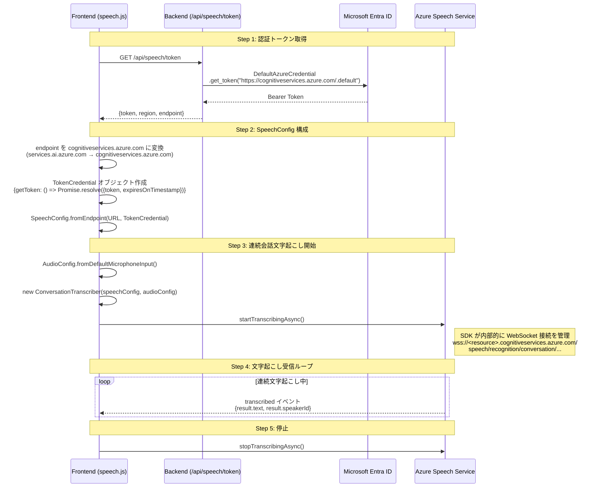
```mermaid
sequenceDiagram
    participant FE as Frontend (speech.js)
    participant BE as Backend (/api/speech/token)
    participant EntraID as Microsoft Entra ID
    participant Speech as Azure Speech Service

    Note over FE,Speech: Step 1: 認証トークン取得
    FE->>BE: GET /api/speech/token
    BE->>EntraID: DefaultAzureCredential<br/>.get_token("https://cognitiveservices.azure.com/.default")
    EntraID-->>BE: Bearer Token
    BE-->>FE: {token, region, endpoint}

    Note over FE,Speech: Step 2: SpeechConfig 構成
    FE->>FE: endpoint を cognitiveservices.azure.com に変換<br/>(services.ai.azure.com → cognitiveservices.azure.com)
    FE->>FE: TokenCredential オブジェクト作成<br/>{getToken: () => Promise.resolve({token, expiresOnTimestamp})}
    FE->>FE: SpeechConfig.fromEndpoint(URL, TokenCredential)

    Note over FE,Speech: Step 3: 連続会話文字起こし開始
    FE->>FE: AudioConfig.fromDefaultMicrophoneInput()
    FE->>FE: new ConversationTranscriber(speechConfig, audioConfig)
    FE->>Speech: startTranscribingAsync()
    Note right of Speech: SDK が内部的に WebSocket 接続を管理<br/>wss://<resource>.cognitiveservices.azure.com/<br/>speech/recognition/conversation/...

    Note over FE,Speech: Step 4: 文字起こし受信ループ
    loop 連続文字起こし中
        Speech-->>FE: transcribed イベント<br/>{result.text, result.speakerId}
    end

    Note over FE,Speech: Step 5: 停止
    FE->>Speech: stopTranscribingAsync()
```

### 6.2 Speech SDK 設定

```javascript
// SpeechConfig
speechConfig.speechRecognitionLanguage = "ja-JP"; // or "en-US"
speechConfig.setProperty(
  sdk.PropertyId.SpeechServiceConnection_EndSilenceTimeoutMs,
  "500"
);
```

| 設定項目 | 値 | 説明 |
|---|---|---|
| `speechRecognitionLanguage` | `"ja-JP"` / `"en-US"` | 認識言語（言語トグルに連動） |
| `EndSilenceTimeoutMs` | `"500"` | 500ms の無音でフレーズ確定 |
| `AudioConfig` | `fromDefaultMicrophoneInput()` | ブラウザのデフォルトマイク入力 |
| 認識モード | 連続会話文字起こし (`ConversationTranscriber.startTranscribingAsync`) | インタビュー全体を通して文字起こしと話者分離を継続 |

### 6.3 エンドポイントドメイン変換

AI Foundry リソース（`kind: AIServices`）は2つのドメインを提供する:

| ドメイン | 用途 |
|---|---|
| `<name>.services.ai.azure.com` | AI Foundry / OpenAI API / Agent Service |
| `<name>.cognitiveservices.azure.com` | Speech / Vision / 他の Cognitive Services API |

Bicep の `AZURE_SPEECH_ENDPOINT` 出力は `services.ai.azure.com` 形式であるため、
`speech.js` でフロントエンド側でドメインを変換する:

```javascript
speechHost = endpoint.replace(".services.ai.azure.com", ".cognitiveservices.azure.com");
```

### 6.4 ノイズ抑制

Speech SDK の Microsoft Audio Stack（MAS）は JavaScript/ブラウザ環境では利用不可（C#/C++/Java のみ対応）。
ブラウザの WebRTC ノイズ抑制（`getUserMedia` のデフォルト `noiseSuppression: true`）に依存する。
Speech SDK の `fromDefaultMicrophoneInput()` がブラウザのデフォルト設定を使用するため、自動的に有効。

### 6.5 話者分離（Speaker Diarization）

`ConversationTranscriber` を使用することで、単一マイクのミックス音声から Azure Speech Service が音声クラスタリングにより話者を自動分離する。

| 項目 | 内容 |
|---|---|
| 有効化方法 | `new ConversationTranscriber(speechConfig, audioConfig)` を使用（SDK 内部で `isSpeakerDiarizationEnabled = true` が自動設定） |
| 事前準備 | 不要（声紋登録なし） |
| 話者ID形式 | `"Guest-1"`, `"Guest-2"`, ...（初期や特定不能時は `"Unknown"`） |
| 属性判別 | Interviewer / Interviewee の区別はしない（エージェントが文脈から推測） |
| 対応マイク | 単一マイク（複数話者の混在音声） |
| UI 表示 | テキスト先頭に `●` を配置し、`speakerId` ごとに異なる色で表示（話者名自体は非表示） |
| データ保存 | Cosmos DB `transcripts` コンテナの `speakerId` フィールドに保存 |
| エージェント入力 | 各文字起こし行を `[Guest-1] text` 形式に整形して渡す（質問生成・補足情報・チャット・レポート生成すべて共通） |
| 既存データ互換 | `speakerId` を持たない既存レコードは空タグとして扱う（後方互換） |

```javascript
// speech.js: 話者IDを含む結果取得
transcriber.transcribed = (_s, e) => {
  if (e.result.reason === sdk.ResultReason.RecognizedSpeech && e.result.text) {
    const speakerId = e.result.speakerId || "Unknown";
    onTranscript({ text: e.result.text, speakerId });
  }
};
```

```javascript
// ui.js: 話者色分け（CSS クラスを動的付与）
// Guest-1 → speaker-1, Guest-2 → speaker-2, ..., Unknown → speaker-unknown
const speakerClass = _speakerClass(speakerId);
const dot = document.createElement("span");
dot.className = `speaker-dot ${speakerClass}`;
dot.textContent = "●";
```

    Note over FE,Speech: Step 1: 認証トークン取得
    FE->>BE: GET /api/speech/token
    BE->>EntraID: DefaultAzureCredential<br/>.get_token("https://cognitiveservices.azure.com/.default")
    EntraID-->>BE: Bearer Token
    BE-->>FE: {token, endpoint, region, expiresOn}

    Note over FE,Speech: Step 2: Speech SDK 連続会話文字起こし開始
    FE->>Speech: ConversationTranscriber<br/>startTranscribingAsync()

    Note over FE,Speech: Step 3: リアルタイム文字起こし
    loop マイク音声キャプチャ中
        Speech-->>FE: transcribed イベント<br/>(event.result.text, event.result.speakerId)
    end

---

## 7. 音声入力 → 文字起こし → エージェント入力の関係

### 7.1 データフローパイプライン

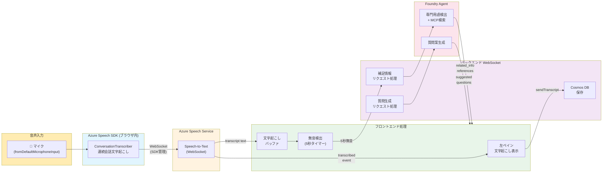
```mermaid
flowchart LR
    subgraph Input["音声入力"]
        MIC["🎤 マイク<br/>(fromDefaultMicrophoneInput)"]
    end

    subgraph SpeechSDK["Azure Speech SDK (ブラウザ内)"]
        RECO["ConversationTranscriber<br/>連続会話文字起こし"]
    end

    subgraph AzureSpeech["Azure Speech Service"]
        STT["Speech-to-Text<br/>(WebSocket)"]
    end

    subgraph Frontend["フロントエンド処理"]
        DISPLAY["左ペイン<br/>文字起こし表示"]
        BUFFER["文字起こし<br/>バッファ"]
        SILENCE["無音検出<br/>(5秒タイマー)"]
    end

    subgraph BackendWS["バックエンド WebSocket"]
        SAVE["Cosmos DB<br/>保存"]
        SUPP["補足情報<br/>リクエスト処理"]
        QGEN["質問生成<br/>リクエスト処理"]
    end

    subgraph Agent["Foundry Agent"]
        ANALYZE["専門用語検出<br/>+ MCP検索"]
        SUGGEST["質問案生成"]
    end

    MIC --> RECO -->|"WebSocket<br/>(SDK管理)"| STT
    STT -->|"transcribed<br/>event"| DISPLAY
    STT -->|"transcript text"| BUFFER
    BUFFER --> SILENCE
    SILENCE -->|"5秒無音"| SUPP
    DISPLAY -->|"sendTranscript"| SAVE

    SUPP --> ANALYZE -->|"related_info<br/>references"| Frontend
    QGEN --> SUGGEST -->|"suggested<br/>questions"| Frontend

    style Input fill:#ffecb3
    style SpeechSDK fill:#e1f5fe
    style AzureSpeech fill:#fff3e0
    style Frontend fill:#e8f5e9
    style BackendWS fill:#f3e5f5
    style Agent fill:#fce4ec
```

### 7.2 文字起こしテキストの二重ルーティング

文字起こしテキストが生成されると、2 つの独立したパスで処理される:

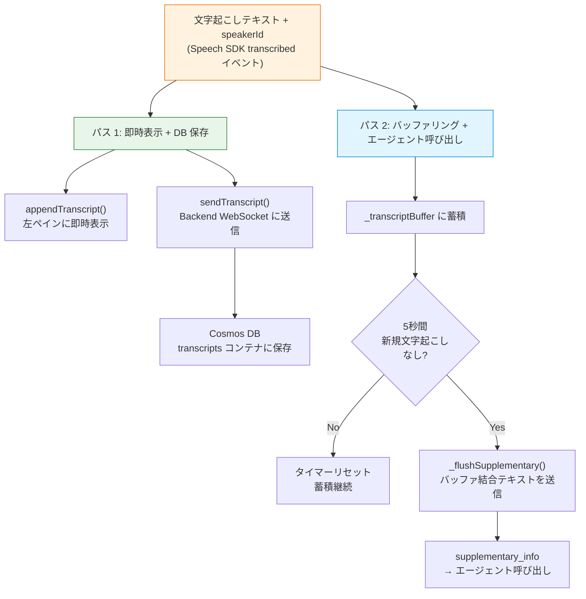
```mermaid
flowchart TD
    TRANSCRIPT["文字起こしテキスト + speakerId<br/>(Speech SDK transcribed イベント)"]

    TRANSCRIPT --> PATH1["パス 1: 即時表示 + DB 保存"]
    TRANSCRIPT --> PATH2["パス 2: バッファリング + エージェント呼び出し"]

    PATH1 --> UI["appendTranscript()<br/>左ペインに即時表示"]
    PATH1 --> WS_SEND["sendTranscript()<br/>Backend WebSocket に送信"]
    WS_SEND --> DB_SAVE["Cosmos DB<br/>transcripts コンテナに保存"]

    PATH2 --> BUF["_transcriptBuffer に蓄積"]
    BUF --> TIMER{"5秒間<br/>新規文字起こし<br/>なし?"}
    TIMER -->|No| BUF_WAIT["タイマーリセット<br/>蓄積継続"]
    TIMER -->|Yes| FLUSH["_flushSupplementary()<br/>バッファ結合テキストを送信"]
    FLUSH --> AGENT["supplementary_info<br/>→ エージェント呼び出し"]

    style TRANSCRIPT fill:#fff3e0,stroke:#ef6c00
    style PATH1 fill:#e8f5e9,stroke:#2e7d32
    style PATH2 fill:#e1f5fe,stroke:#0288d1
```

**重要なポイント**:
1. **文字起こしの DB 保存**（`transcript` メッセージ）と **エージェント呼び出し**（`supplementary_info` メッセージ）は **完全に分離** されている
2. DB 保存は文字起こし受信の都度即時実行される
3. エージェント呼び出しは無音検出後にバッチで実行される
4. 質問生成（`generate_questions`）は手動トリガーで、DB に保存済みの全文字起こしを使用する

---

## 8. データモデル

### 8.1 Cosmos DB コンテナ設計


```mermaid
erDiagram
    interviews {
        string id PK
        string interviewId "= id"
        string type "interview_metadata"
        string intervieweeName
        string intervieweeAffiliation
        string relatedInfo
        int durationMinutes
        string goal
        string status "not_started|in_progress|completed"
        string startedAt "nullable"
        string endedAt "nullable"
        string createdAt
        string updatedAt
    }

    transcripts {
        string id PK
        string interviewId FK
        string type "transcript_entry"
        string text
        string speakerId "Guest-1 / Guest-2 / Unknown"
        string timestamp
        int sequenceNumber
    }

    agent_responses {
        string id PK
        string interviewId FK
        string type "agent_response"
        string relatedInfo
        array suggestedQuestions
        array references
        string timestamp
        string triggerTranscriptId "nullable"
    }

    chat_messages {
        string id PK
        string interviewId FK
        string type "chat_message"
        string role
        string content
        string timestamp
    }

    reports {
        string id PK
        string interviewId FK
        string type "report"
        string markdownContent
        string status "generating|completed|failed"
        string createdAt
        string completedAt "nullable"
    }

    interview_records {
        string id PK
        string interviewId FK
        string type "interview_record"
        string intervieweeName
        string intervieweeAffiliation
        string relatedInfo
        string goal
        string interviewDate
        string startTime
        string endTime
        string curatedTranscript
        string reportMarkdown
        array embedding "float32 x 1536"
        string createdAt
        string updatedAt
    }

    interviews ||--o{ transcripts : "has many"
    interviews ||--o{ agent_responses : "has many"
    interviews ||--o{ chat_messages : "has many"
    interviews ||--o| reports : "has one"
    interviews ||--o| interview_records : "has one (with vector)"
```

全コンテナの **パーティションキー** は `/interviewId`。

---

## 9. インフラストラクチャ

### 9.1 Azure リソース構成

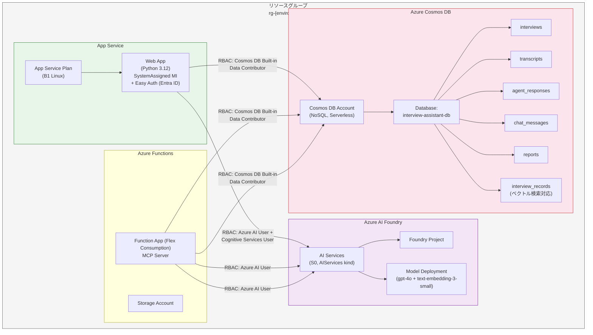
```mermaid
graph TB
    subgraph RG["リソースグループ<br/>rg-{environmentName}"]
        subgraph AppService["App Service"]
            PLAN["App Service Plan<br/>(B1 Linux)"]
            WEB["Web App<br/>(Python 3.12)<br/>SystemAssigned MI<br/>+ Easy Auth (Entra ID)"]
        end

        subgraph AI["Azure AI Foundry"]
            AIF["AI Services<br/>(S0, AIServices kind)"]
            PROJ["Foundry Project"]
            DEPLOY["Model Deployment<br/>(gpt-4o + text-embedding-3-small)"]
        end

        subgraph DB["Azure Cosmos DB"]
            COSMOS["Cosmos DB Account<br/>(NoSQL, Serverless)"]
            COSMOS_DB["Database:<br/>interview-assistant-db"]
            C1["interviews"]
            C2["transcripts"]
            C3["agent_responses"]
            C4["chat_messages"]
            C5["reports"]
            C6["interview_records<br/>(ベクトル検索対応)"]
        end

        subgraph FUNC["Azure Functions"]
            FA["Function App (Flex Consumption)<br/>MCP Server"]
            STOR["Storage Account"]
        end
    end

    WEB -->|"RBAC: Cosmos DB Built-in<br/>Data Contributor"| COSMOS
    WEB -->|"RBAC: Azure AI User +<br/>Cognitive Services User"| AIF
    FA -->|"RBAC: Cosmos DB Built-in<br/>Data Contributor"| COSMOS
    FA -->|"RBAC: Azure AI User"| AIF

    PLAN --> WEB
    AIF --> PROJ
    AIF --> DEPLOY
    COSMOS --> COSMOS_DB
    COSMOS_DB --> C1
    COSMOS_DB --> C2
    COSMOS_DB --> C3
    COSMOS_DB --> C4
    COSMOS_DB --> C5
    COSMOS_DB --> C6

    FA -->|"RBAC: Cosmos DB Built-in<br/>Data Contributor"| COSMOS
    FA -->|"RBAC: Azure AI User"| AIF

    style RG fill:#f5f5f5,stroke:#616161
    style AppService fill:#e8f5e9,stroke:#2e7d32
    style AI fill:#f3e5f5,stroke:#7b1fa2
    style DB fill:#fce4ec,stroke:#c62828
```

### 9.2 認証とセキュリティ

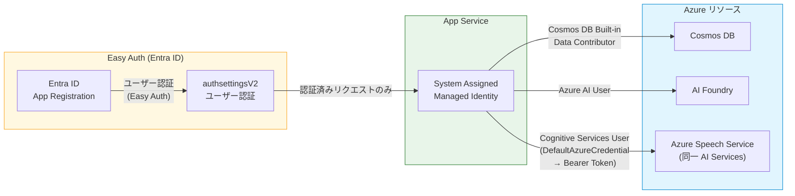
```mermaid
flowchart LR
    subgraph EasyAuth["Easy Auth (Entra ID)"]
        ENTRA["Entra ID<br/>App Registration"]
        AUTH["authsettingsV2<br/>ユーザー認証"]
    end

    subgraph AppService["App Service"]
        MI["System Assigned<br/>Managed Identity"]
    end

    subgraph Resources["Azure リソース"]
        COSMOS["Cosmos DB"]
        FOUNDRY["AI Foundry"]
        SPEECH["Azure Speech Service<br/>(同一 AI Services)"]
    end

    ENTRA -->|"ユーザー認証<br/>(Easy Auth)"| AUTH
    AUTH -->|"認証済みリクエストのみ"| MI
    MI -->|"Cosmos DB Built-in<br/>Data Contributor"| COSMOS
    MI -->|"Azure AI User"| FOUNDRY
    MI -->|"Cognitive Services User<br/>(DefaultAzureCredential<br/>→ Bearer Token)"|SPEECH

    style EasyAuth fill:#fff8e1,stroke:#f9a825
    style AppService fill:#e8f5e9,stroke:#2e7d32
    style Resources fill:#e1f5fe,stroke:#0288d1
```

- ユーザー認証は **App Service Easy Auth (Microsoft Entra ID)** で実施
  - `azd up` の `preprovision` フックで Entra ID App Registration + クライアントシークレットを自動作成
  - `postprovision` フックで App Service URL に基づくリダイレクト URI を自動設定
  - Bicep の `authsettingsV2` リソースで Easy Auth を構成
  - 未認証リクエストはログインページへリダイレクト
- すべての Azure リソースアクセスは **Managed Identity** で認証（組織ポリシー準拠）
- アクセスキー・接続文字列・SAS トークンは使用しない
- App Service の Basic 認証（SCM/FTP）は **無効化**
- Speech Service のトークンはバックエンドで取得し、フロントエンドに短期トークンとして提供

### 9.3 デプロイ

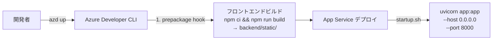
```mermaid
flowchart LR
    DEV["開発者"] -->|"azd up"| AZD["Azure Developer CLI"]
    AZD -->|"1. prepackage hook"| BUILD["フロントエンドビルド<br/>npm ci && npm run build<br/>→ backend/static/"]
    BUILD --> DEPLOY["App Service デプロイ"]
    DEPLOY -->|"startup.sh"| RUN["uvicorn app:app<br/>--host 0.0.0.0<br/>--port 8000"]
```

---

## 10. 並行処理と非同期設計

### 10.1 スレッドプール設計

```mermaid
flowchart TD
    subgraph AsyncLoop["asyncio イベントループ"]
        WS_HANDLER["WebSocket Handler<br/>(async)"]
        REST_HANDLER["REST Handler<br/>(async)"]
    end

    subgraph ThreadPool["ThreadPoolExecutor<br/>(max_workers=20)"]
        T1["Thread 1:<br/>agent_service.send_message()"]
        T2["Thread 2:<br/>cosmos_service.create_transcript()"]
        T3["Thread 3:<br/>agent_service.send_message()"]
        TN["Thread N:<br/>..."]
    end

    WS_HANDLER -->|"asyncio.to_thread()"| T1
    WS_HANDLER -->|"asyncio.to_thread()"| T2
    REST_HANDLER -->|"asyncio.to_thread()"| T3

    style AsyncLoop fill:#e1f5fe,stroke:#0288d1
    style ThreadPool fill:#fff3e0,stroke:#ef6c00
```

- FastAPI の async ハンドラから同期的な SDK 呼び出し（Azure SDK）を `asyncio.to_thread()` でスレッドプールに委譲
- `ThreadPoolExecutor(max_workers=20)` でエージェント呼び出しの並行性を確保
- 各 WebSocket メッセージタイプ（`supplementary_info`, `generate_questions`, `chat_message`）は `asyncio.create_task()` で非同期実行し、WebSocket の受信ループをブロックしない

### 10.2 WebSocket 接続管理

```mermaid
flowchart TD
    subgraph State["グローバル状態 (websocket.py)"]
        CONN["_connections<br/>dict[interview_id, list[WebSocket]]"]
        SEQ["_seq_counters<br/>dict[interview_id, int]"]
        CACHE["_interview_cache<br/>dict[interview_id, dict]"]
        INIT["_initial_done<br/>set[interview_id]"]
    end

    WS1["Client 1 WebSocket"] --> CONN
    WS2["Client 2 WebSocket"] --> CONN

    CONN -->|"ブロードキャスト"| WS1
    CONN -->|"ブロードキャスト"| WS2

    style State fill:#f3e5f5,stroke:#7b1fa2
```

- 同一 `interview_id` に対して複数の WebSocket 接続を管理可能
- エージェントの応答は同一 `interview_id` に接続している **全クライアントにブロードキャスト**
- `_initial_done` セットにより、初回接続時のエージェント初期化は1度のみ実行

---

## 11. エラーハンドリングと耐障害性

| コンポーネント | エラー処理 |
|---|---|
| Agent Service | Rate Limit (429) に対する指数バックオフリトライ（最大5回） |
| WebSocket Handler | 各メッセージタイプのエージェント呼び出しに 60 秒タイムアウト。タイムアウト/例外はログ出力のみ |
| Report Service | 例外時は `status: "failed"` + エラー詳細を Markdown として reports に保存 |
| Frontend WebSocket | 切断時 3 秒後に自動再接続 |
| Speech SDK エラー | エラーイベントをコンソール出力。`stopTranscribingAsync()` でリソース解放 |
| Agent Response Parse | JSON パース失敗時は生テキストを `relatedInfo` にフォールバック |
| App Startup | エージェント初期化失敗時はログ出力のみ。初回リクエスト時にリトライ |

---

## 12. 技術的制約と設計判断

| 制約/判断 | 理由 |
|---|---|
| Azure Speech SDK を文字起こしに使用 | `ConversationTranscriber.startTranscribingAsync` で連続会話文字起こしと話者分離を同時に実行。SDK がマイク入力・WebSocket通信を管理 |
| Speech SDK CDN 版使用 | npm 依存なしでブラウザで動作。AudioWorklet/PCM16変換不要 |
| 毎回新規 conversation を作成 | Role 間のコンテキスト汚染防止。各リクエストは独立した文脈で処理 |
| レポート生成は直接モデル呼び出し | エージェントの JSON 出力制約が Markdown レポートに不適合 |
| フロントエンドの無音検出（5秒） | 発話中のエージェント呼び出しを抑制し、まとまった内容で補足情報を生成 |
| 文字起こし直近 5000 文字のみ使用 | コンテキストウィンドウ制限への対応 |
| トークン推定: 3文字≈1トークン | 日本語テキストの粗い推定。チャンク分割の判定に使用 |
| Cosmos DB コンテナ分割方式 | クエリパターンの明確さと開発効率を優先 |
