# Interview Assistant AI — アーキテクチャ詳細ドキュメント

## 1. 全体アーキテクチャ概要

Interview Assistant AI は、インタビュー中のリアルタイム音声文字起こしと AI エージェントによるインタビュー支援を提供するブラウザベースの Web アプリケーションである。エキスパート（Interviewee）の暗黙知を素人（Interviewer）が効果的に引き出すことを目的とし、専門用語の補足説明・次の質問案提示・参照ドキュメントリンク提示を AI エージェントが自動的に行う。

### 1.1 全体構成図

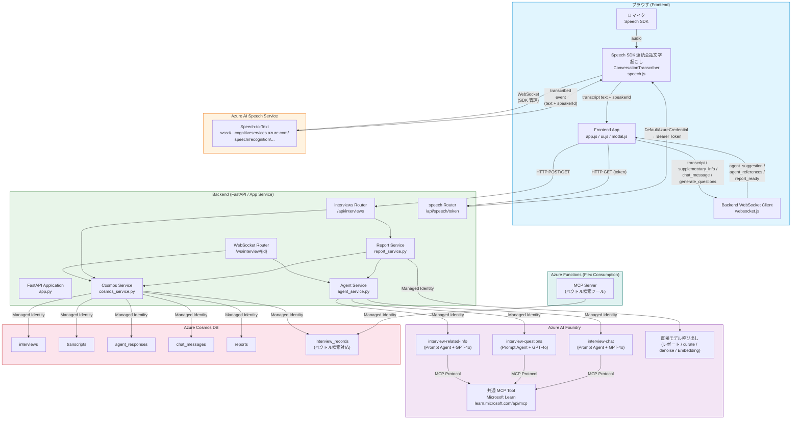
```mermaid
graph TB
    subgraph Browser["ブラウザ (Frontend)"]
        MIC["🎤 マイク<br/>Speech SDK"]
        SPEECH_JS["Speech SDK 連続会話文字起こし<br/>ConversationTranscriber<br/>speech.js"]
        FE["Frontend App<br/>app.js / ui.js / modal.js"]
        BE_WS["Backend WebSocket Client<br/>websocket.js"]
    end

    subgraph Azure_Speech["Azure AI Speech Service"]
        SPEECH_API["Speech-to-Text<br/>wss://...cognitiveservices.azure.com/<br/>speech/recognition/..."]
    end

    subgraph Backend["Backend (FastAPI / App Service)"]
        APP["FastAPI Application<br/>app.py"]
        R_INT["interviews Router<br/>/api/interviews"]
        R_SP["speech Router<br/>/api/speech/token"]
        R_WS["WebSocket Router<br/>/ws/interview/{id}"]
        AGT_SVC["Agent Service<br/>agent_service.py"]
        COS_SVC["Cosmos Service<br/>cosmos_service.py"]
        RPT_SVC["Report Service<br/>report_service.py"]
    end

    subgraph Azure_AI["Azure AI Foundry"]
        AGENT_RI["interview-related-info<br/>(Prompt Agent + GPT-4o)"]
        AGENT_Q["interview-questions<br/>(Prompt Agent + GPT-4o)"]
        AGENT_C["interview-chat<br/>(Prompt Agent + GPT-4o)"]
        DIRECT["直接モデル呼び出し<br/>(レポート / curate / denoise / Embedding)"]
        MCP["共通 MCP Tool<br/>Microsoft Learn<br/>learn.microsoft.com/api/mcp"]
    end

    subgraph Azure_Cosmos["Azure Cosmos DB"]
        DB_INT["interviews"]
        DB_TR["transcripts"]
        DB_AR["agent_responses"]
        DB_CM["chat_messages"]
        DB_RP["reports"]
        DB_IR["interview_records<br/>(ベクトル検索対応)"]
    end

    subgraph Azure_Functions["Azure Functions (Flex Consumption)"]
        MCP_SRV["MCP Server<br/>(ベクトル検索ツール)"]
    end

    MIC -->|"audio"| SPEECH_JS
    SPEECH_JS -->|"WebSocket<br/>(SDK 管理)"| SPEECH_API
    SPEECH_API -->|"transcribed<br/>event<br/>(text + speakerId)"| SPEECH_JS
    SPEECH_JS -->|"transcript text + speakerId"| FE

    FE -->|"transcript / supplementary_info /<br/>chat_message / generate_questions"| BE_WS
    BE_WS -->|"agent_suggestion /<br/>agent_references /<br/>report_ready"| FE

    FE -->|"HTTP POST/GET"| R_INT
    FE -->|"HTTP GET (token)"| R_SP

    R_SP -->|"DefaultAzureCredential<br/>→ Bearer Token"| SPEECH_JS

    R_WS --> AGT_SVC
    R_WS --> COS_SVC
    R_INT --> COS_SVC
    R_INT --> RPT_SVC
    RPT_SVC --> AGT_SVC
    RPT_SVC --> COS_SVC

    AGT_SVC -->|"Managed Identity"| AGENT_RI
    AGT_SVC -->|"Managed Identity"| AGENT_Q
    AGT_SVC -->|"Managed Identity"| AGENT_C
    RPT_SVC -->|"Managed Identity"| DIRECT
    AGENT_RI -->|"MCP Protocol"| MCP
    AGENT_Q -->|"MCP Protocol"| MCP
    AGENT_C -->|"MCP Protocol"| MCP
    COS_SVC -->|"Managed Identity"| DB_INT
    COS_SVC -->|"Managed Identity"| DB_TR
    COS_SVC -->|"Managed Identity"| DB_AR
    COS_SVC -->|"Managed Identity"| DB_CM
    COS_SVC -->|"Managed Identity"| DB_RP
    COS_SVC -->|"Managed Identity"| DB_IR
    MCP_SRV -->|"Managed Identity"| DB_IR

    style Browser fill:#e1f5fe,stroke:#0288d1
    style Azure_Speech fill:#fff3e0,stroke:#ef6c00
    style Backend fill:#e8f5e9,stroke:#2e7d32
    style Azure_AI fill:#f3e5f5,stroke:#7b1fa2
    style Azure_Cosmos fill:#fce4ec,stroke:#c62828
    style Azure_Functions fill:#e0f2f1,stroke:#00695c
```

---

## 2. 通信プロトコルとデータフロー

本アプリケーションには **2 系統の WebSocket 接続** と **REST API** が存在する。

### 2.1 通信チャネル一覧

| チャネル | プロトコル | 接続元 → 接続先 | 用途 |
|---|---|---|---|
| Speech SDK WebSocket | WSS | ブラウザ (Speech SDK) → Azure Speech Service | 音声データ送信 + 文字起こし受信 (SDK管理) |
| Backend WebSocket | WS/WSS | ブラウザ → FastAPI Backend | 文字起こし転送・エージェント応答受信 |
| REST API | HTTPS | ブラウザ → FastAPI Backend | インタビューCRUD・トークン取得・レポート取得 |
| Agent API | HTTPS | FastAPI Backend → Azure AI Foundry | エージェント会話 |
| Cosmos DB | HTTPS | FastAPI Backend → Azure Cosmos DB | データ永続化 |

### 2.2 全体データフローシーケンス

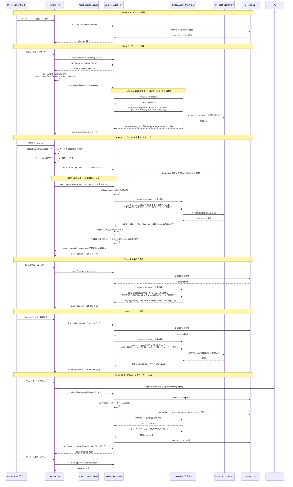
```mermaid
sequenceDiagram
    participant User as Interviewer (ブラウザ)
    participant FE as Frontend (JS)
    participant Speech as Azure Speech Service
    participant BE_WS as Backend WebSocket
    participant AGT as Foundry Agent (役割別 3 つ)
    participant MCP as Microsoft Learn MCP
    participant DB as Cosmos DB

    Note over User,DB: Phase 1: インタビュー準備
    User->>FE: インタビュー詳細登録 (モーダル)
    FE->>BE_WS: POST /api/interviews (REST)
    BE_WS->>DB: interviews コンテナに保存
    DB-->>BE_WS: interview doc (id 発行)
    BE_WS-->>FE: interview JSON

    Note over User,DB: Phase 2: インタビュー開始
    User->>FE: 「開始」ボタンクリック
    FE->>BE_WS: POST /api/interviews/{id}/start (REST)
    FE->>BE_WS: GET /api/speech/token (REST)
    BE_WS-->>FE: Bearer Token + endpoint

    FE->>FE: Speech SDK 連続認識開始<br/>(SpeechConfig.fromEndpoint + TokenCredential)

    FE->>BE_WS: WebSocket接続 (/ws/interview/{id})

    Note over BE_WS, AGT: 初回接続: questions エージェントで挨拶+最初の質問
    BE_WS->>AGT: conversations.create()
    AGT-->>BE_WS: conversation_id
    BE_WS->>AGT: send_message(QUESTIONS_AGENT_NAME,<br/>"[インタビュー開始] + インタビュー情報")
    AGT->>MCP: microsoft_docs_search (必要に応じて)
    MCP-->>AGT: 検索結果
    AGT-->>BE_WS: JSON (related_info=挨拶 + suggested_questions=[1件])
    BE_WS-->>FE: agent_suggestion メッセージ

    Note over User,DB: Phase 3: リアルタイム文字起こしループ
    User->>FE: 音声入力 (マイク)
    FE->>FE: Speech SDK transcribed イベントでテキストと speakerId を取得
    FE->>FE: 左ペインに話者アイコンつき文字起こし表示
    FE->>BE_WS: {type: "transcript", text: "...", speakerId: "Guest-1"}
    BE_WS->>DB: transcripts コンテナに保存（speakerId 含む）

    Note over FE,BE_WS: 5秒間の無音検出 → 補足情報リクエスト
    FE->>BE_WS: {type: "supplementary_info", text: "バッファ結合テキスト"}
    BE_WS->>BE_WS: rolling deque(maxlen=5) に追加
    BE_WS->>AGT: conversations.create() (新規会話)
    BE_WS->>AGT: send_message(RELATED_INFO_AGENT_NAME,<br/>"[文字起こし] + 直近5チャンク + 既出キーワードリスト")
    AGT->>MCP: 専門用語検索 (必要に応じて)
    MCP-->>AGT: ドキュメント情報
    AGT-->>BE_WS: JSON (related_info + keywords + references) または空応答
    BE_WS->>BE_WS: keywords を _used_keywords にマージ
    BE_WS->>BE_WS: related_info 内のリンク URL を references に自動補完
    BE_WS-->>FE: agent_suggestion (relatedInfo が空でなければ送信)
    BE_WS-->>FE: agent_references (参照リンク)

    Note over User,DB: Phase 4: 手動質問生成
    User->>FE: 「次の質問を生成」ボタン
    FE->>BE_WS: {type: "generate_questions"}
    BE_WS->>DB: 全文字起こし取得
    DB-->>BE_WS: transcript list
    BE_WS->>AGT: conversations.create() (新規会話)
    BE_WS->>AGT: send_message(QUESTIONS_AGENT_NAME,<br/>"[質問生成] + 末尾30000字 + 末尾2000字 (中心トピック特定用)")
    AGT-->>BE_WS: JSON (suggested_questions: deepdive/broaden/challenge × 3)
    BE_WS-->>FE: agent_suggestion (質問案のみ)

    Note over User,DB: Phase 5: チャット質問
    User->>FE: チャットボックスで質問入力
    FE->>BE_WS: {type: "chat_message", content: "..."}
    BE_WS->>DB: 全文字起こし取得
    DB-->>BE_WS: transcript list
    BE_WS->>AGT: conversations.create() (新規会話)
    BE_WS->>AGT: send_message(CHAT_AGENT_NAME,<br/>"[Q&A] + 質問サンドイッチ配置 + 末尾20000字 + インタビュー情報")
    AGT->>MCP: 検索 (用語の意味質問など必要時のみ)
    MCP-->>AGT: 結果
    AGT-->>BE_WS: JSON (related_info=回答 + references)
    BE_WS-->>FE: agent_suggestion (cardTitle: チャット)

    Note over User,DB: Phase 6: インタビュー終了 + レポート生成
    User->>FE: 「終了」ボタンクリック
    FE->>VL: Speech SDK 停止 (stopTranscribingAsync)
    FE->>BE_WS: POST /api/interviews/{id}/stop (REST)
    BE_WS->>DB: status → completed
    BE_WS->>BE_WS: BackgroundTask: レポート生成開始

    BE_WS->>DB: transcripts / agent_responses / chat_messages 取得
    BE_WS->>AGT: transcript ノイズ除去 (denoise)
    AGT-->>BE_WS: クリーンテキスト
    BE_WS->>AGT: レポート生成プロンプト (直接モデル呼び出し)
    AGT-->>BE_WS: Markdown レポート
    BE_WS->>DB: reports コンテナに保存

    FE->>BE_WS: GET /api/interviews/{id}/report/status (ポーリング)
    BE_WS-->>FE: {status: "completed"}
    User->>FE: 「レポート表示」ボタン
    FE->>BE_WS: GET /api/interviews/{id}/report
    BE_WS-->>FE: Markdown レポート
```

---

## 3. フロントエンドアーキテクチャ

### 3.1 モジュール構成

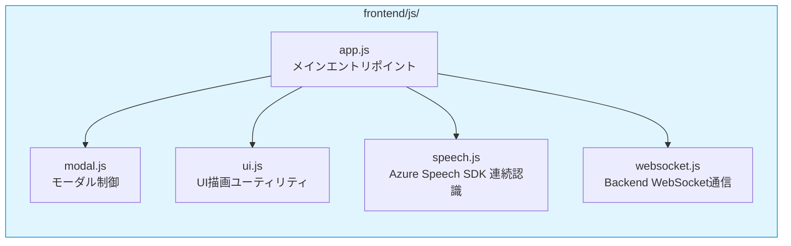
```mermaid
graph LR
    subgraph Frontend["frontend/js/"]
        APP["app.js<br/>メインエントリポイント"]
        MODAL["modal.js<br/>モーダル制御"]
        UI["ui.js<br/>UI描画ユーティリティ"]
        SPEECH["speech.js<br/>Azure Speech SDK 連続認識"]
        WS["websocket.js<br/>Backend WebSocket通信"]
    end

    APP --> MODAL
    APP --> UI
    APP --> SPEECH
    APP --> WS

    style Frontend fill:#e1f5fe,stroke:#0288d1
```

| モジュール | 責務 |
|---|---|
| `app.js` | アプリケーションのメインエントリポイント。各モジュールの初期化、ボタンイベントのバインド、インタビューライフサイクル管理（開始・停止・レポート表示）。レポートポーリング制御 |
| `modal.js` | インタビュー詳細登録モーダルの表示/非表示制御、フォーム送信ハンドリング。`initModal(callback)` で登録完了コールバックを設定 |
| `ui.js` | DOM 操作ユーティリティ。文字起こし表示、AI提案カード描画、参照リンク追加、レポートモーダル描画。Markdown の簡易レンダリング、HTML エスケープ処理 |
| `speech.js` | Azure Speech SDK による連続会話文字起こし（`ConversationTranscriber`）。バックエンドから取得したEntra IDトークンで `SpeechConfig.fromEndpoint(URL, TokenCredential)` を構成。`transcribed` イベントで確定テキストと `speakerId` をコールバックに返す |
| `websocket.js` | バックエンド WebSocket との通信管理。文字起こし転送（バッファリング+無音検出）、補足情報リクエスト、質問生成リクエスト、チャットメッセージ送信。自動再接続機能 |

### 3.2 フロントエンドの状態管理

フロントエンドは Vanilla JS で構成されておりフレームワークを使用しない。状態管理はモジュールスコープのグローバル変数で行う。

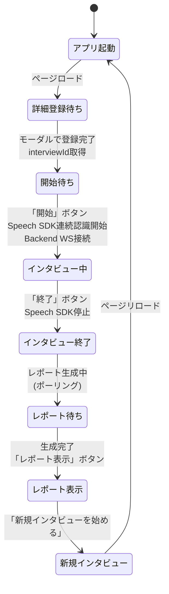
```mermaid
stateDiagram-v2
    [*] --> アプリ起動
    アプリ起動 --> 詳細登録待ち: ページロード
    詳細登録待ち --> 開始待ち: モーダルで登録完了<br/>interviewId取得
    開始待ち --> インタビュー中: 「開始」ボタン<br/>Speech SDK連続認識開始<br/>Backend WS接続
    インタビュー中 --> インタビュー終了: 「終了」ボタン<br/>Speech SDK停止
    インタビュー終了 --> レポート待ち: レポート生成中<br/>(ポーリング)
    レポート待ち --> レポート表示: 生成完了<br/>「レポート表示」ボタン
    レポート表示 --> 新規インタビュー: 「新規インタビューを始める」
    新規インタビュー --> アプリ起動: ページリロード
```

### 3.3 音声キャプチャ

Speech SDK の `AudioConfig.fromDefaultMicrophoneInput()` がブラウザのマイク入力を直接管理する。
AudioWorklet や手動の PCM16 変換は不要（SDK が内部的に処理）。

---

## 4. バックエンドアーキテクチャ

### 4.1 モジュール構成

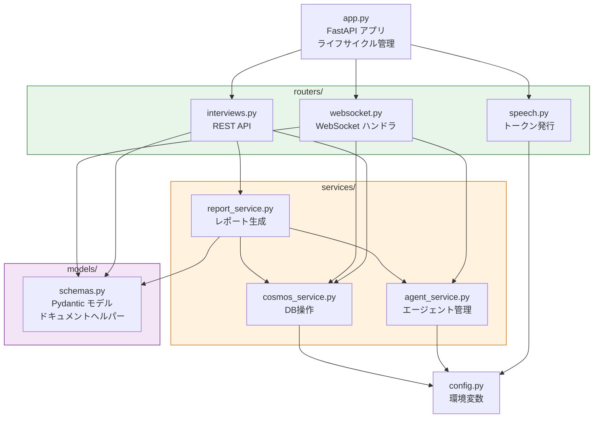
```mermaid
graph TB
    subgraph Routers["routers/"]
        R_INT["interviews.py<br/>REST API"]
        R_SP["speech.py<br/>トークン発行"]
        R_WS["websocket.py<br/>WebSocket ハンドラ"]
    end

    subgraph Services["services/"]
        AGT["agent_service.py<br/>エージェント管理"]
        COS["cosmos_service.py<br/>DB操作"]
        RPT["report_service.py<br/>レポート生成"]
    end

    subgraph Models["models/"]
        SCH["schemas.py<br/>Pydantic モデル<br/>ドキュメントヘルパー"]
    end

    APP_PY["app.py<br/>FastAPI アプリ<br/>ライフサイクル管理"]
    CFG["config.py<br/>環境変数"]

    APP_PY --> R_INT
    APP_PY --> R_SP
    APP_PY --> R_WS

    R_INT --> COS
    R_INT --> RPT
    R_SP --> CFG
    R_WS --> AGT
    R_WS --> COS
    RPT --> AGT
    RPT --> COS

    AGT --> CFG
    COS --> CFG

    R_INT --> SCH
    R_WS --> SCH
    RPT --> SCH

    style Routers fill:#e8f5e9,stroke:#2e7d32
    style Services fill:#fff3e0,stroke:#ef6c00
    style Models fill:#f3e5f5,stroke:#7b1fa2
```

### 4.2 REST API エンドポイント

| メソッド | パス | 説明 |
|---|---|---|
| `POST` | `/api/interviews` | インタビュー作成 |
| `GET` | `/api/interviews/{id}` | インタビュー詳細取得 |
| `POST` | `/api/interviews/{id}/start` | インタビュー開始（status → `in_progress`） |
| `POST` | `/api/interviews/{id}/stop` | インタビュー終了（status → `completed`）+ レポート生成開始 |
| `GET` | `/api/interviews/{id}/report` | レポート取得 |
| `GET` | `/api/interviews/{id}/report/status` | レポート生成状況取得 |
| `GET` | `/api/speech/token` | Azure Speech Service 用 Bearer トークン取得 |

### 4.3 WebSocket メッセージプロトコル

#### クライアント → サーバー（受信メッセージ）

| `type` | ペイロード | 説明 |
|---|---|---|
| `transcript` | `{text, timestamp}` | 文字起こしテキストの保存 |
| `supplementary_info` | `{text}` | 補足情報リクエスト（バッファされた文字起こしテキスト） |
| `generate_questions` | `{}` | 質問生成リクエスト |
| `chat_message` | `{content}` | Interviewer のチャット質問 |

#### サーバー → クライアント（送信メッセージ）

| `type` | ペイロード | 説明 |
|---|---|---|
| `agent_suggestion` | `{relatedInfo, suggestedQuestions, references, cardTitle?}` | エージェントの提案（関連情報・質問案） |
| `agent_references` | `{references}` | 参照リンク（重複なしで右ペインに追加） |
| `report_ready` | `{reportId}` | レポート生成完了通知 |

### 4.4 アプリケーション起動フロー

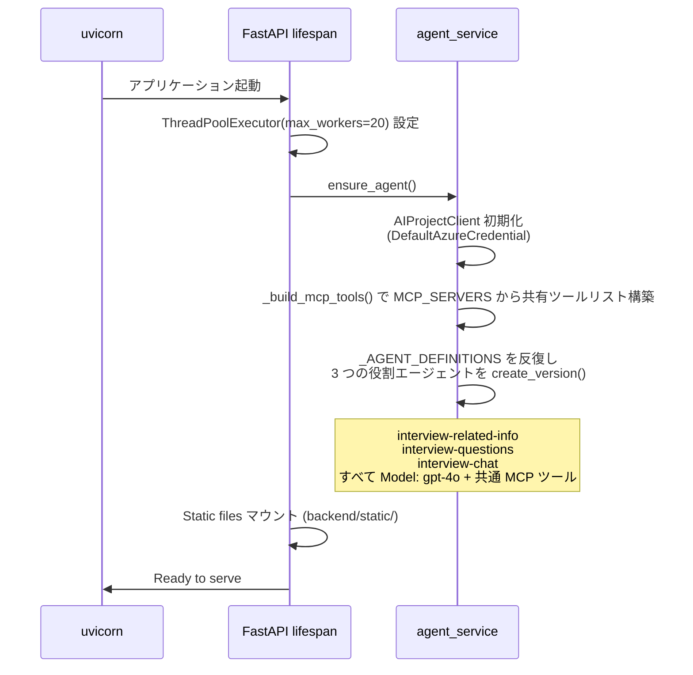
```mermaid
sequenceDiagram
    participant Process as uvicorn
    participant App as FastAPI lifespan
    participant AGT as agent_service

    Process->>App: アプリケーション起動
    App->>App: ThreadPoolExecutor(max_workers=20) 設定
    App->>AGT: ensure_agent()
    AGT->>AGT: AIProjectClient 初期化<br/>(DefaultAzureCredential)
    AGT->>AGT: _build_mcp_tools() で MCP_SERVERS から共有ツールリスト構築
    AGT->>AGT: _AGENT_DEFINITIONS を反復し<br/>3 つの役割エージェントを create_version()
    Note over AGT: interview-related-info<br/>interview-questions<br/>interview-chat<br/>すべて Model: gpt-4o + 共通 MCP ツール
    App->>App: Static files マウント (backend/static/)
    App->>Process: Ready to serve
```

---

## 5. エージェントアーキテクチャ

### 5.1 エージェント概要

本アプリケーションは **役割別 3 つの Foundry Prompt Agent** を使用する。それぞれの SYSTEM_PROMPT は役割に純化されており、互いに干渉しないよう分離されている。3 エージェントはすべて同じ MCP ツールセット（Microsoft Learn）を共有する。各役割は **毎回新規の会話（conversation）を作成** してコンテキスト汚染を防ぐ（ステートレス）。

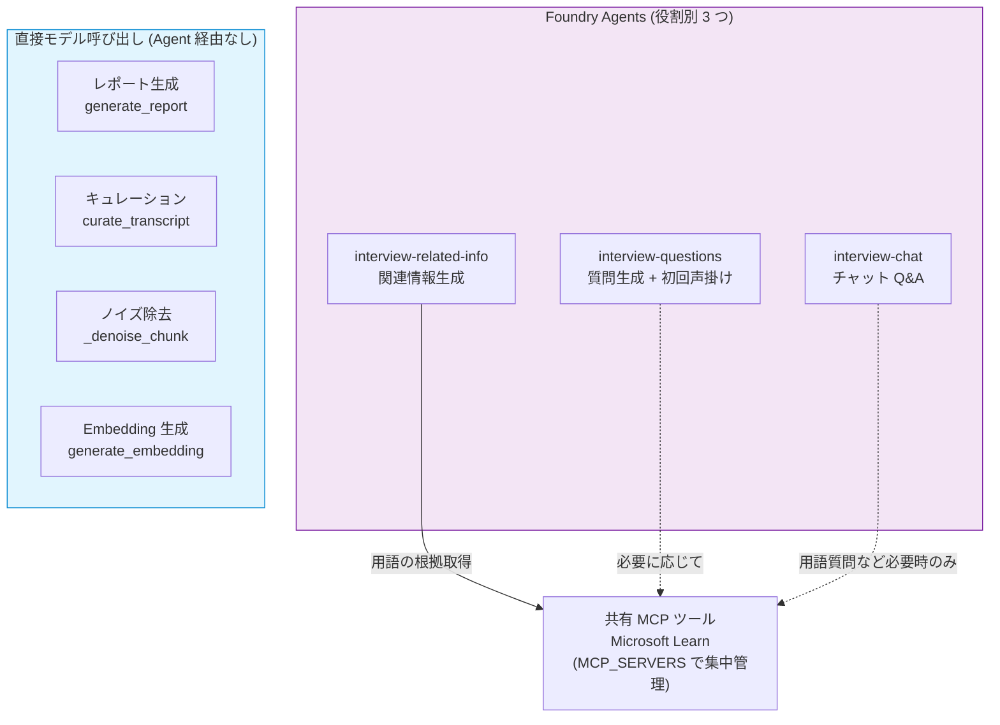
```mermaid
graph TB
    subgraph Agents["Foundry Agents (役割別 3 つ)"]
        AGT_RI["interview-related-info<br/>関連情報生成"]
        AGT_Q["interview-questions<br/>質問生成 + 初回声掛け"]
        AGT_C["interview-chat<br/>チャット Q&A"]
    end

    subgraph Direct["直接モデル呼び出し (Agent 経由なし)"]
        REPORT["レポート生成<br/>generate_report"]
        CURATE["キュレーション<br/>curate_transcript"]
        DENOISE["ノイズ除去<br/>_denoise_chunk"]
        EMBED["Embedding 生成<br/>generate_embedding"]
    end

    MCP["共有 MCP ツール<br/>Microsoft Learn<br/>(MCP_SERVERS で集中管理)"]

    AGT_RI -->|"用語の根拠取得"| MCP
    AGT_Q -.->|"必要に応じて"| MCP
    AGT_C -.->|"用語質問など必要時のみ"| MCP

    style Agents fill:#f3e5f5,stroke:#7b1fa2
    style Direct fill:#e1f5fe,stroke:#0288d1
```

### 5.2 各役割の詳細

#### Role 0: 初期化（WebSocket 初回接続時、`interview-questions` エージェント）

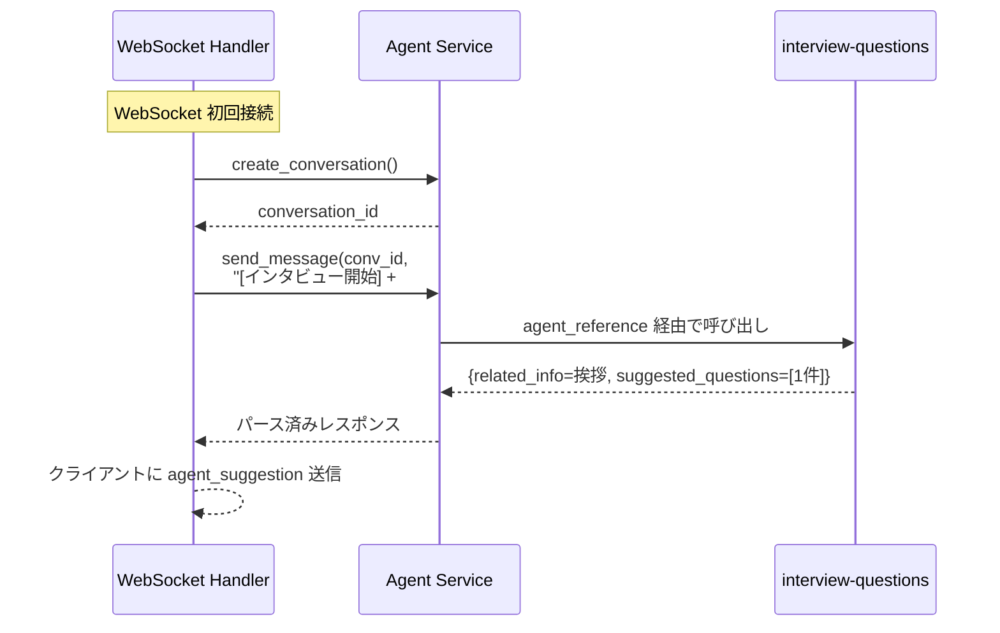
```mermaid
sequenceDiagram
    participant WS as WebSocket Handler
    participant AGT as Agent Service
    participant Q as interview-questions

    Note over WS: WebSocket 初回接続
    WS->>AGT: create_conversation()
    AGT-->>WS: conversation_id
    WS->>AGT: send_message(conv_id,<br/>"[インタビュー開始] + ## インタビュー情報",<br/>QUESTIONS_AGENT_NAME)
    AGT->>Q: agent_reference 経由で呼び出し
    Q-->>AGT: {related_info=挨拶, suggested_questions=[1件]}
    AGT-->>WS: パース済みレスポンス
    WS-->>WS: クライアントに agent_suggestion 送信
```

**担当エージェント**: `interview-questions`（プレフィックス `[インタビュー開始]` でモード判別）
**トリガー**: WebSocket 初回接続時（`interview_id` が `_initial_done` セットにない場合）
**入力**: インタビュー情報（対象者名、所属、関連情報、時間、ゴール）
**出力**: 最初の声掛け内容案（`related_info`）+ 初期質問 1 個（`suggested_questions`）
**会話管理**: 新規 conversation を作成（この conversation は使い捨て）

---

#### Role 1: 関連情報生成（`_handle_supplementary` / `interview-related-info` エージェント）

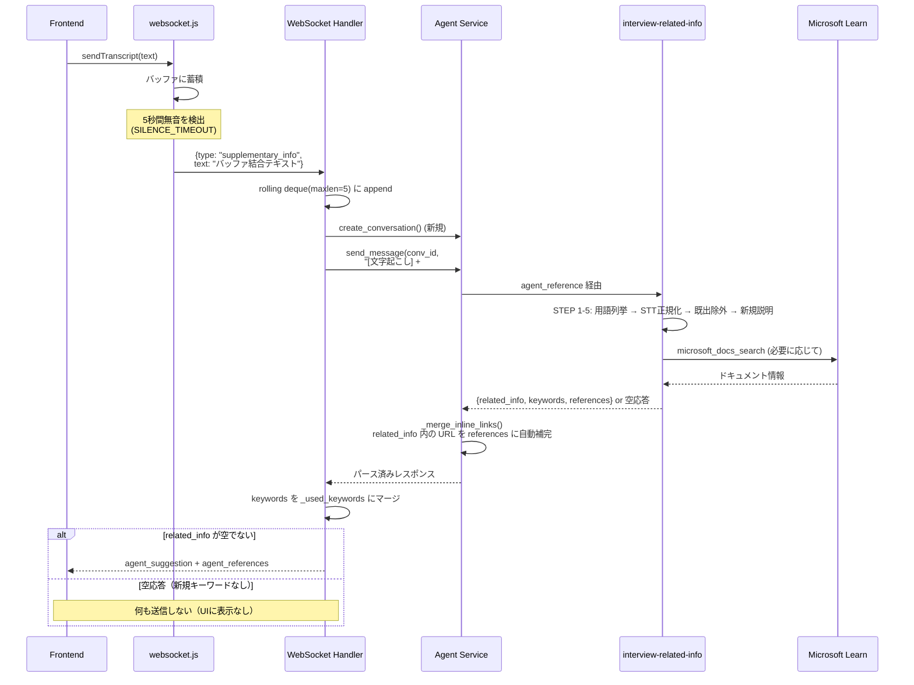
```mermaid
sequenceDiagram
    participant FE as Frontend
    participant WS_CLI as websocket.js
    participant WS_SRV as WebSocket Handler
    participant AGT as Agent Service
    participant RI as interview-related-info
    participant MCP as Microsoft Learn

    FE->>WS_CLI: sendTranscript(text)
    WS_CLI->>WS_CLI: バッファに蓄積
    Note over WS_CLI: 5秒間無音を検出<br/>(SILENCE_TIMEOUT)
    WS_CLI->>WS_SRV: {type: "supplementary_info",<br/>text: "バッファ結合テキスト"}
    WS_SRV->>WS_SRV: rolling deque(maxlen=5) に append
    WS_SRV->>AGT: create_conversation() (新規)
    WS_SRV->>AGT: send_message(conv_id,<br/>"[文字起こし] + ## インタビュー情報<br/> + ## 直近5チャンク + ## 既出キーワードリスト",<br/>RELATED_INFO_AGENT_NAME)
    AGT->>RI: agent_reference 経由
    RI->>RI: STEP 1-5: 用語列挙 → STT正規化 → 既出除外 → 新規説明
    RI->>MCP: microsoft_docs_search (必要に応じて)
    MCP-->>RI: ドキュメント情報
    RI-->>AGT: {related_info, keywords, references} or 空応答
    AGT->>AGT: _merge_inline_links()<br/>related_info 内の URL を references に自動補完
    AGT-->>WS_SRV: パース済みレスポンス
    WS_SRV->>WS_SRV: keywords を _used_keywords にマージ
    alt related_info が空でない
        WS_SRV-->>FE: agent_suggestion + agent_references
    else 空応答（新規キーワードなし）
        Note over WS_SRV,FE: 何も送信しない（UIに表示なし）
    end
```

**担当エージェント**: `interview-related-info`
**トリガー**: フロントエンドの **5秒間の無音検出**（`SILENCE_TIMEOUT = 5000ms`）
- `websocket.js` が文字起こしテキストをバッファに蓄積
- 最後の文字起こしから 5 秒間新しい文字起こしが来なかった場合、バッファを結合して `supplementary_info` メッセージを送信
- バッファはフラッシュ後にクリアされる

**フィルタ条件**: テキストが 10 文字未満の場合はスキップ
**入力コンテキスト**:
- `## インタビュー情報`: 対象者・所属・関連情報・ゴール
- `## 直近の文字起こしチャンク`: **直近 5 チャンク**（per-interview の `deque(maxlen=SUPPLEMENTARY_CHUNK_WINDOW=5)` で管理）
- `## 既に説明済みのキーワード`: per-interview に保持された既出キーワードリスト（大文字小文字無視で重複除去、順序保持）

**SYSTEM_PROMPT に含まれるロジック**:
1. **列挙**: 直近チャンク全体から重要用語（専門用語・製品名・技術概念・人名・組織名・固有名詞・業界用語・略語等）をすべて列挙
2. **Speech-to-Text 誤認識正規化**: インタビュー情報と文脈に基づいて正式名称に書き換え（例: 「フォラグ」→「RAG」、「ハレシネーション」→「ハルシネーション」）
3. **既出除外**: 既出キーワードリストに含まれるもの（表記揺れ・略称・別名含む）を除外
4. **新規キーワードの説明**: 新規キーワードがあれば必ずすべて related_info に説明、`keywords` に正規化後の正式名称で列挙
5. **空応答**: 新規キーワードがゼロの場合のみ `related_info=""`, `keywords=[]`, `references=[]`
6. **references / related_info 整合性**: related_info 内のすべてのマークダウンリンク URL を references に対応させる（URL 完全一致、捏造禁止）

**バックエンドのセーフティネット**: `_parse_agent_response` 内の `_merge_inline_links()` が related_info 内の `[text](url)` を正規表現抽出し、references に自動マージ（URL 重複は除去、既存 title 優先）。

**出力**: `relatedInfo` + `keywords` + `references`、`suggestedQuestions=[]` 強制
**UI 抑制**: `relatedInfo` が空の場合は `agent_suggestion` も `agent_references` も**送信しない**（UI に何も表示されない）
**会話管理**: 毎回新規 conversation
**非同期**: `asyncio.create_task()` で非同期実行
**タイムアウト**: 60 秒（`AGENT_TIMEOUT`）

---

#### Role 2: 質問生成（`_handle_generate_questions` / `interview-questions` エージェント）

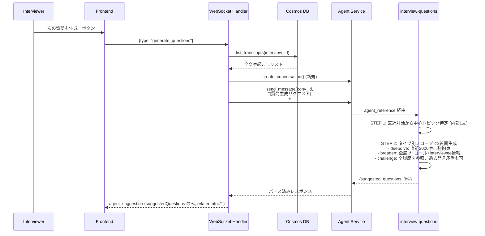
```mermaid
sequenceDiagram
    participant User as Interviewer
    participant FE as Frontend
    participant WS_SRV as WebSocket Handler
    participant DB as Cosmos DB
    participant AGT as Agent Service
    participant Q as interview-questions

    User->>FE: 「次の質問を生成」ボタン
    FE->>WS_SRV: {type: "generate_questions"}
    WS_SRV->>DB: list_transcripts(interview_id)
    DB-->>WS_SRV: 全文字起こしリスト
    WS_SRV->>AGT: create_conversation() (新規)
    WS_SRV->>AGT: send_message(conv_id,<br/>"[質問生成リクエスト]<br/>+ ## インタビュー情報<br/>+ ## 文字起こし全履歴 (末尾30,000字)<br/>+ ## 直近の対話 (末尾2,000字)",<br/>QUESTIONS_AGENT_NAME)
    AGT->>Q: agent_reference 経由
    Q->>Q: STEP 1: 直近対話から中心トピック特定 (内部1文)
    Q->>Q: STEP 2: タイプ別スコープで3質問生成<br/>- deepdive: 直近2000字に強拘束<br/>- broaden: 全履歴+ゴール+Interviewee情報<br/>- challenge: 全履歴を参照、過去発言矛盾も可
    Q-->>AGT: {suggested_questions: 3件}
    AGT-->>WS_SRV: パース済みレスポンス
    WS_SRV-->>FE: agent_suggestion (suggestedQuestions のみ, relatedInfo="")
```

**担当エージェント**: `interview-questions`（プレフィックス `[質問生成リクエスト]` でモード判別）
**トリガー**: Interviewer が **「次の質問を生成」ボタン** をクリック
- フロントエンドではクリック後 10 秒間ボタンを無効化（連打防止）

**入力コンテキスト**:
- `## インタビュー情報`: 対象者・所属・関連情報・ゴール
- `## 文字起こし全履歴（直近部分）`: 末尾 **`QUESTIONS_HISTORY_CHARS = 30000` 字**（≒直近 50〜60 分相当）
- `## 直近の対話`: 末尾 **`QUESTIONS_RECENT_CHARS = 2000` 字**（中心トピック特定用）

**SYSTEM_PROMPT に含まれるロジック**:
1. **中心トピック特定**: 「直近の対話」から中心トピックを内部的に1文で特定。短すぎる場合は全履歴を遡って文脈補完
2. **3 タイプの質問をタイプ別スコープで生成**:
   - **deepdive**: 直近 2,000 字の中心トピックに**強く拘束**、具体例・判断基準・例外を深掘り
   - **broaden**: 全履歴 30,000 字 + ゴール + Interviewee 関連情報を**見渡し**、未掘削領域・別観点・ゴール上重要な周辺領域に拡張、関連性を rationale で 1 文明示
   - **challenge**: 中心トピックの前提・矛盾・例外を問う、過去発言との矛盾も全履歴から探して突くことが可
3. **共通**: 3 つすべて中心トピックと何らかの関連性を持つこと（無関係な題材への飛躍禁止）、ゴール達成と暗黙知抽出を最優先

**出力**: `suggestedQuestions` 3 件（deepdive / broaden / challenge を 1 つずつ）、`relatedInfo=""`, `keywords=[]`, `references=[]` 強制
**会話管理**: 毎回新規 conversation
**非同期**: `asyncio.create_task()` で非同期実行
**タイムアウト**: 60 秒

---

#### Role 3: チャット Q&A（`_handle_chat_message` / `interview-chat` エージェント）

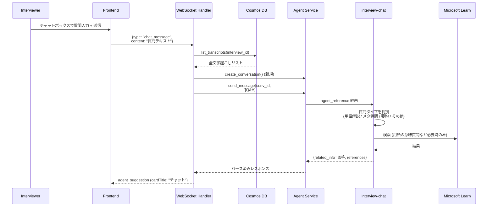
```mermaid
sequenceDiagram
    participant User as Interviewer
    participant FE as Frontend
    participant WS_SRV as WebSocket Handler
    participant DB as Cosmos DB
    participant AGT as Agent Service
    participant C as interview-chat
    participant MCP as Microsoft Learn

    User->>FE: チャットボックスで質問入力 + 送信
    FE->>WS_SRV: {type: "chat_message",<br/>content: "質問テキスト"}
    WS_SRV->>DB: list_transcripts(interview_id)
    DB-->>WS_SRV: 全文字起こしリスト
    WS_SRV->>AGT: create_conversation() (新規)
    WS_SRV->>AGT: send_message(conv_id,<br/>"[Q&A] ## Interviewerの質問 (冒頭)<br/>+ ## インタビュー情報<br/>+ ## 文字起こし履歴 (末尾20,000字)<br/>+ ## Interviewerの質問 (末尾・再掲)",<br/>CHAT_AGENT_NAME)
    AGT->>C: agent_reference 経由
    C->>C: 質問タイプを判別<br/>(用語解説 / メタ質問 / 要約 / その他)
    C->>MCP: 検索 (用語の意味質問など必要時のみ)
    MCP-->>C: 結果
    C-->>AGT: {related_info=回答, references}
    AGT-->>WS_SRV: パース済みレスポンス
    WS_SRV-->>FE: agent_suggestion (cardTitle: "チャット")
```

**担当エージェント**: `interview-chat`（プレフィックス `[Interviewerからのチャット質問]` で動作）
**トリガー**: Interviewer が **チャットボックスで質問を入力し送信**（Enter キーまたは送信ボタン）
**入力コンテキスト**:
- `## Interviewer の質問`（冒頭・最重要）
- `## インタビュー情報`
- `## 文字起こし履歴`: 末尾 **`CHAT_HISTORY_CHARS = 20000` 字**
- `## Interviewer の質問（再掲・最重要）`（末尾、サンドイッチ配置で attention 強化）

**SYSTEM_PROMPT に含まれるルール**:
- **Q&A モード**: ユーザー質問を最優先で読み取り、その問いに直接回答する
- **用語解説モードに走らない**: 履歴中に専門用語があっても、質問が用語解説を求めない限り解説しない
- **質問タイプ別応答指針**:
  - 用語の意味を聞かれた場合: 平易に解説、MCP で根拠取得可
  - メタ質問（「どこを深掘りすべき？」「次に何を聞くべき？」「要約して」「重要なポイントは？」等）: 履歴を分析し、未掘削トピック・矛盾点・暗黙前提・ゴール上手薄な領域を特定して具体的助言を返す
  - 要約・整理依頼: 履歴を構造化して返す
  - その他: 履歴とインタビュー情報から直接回答
- **キーワード検出ルール非適用**（このエージェントの役割ではない）

**出力**: `relatedInfo` に回答そのもの、`references` は回答に直接関係するもののみ（捏造禁止）、`suggestedQuestions=[]` / `keywords=[]` 強制、`cardTitle: "チャット"`/`"Chat"` 付与
**会話管理**: 毎回新規 conversation
**非同期**: `asyncio.create_task()` で非同期実行
**タイムアウト**: 60 秒

---

#### Role 4: レポート生成（`report_service.generate_report`、直接モデル呼び出し）

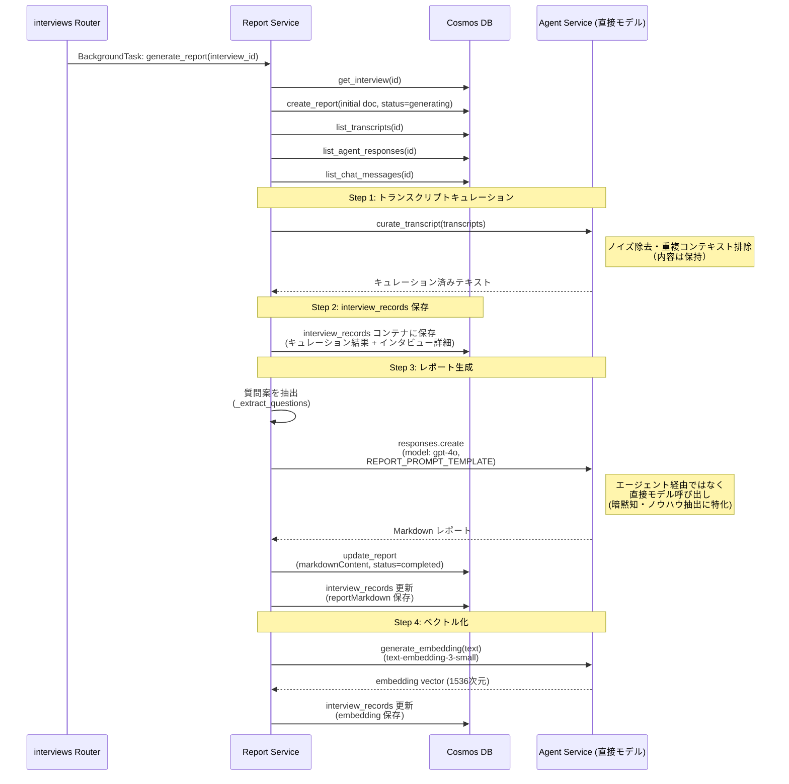
```mermaid
sequenceDiagram
    participant API as interviews Router
    participant RPT as Report Service
    participant DB as Cosmos DB
    participant AGT as Agent Service (直接モデル)

    API->>RPT: BackgroundTask: generate_report(interview_id)
    RPT->>DB: get_interview(id)
    RPT->>DB: create_report(initial doc, status=generating)
    RPT->>DB: list_transcripts(id)
    RPT->>DB: list_agent_responses(id)
    RPT->>DB: list_chat_messages(id)

    Note over RPT,AGT: Step 1: トランスクリプトキュレーション
    RPT->>AGT: curate_transcript(transcripts)
    Note right of AGT: ノイズ除去・重複コンテキスト排除<br/>（内容は保持）
    AGT-->>RPT: キュレーション済みテキスト

    Note over RPT,DB: Step 2: interview_records 保存
    RPT->>DB: interview_records コンテナに保存<br/>(キュレーション結果 + インタビュー詳細)

    Note over RPT,AGT: Step 3: レポート生成
    RPT->>RPT: 質問案を抽出<br/>(_extract_questions)
    RPT->>AGT: responses.create<br/>(model: gpt-4o,<br/>REPORT_PROMPT_TEMPLATE)
    Note right of AGT: エージェント経由ではなく<br/>直接モデル呼び出し<br/>(暗黙知・ノウハウ抽出に特化)
    AGT-->>RPT: Markdown レポート

    RPT->>DB: update_report<br/>(markdownContent, status=completed)
    RPT->>DB: interview_records 更新<br/>(reportMarkdown 保存)

    Note over RPT,AGT: Step 4: ベクトル化
    RPT->>AGT: generate_embedding(text)<br/>(text-embedding-3-small)
    AGT-->>RPT: embedding vector (1536次元)
    RPT->>DB: interview_records 更新<br/>(embedding 保存)
```

**トリガー**: `POST /api/interviews/{id}/stop` 呼び出し時の `BackgroundTasks`
**特徴**:
- エージェント経由ではなく **直接モデル呼び出し**（`openai.responses.create(model="gpt-4o")`）を使用。理由: レポートは Markdown 形式で出力する必要があり、エージェントの JSON 出力制約が不適切なため
- **2段階処理**: (1) ノイズ除去 → (2) レポート生成
- **チャンク処理**: 推定トークン数が 100,000 を超える場合、90,000 トークンごとに分割（10,000 トークンのオーバーラップ付き）
- トークン推定: 日本語テキストは約 3 文字 ≈ 1 トークンとして計算

### 5.3 役割別エージェントのシステムプロンプト

各エージェントには専用の SYSTEM_PROMPT が設定されている。共通の出力スキーマ（`related_info` / `keywords` / `suggested_questions` / `references`）を持つが、役割により使用するフィールドが異なる。

| エージェント | 役割の主眼 | 主な出力フィールド | MCP ツール利用方針 |
|---|---|---|---|
| `interview-related-info` | 直近5チャンクからのキーワード検出、Speech-to-Text 誤認識正規化、既出キーワード除外、references / related_info の整合性 | `related_info` + `keywords` + `references` | 用語の根拠取得のため積極利用 |
| `interview-questions` | 中心トピック特定、deepdive / broaden / challenge の3タイプ別スコープ、ゴール意識、初回モードの挨拶 | `suggested_questions`（質問生成）または `related_info`=挨拶 + `suggested_questions` 1件（初回） | 必要に応じて利用 |
| `interview-chat` | Q&A モード、メタ質問対応、用語解説モードに走らない、ユーザー質問の最優先 | `related_info`=回答 + `references` | 質問が用語解説を求めた場合や根拠が必要な場合のみ |

#### MCP ツール集中管理パターン

3 つのエージェントはすべて同じ MCP ツールセット（Microsoft Learn）を共有する。これは `config.py` の単一定数 `MCP_SERVERS` に集約されている：

```python
# backend/config.py
MCP_SERVERS: list[dict] = [
    {"label": "microsoft_learn", "url": "https://learn.microsoft.com/api/mcp"},
]
```

`agent_service.py` の `_build_mcp_tools()` がこれを読み込んでツールリストを生成し、`ensure_agent()` が `_AGENT_DEFINITIONS` を反復してすべての役割エージェントに **同一のツールセット** を割り当てる。MCP 設定変更は **1 箇所の編集 + `azd deploy` のみ** で全エージェントに反映される。

```python
# 抜粋: agent_service.py
_AGENT_DEFINITIONS: list[tuple[str, str]] = [
    (RELATED_INFO_AGENT_NAME, RELATED_INFO_SYSTEM_PROMPT),
    (QUESTIONS_AGENT_NAME, QUESTIONS_SYSTEM_PROMPT),
    (CHAT_AGENT_NAME, CHAT_SYSTEM_PROMPT),
]

def ensure_agent() -> None:
    project = _get_project()
    tools = _build_mcp_tools()
    for name, prompt in _AGENT_DEFINITIONS:
        project.agents.create_version(
            agent_name=name,
            definition=PromptAgentDefinition(
                model=AGENT_MODEL,
                instructions=prompt,
                tools=tools,
            ),
        )
```

### 5.4 エージェント応答のパース処理

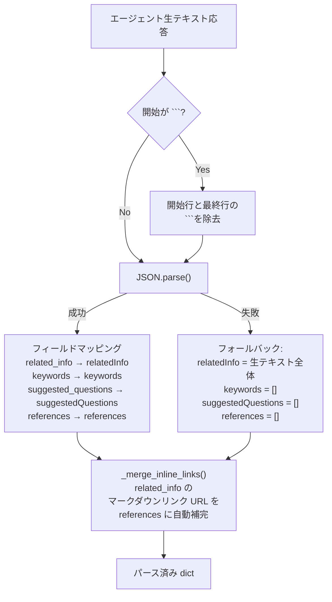
```mermaid
flowchart TD
    RAW["エージェント生テキスト応答"]
    --> FENCE{"開始が ```?"}
    FENCE -->|Yes| STRIP["開始行と最終行の<br/>```を除去"]
    FENCE -->|No| PARSE
    STRIP --> PARSE["JSON.parse()"]
    PARSE -->|成功| MAP["フィールドマッピング<br/>related_info → relatedInfo<br/>keywords → keywords<br/>suggested_questions → suggestedQuestions<br/>references → references"]
    PARSE -->|失敗| FALLBACK["フォールバック:<br/>relatedInfo = 生テキスト全体<br/>keywords = []<br/>suggestedQuestions = []<br/>references = []"]
    MAP --> MERGE["_merge_inline_links()<br/>related_info の<br/>マークダウンリンク URL を<br/>references に自動補完"]
    FALLBACK --> MERGE
    MERGE --> RESULT["パース済み dict"]
```

`_merge_inline_links()` は related_info 内の `[text](url)` を正規表現抽出し、references に存在しない URL を順序保持で追加する（既存の title を優先、URL 重複は除去）。これにより、エージェントが references を埋め忘れても related_info に表示されたリンクは必ず右側パネルにも反映される。

### 5.5 リトライ制御

エージェント呼び出しには **指数バックオフリトライ** が実装されている:

| パラメータ | 値 |
|---|---|
| 最大リトライ回数 | 5 回 |
| 初期待機時間 | 10 秒 |
| バックオフ | 指数関数的（10s → 20s → 40s → 80s → 160s） |
| リトライ対象 | HTTP 429（Rate Limit）のみ |

---

## 6. Azure Speech SDK 接続詳細

### 6.1 接続アーキテクチャ

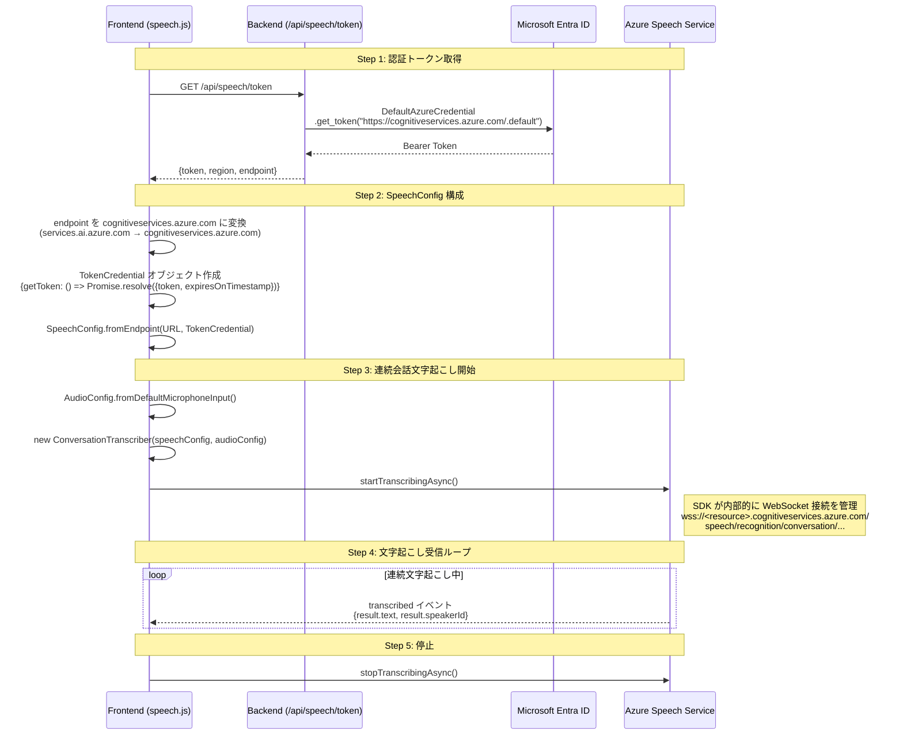
```mermaid
sequenceDiagram
    participant FE as Frontend (speech.js)
    participant BE as Backend (/api/speech/token)
    participant EntraID as Microsoft Entra ID
    participant Speech as Azure Speech Service

    Note over FE,Speech: Step 1: 認証トークン取得
    FE->>BE: GET /api/speech/token
    BE->>EntraID: DefaultAzureCredential<br/>.get_token("https://cognitiveservices.azure.com/.default")
    EntraID-->>BE: Bearer Token
    BE-->>FE: {token, region, endpoint}

    Note over FE,Speech: Step 2: SpeechConfig 構成
    FE->>FE: endpoint を cognitiveservices.azure.com に変換<br/>(services.ai.azure.com → cognitiveservices.azure.com)
    FE->>FE: TokenCredential オブジェクト作成<br/>{getToken: () => Promise.resolve({token, expiresOnTimestamp})}
    FE->>FE: SpeechConfig.fromEndpoint(URL, TokenCredential)

    Note over FE,Speech: Step 3: 連続会話文字起こし開始
    FE->>FE: AudioConfig.fromDefaultMicrophoneInput()
    FE->>FE: new ConversationTranscriber(speechConfig, audioConfig)
    FE->>Speech: startTranscribingAsync()
    Note right of Speech: SDK が内部的に WebSocket 接続を管理<br/>wss://<resource>.cognitiveservices.azure.com/<br/>speech/recognition/conversation/...

    Note over FE,Speech: Step 4: 文字起こし受信ループ
    loop 連続文字起こし中
        Speech-->>FE: transcribed イベント<br/>{result.text, result.speakerId}
    end

    Note over FE,Speech: Step 5: 停止
    FE->>Speech: stopTranscribingAsync()
```

### 6.2 Speech SDK 設定

```javascript
// SpeechConfig
speechConfig.speechRecognitionLanguage = "ja-JP"; // or "en-US"
speechConfig.setProperty(
  sdk.PropertyId.SpeechServiceConnection_EndSilenceTimeoutMs,
  "500"
);
```

| 設定項目 | 値 | 説明 |
|---|---|---|
| `speechRecognitionLanguage` | `"ja-JP"` / `"en-US"` | 認識言語（言語トグルに連動） |
| `EndSilenceTimeoutMs` | `"500"` | 500ms の無音でフレーズ確定 |
| `AudioConfig` | `fromDefaultMicrophoneInput()` | ブラウザのデフォルトマイク入力 |
| 認識モード | 連続会話文字起こし (`ConversationTranscriber.startTranscribingAsync`) | インタビュー全体を通して文字起こしと話者分離を継続 |

### 6.3 エンドポイントドメイン変換

AI Foundry リソース（`kind: AIServices`）は2つのドメインを提供する:

| ドメイン | 用途 |
|---|---|
| `<name>.services.ai.azure.com` | AI Foundry / OpenAI API / Agent Service |
| `<name>.cognitiveservices.azure.com` | Speech / Vision / 他の Cognitive Services API |

Bicep の `AZURE_SPEECH_ENDPOINT` 出力は `services.ai.azure.com` 形式であるため、
`speech.js` でフロントエンド側でドメインを変換する:

```javascript
speechHost = endpoint.replace(".services.ai.azure.com", ".cognitiveservices.azure.com");
```

### 6.4 ノイズ抑制

Speech SDK の Microsoft Audio Stack（MAS）は JavaScript/ブラウザ環境では利用不可（C#/C++/Java のみ対応）。
ブラウザの WebRTC ノイズ抑制（`getUserMedia` のデフォルト `noiseSuppression: true`）に依存する。
Speech SDK の `fromDefaultMicrophoneInput()` がブラウザのデフォルト設定を使用するため、自動的に有効。

### 6.5 話者分離（Speaker Diarization）

`ConversationTranscriber` を使用することで、単一マイクのミックス音声から Azure Speech Service が音声クラスタリングにより話者を自動分離する。

| 項目 | 内容 |
|---|---|
| 有効化方法 | `new ConversationTranscriber(speechConfig, audioConfig)` を使用（SDK 内部で `isSpeakerDiarizationEnabled = true` が自動設定） |
| 事前準備 | 不要（声紋登録なし） |
| 話者ID形式 | `"Guest-1"`, `"Guest-2"`, ...（初期や特定不能時は `"Unknown"`） |
| 属性判別 | Interviewer / Interviewee の区別はしない（エージェントが文脈から推測） |
| 対応マイク | 単一マイク（複数話者の混在音声） |
| UI 表示 | テキスト先頭に `●` を配置し、`speakerId` ごとに異なる色で表示（話者名自体は非表示） |
| データ保存 | Cosmos DB `transcripts` コンテナの `speakerId` フィールドに保存 |
| エージェント入力 | 各文字起こし行を `[Guest-1] text` 形式に整形して渡す（質問生成・補足情報・チャット・レポート生成すべて共通） |
| 既存データ互換 | `speakerId` を持たない既存レコードは空タグとして扱う（後方互換） |

```javascript
// speech.js: 話者IDを含む結果取得
transcriber.transcribed = (_s, e) => {
  if (e.result.reason === sdk.ResultReason.RecognizedSpeech && e.result.text) {
    const speakerId = e.result.speakerId || "Unknown";
    onTranscript({ text: e.result.text, speakerId });
  }
};
```

```javascript
// ui.js: 話者色分け（CSS クラスを動的付与）
// Guest-1 → speaker-1, Guest-2 → speaker-2, ..., Unknown → speaker-unknown
const speakerClass = _speakerClass(speakerId);
const dot = document.createElement("span");
dot.className = `speaker-dot ${speakerClass}`;
dot.textContent = "●";
```

    Note over FE,Speech: Step 1: 認証トークン取得
    FE->>BE: GET /api/speech/token
    BE->>EntraID: DefaultAzureCredential<br/>.get_token("https://cognitiveservices.azure.com/.default")
    EntraID-->>BE: Bearer Token
    BE-->>FE: {token, endpoint, region, expiresOn}

    Note over FE,Speech: Step 2: Speech SDK 連続会話文字起こし開始
    FE->>Speech: ConversationTranscriber<br/>startTranscribingAsync()

    Note over FE,Speech: Step 3: リアルタイム文字起こし
    loop マイク音声キャプチャ中
        Speech-->>FE: transcribed イベント<br/>(event.result.text, event.result.speakerId)
    end

---

## 7. 音声入力 → 文字起こし → エージェント入力の関係

### 7.1 データフローパイプライン

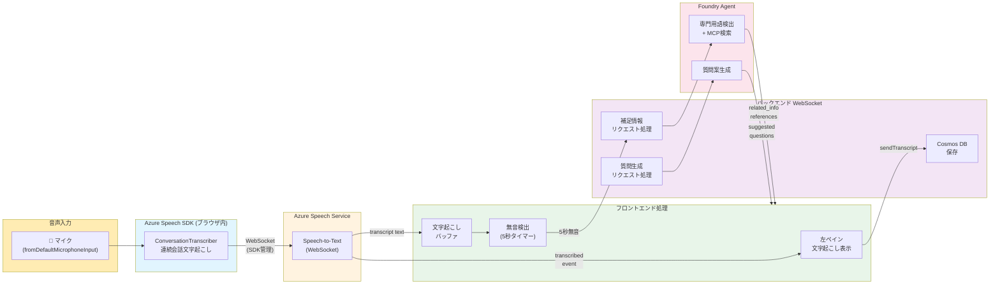
```mermaid
flowchart LR
    subgraph Input["音声入力"]
        MIC["🎤 マイク<br/>(fromDefaultMicrophoneInput)"]
    end

    subgraph SpeechSDK["Azure Speech SDK (ブラウザ内)"]
        RECO["ConversationTranscriber<br/>連続会話文字起こし"]
    end

    subgraph AzureSpeech["Azure Speech Service"]
        STT["Speech-to-Text<br/>(WebSocket)"]
    end

    subgraph Frontend["フロントエンド処理"]
        DISPLAY["左ペイン<br/>文字起こし表示"]
        BUFFER["文字起こし<br/>バッファ"]
        SILENCE["無音検出<br/>(5秒タイマー)"]
    end

    subgraph BackendWS["バックエンド WebSocket"]
        SAVE["Cosmos DB<br/>保存"]
        SUPP["補足情報<br/>リクエスト処理"]
        QGEN["質問生成<br/>リクエスト処理"]
    end

    subgraph Agent["Foundry Agent"]
        ANALYZE["専門用語検出<br/>+ MCP検索"]
        SUGGEST["質問案生成"]
    end

    MIC --> RECO -->|"WebSocket<br/>(SDK管理)"| STT
    STT -->|"transcribed<br/>event"| DISPLAY
    STT -->|"transcript text"| BUFFER
    BUFFER --> SILENCE
    SILENCE -->|"5秒無音"| SUPP
    DISPLAY -->|"sendTranscript"| SAVE

    SUPP --> ANALYZE -->|"related_info<br/>references"| Frontend
    QGEN --> SUGGEST -->|"suggested<br/>questions"| Frontend

    style Input fill:#ffecb3
    style SpeechSDK fill:#e1f5fe
    style AzureSpeech fill:#fff3e0
    style Frontend fill:#e8f5e9
    style BackendWS fill:#f3e5f5
    style Agent fill:#fce4ec
```

### 7.2 文字起こしテキストの二重ルーティング

文字起こしテキストが生成されると、2 つの独立したパスで処理される:

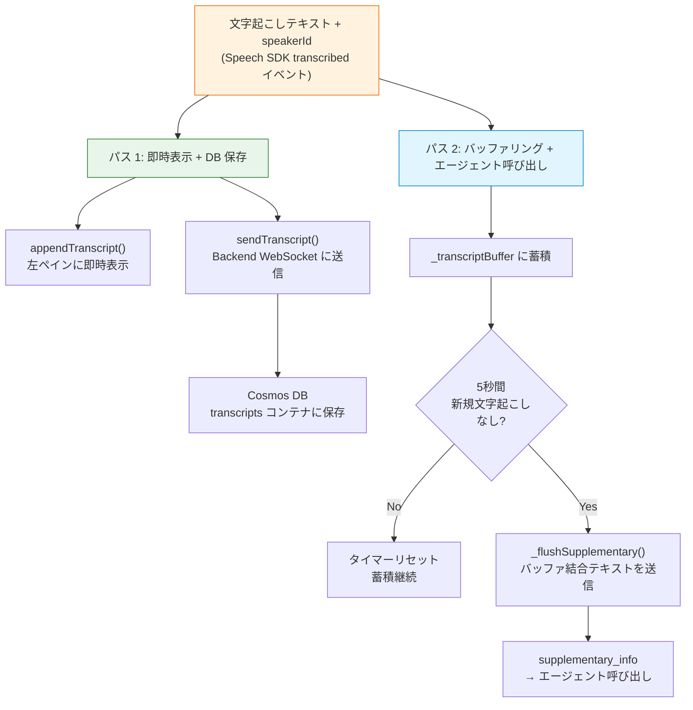
```mermaid
flowchart TD
    TRANSCRIPT["文字起こしテキスト + speakerId<br/>(Speech SDK transcribed イベント)"]

    TRANSCRIPT --> PATH1["パス 1: 即時表示 + DB 保存"]
    TRANSCRIPT --> PATH2["パス 2: バッファリング + エージェント呼び出し"]

    PATH1 --> UI["appendTranscript()<br/>左ペインに即時表示"]
    PATH1 --> WS_SEND["sendTranscript()<br/>Backend WebSocket に送信"]
    WS_SEND --> DB_SAVE["Cosmos DB<br/>transcripts コンテナに保存"]

    PATH2 --> BUF["_transcriptBuffer に蓄積"]
    BUF --> TIMER{"5秒間<br/>新規文字起こし<br/>なし?"}
    TIMER -->|No| BUF_WAIT["タイマーリセット<br/>蓄積継続"]
    TIMER -->|Yes| FLUSH["_flushSupplementary()<br/>バッファ結合テキストを送信"]
    FLUSH --> AGENT["supplementary_info<br/>→ エージェント呼び出し"]

    style TRANSCRIPT fill:#fff3e0,stroke:#ef6c00
    style PATH1 fill:#e8f5e9,stroke:#2e7d32
    style PATH2 fill:#e1f5fe,stroke:#0288d1
```

**重要なポイント**:
1. **文字起こしの DB 保存**（`transcript` メッセージ）と **エージェント呼び出し**（`supplementary_info` メッセージ）は **完全に分離** されている
2. DB 保存は文字起こし受信の都度即時実行される
3. エージェント呼び出しは無音検出後にバッチで実行される
4. 質問生成（`generate_questions`）は手動トリガーで、DB に保存済みの全文字起こしを使用する

---

## 8. データモデル

### 8.1 Cosmos DB コンテナ設計

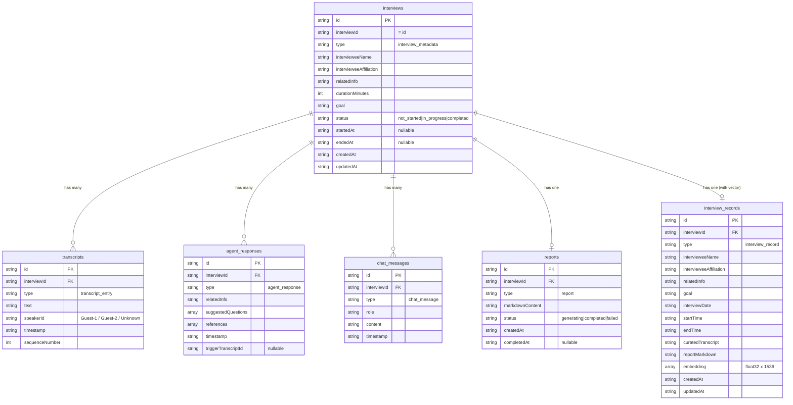
```mermaid
erDiagram
    interviews {
        string id PK
        string interviewId "= id"
        string type "interview_metadata"
        string intervieweeName
        string intervieweeAffiliation
        string relatedInfo
        int durationMinutes
        string goal
        string status "not_started|in_progress|completed"
        string startedAt "nullable"
        string endedAt "nullable"
        string createdAt
        string updatedAt
    }

    transcripts {
        string id PK
        string interviewId FK
        string type "transcript_entry"
        string text
        string speakerId "Guest-1 / Guest-2 / Unknown"
        string timestamp
        int sequenceNumber
    }

    agent_responses {
        string id PK
        string interviewId FK
        string type "agent_response"
        string relatedInfo
        array suggestedQuestions
        array references
        string timestamp
        string triggerTranscriptId "nullable"
    }

    chat_messages {
        string id PK
        string interviewId FK
        string type "chat_message"
        string role
        string content
        string timestamp
    }

    reports {
        string id PK
        string interviewId FK
        string type "report"
        string markdownContent
        string status "generating|completed|failed"
        string createdAt
        string completedAt "nullable"
    }

    interview_records {
        string id PK
        string interviewId FK
        string type "interview_record"
        string intervieweeName
        string intervieweeAffiliation
        string relatedInfo
        string goal
        string interviewDate
        string startTime
        string endTime
        string curatedTranscript
        string reportMarkdown
        array embedding "float32 x 1536"
        string createdAt
        string updatedAt
    }

    interviews ||--o{ transcripts : "has many"
    interviews ||--o{ agent_responses : "has many"
    interviews ||--o{ chat_messages : "has many"
    interviews ||--o| reports : "has one"
    interviews ||--o| interview_records : "has one (with vector)"
```

全コンテナの **パーティションキー** は `/interviewId`。

---

## 9. インフラストラクチャ

### 9.1 Azure リソース構成

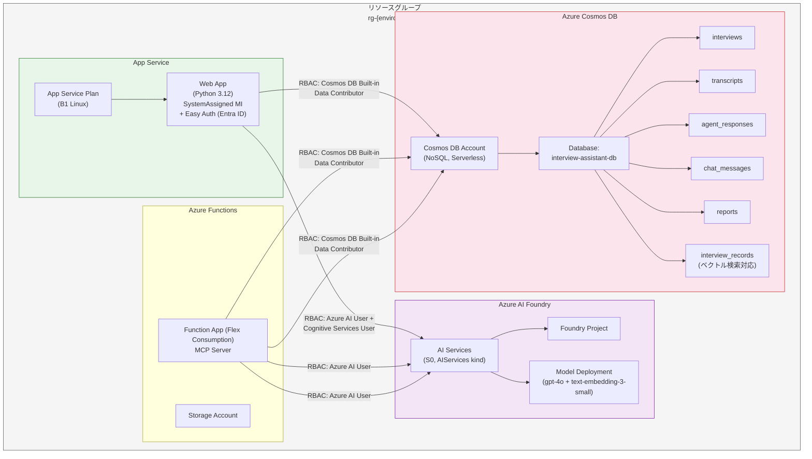
```mermaid
graph TB
    subgraph RG["リソースグループ<br/>rg-{environmentName}"]
        subgraph AppService["App Service"]
            PLAN["App Service Plan<br/>(B1 Linux)"]
            WEB["Web App<br/>(Python 3.12)<br/>SystemAssigned MI<br/>+ Easy Auth (Entra ID)"]
        end

        subgraph AI["Azure AI Foundry"]
            AIF["AI Services<br/>(S0, AIServices kind)"]
            PROJ["Foundry Project"]
            DEPLOY["Model Deployment<br/>(gpt-4o + text-embedding-3-small)"]
        end

        subgraph DB["Azure Cosmos DB"]
            COSMOS["Cosmos DB Account<br/>(NoSQL, Serverless)"]
            COSMOS_DB["Database:<br/>interview-assistant-db"]
            C1["interviews"]
            C2["transcripts"]
            C3["agent_responses"]
            C4["chat_messages"]
            C5["reports"]
            C6["interview_records<br/>(ベクトル検索対応)"]
        end

        subgraph FUNC["Azure Functions"]
            FA["Function App (Flex Consumption)<br/>MCP Server"]
            STOR["Storage Account"]
        end
    end

    WEB -->|"RBAC: Cosmos DB Built-in<br/>Data Contributor"| COSMOS
    WEB -->|"RBAC: Azure AI User +<br/>Cognitive Services User"| AIF
    FA -->|"RBAC: Cosmos DB Built-in<br/>Data Contributor"| COSMOS
    FA -->|"RBAC: Azure AI User"| AIF

    PLAN --> WEB
    AIF --> PROJ
    AIF --> DEPLOY
    COSMOS --> COSMOS_DB
    COSMOS_DB --> C1
    COSMOS_DB --> C2
    COSMOS_DB --> C3
    COSMOS_DB --> C4
    COSMOS_DB --> C5
    COSMOS_DB --> C6

    FA -->|"RBAC: Cosmos DB Built-in<br/>Data Contributor"| COSMOS
    FA -->|"RBAC: Azure AI User"| AIF

    style RG fill:#f5f5f5,stroke:#616161
    style AppService fill:#e8f5e9,stroke:#2e7d32
    style AI fill:#f3e5f5,stroke:#7b1fa2
    style DB fill:#fce4ec,stroke:#c62828
```

### 9.2 認証とセキュリティ

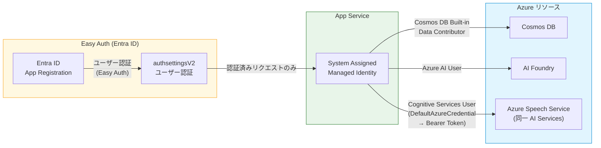
```mermaid
flowchart LR
    subgraph EasyAuth["Easy Auth (Entra ID)"]
        ENTRA["Entra ID<br/>App Registration"]
        AUTH["authsettingsV2<br/>ユーザー認証"]
    end

    subgraph AppService["App Service"]
        MI["System Assigned<br/>Managed Identity"]
    end

    subgraph Resources["Azure リソース"]
        COSMOS["Cosmos DB"]
        FOUNDRY["AI Foundry"]
        SPEECH["Azure Speech Service<br/>(同一 AI Services)"]
    end

    ENTRA -->|"ユーザー認証<br/>(Easy Auth)"| AUTH
    AUTH -->|"認証済みリクエストのみ"| MI
    MI -->|"Cosmos DB Built-in<br/>Data Contributor"| COSMOS
    MI -->|"Azure AI User"| FOUNDRY
    MI -->|"Cognitive Services User<br/>(DefaultAzureCredential<br/>→ Bearer Token)"|SPEECH

    style EasyAuth fill:#fff8e1,stroke:#f9a825
    style AppService fill:#e8f5e9,stroke:#2e7d32
    style Resources fill:#e1f5fe,stroke:#0288d1
```

- ユーザー認証は **App Service Easy Auth (Microsoft Entra ID)** で実施
  - `azd up` の `preprovision` フックで Entra ID App Registration + クライアントシークレットを自動作成
  - `postprovision` フックで App Service URL に基づくリダイレクト URI を自動設定
  - Bicep の `authsettingsV2` リソースで Easy Auth を構成
  - 未認証リクエストはログインページへリダイレクト
- すべての Azure リソースアクセスは **Managed Identity** で認証（組織ポリシー準拠）
- アクセスキー・接続文字列・SAS トークンは使用しない
- App Service の Basic 認証（SCM/FTP）は **無効化**
- Speech Service のトークンはバックエンドで取得し、フロントエンドに短期トークンとして提供

### 9.3 デプロイ

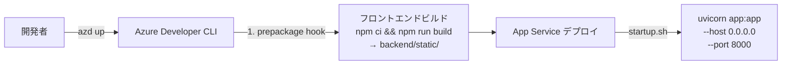
```mermaid
flowchart LR
    DEV["開発者"] -->|"azd up"| AZD["Azure Developer CLI"]
    AZD -->|"1. prepackage hook"| BUILD["フロントエンドビルド<br/>npm ci && npm run build<br/>→ backend/static/"]
    BUILD --> DEPLOY["App Service デプロイ"]
    DEPLOY -->|"startup.sh"| RUN["uvicorn app:app<br/>--host 0.0.0.0<br/>--port 8000"]
```

---

## 10. 並行処理と非同期設計

### 10.1 スレッドプール設計

```mermaid
flowchart TD
    subgraph AsyncLoop["asyncio イベントループ"]
        WS_HANDLER["WebSocket Handler<br/>(async)"]
        REST_HANDLER["REST Handler<br/>(async)"]
    end

    subgraph ThreadPool["ThreadPoolExecutor<br/>(max_workers=20)"]
        T1["Thread 1:<br/>agent_service.send_message()"]
        T2["Thread 2:<br/>cosmos_service.create_transcript()"]
        T3["Thread 3:<br/>agent_service.send_message()"]
        TN["Thread N:<br/>..."]
    end

    WS_HANDLER -->|"asyncio.to_thread()"| T1
    WS_HANDLER -->|"asyncio.to_thread()"| T2
    REST_HANDLER -->|"asyncio.to_thread()"| T3

    style AsyncLoop fill:#e1f5fe,stroke:#0288d1
    style ThreadPool fill:#fff3e0,stroke:#ef6c00
```

- FastAPI の async ハンドラから同期的な SDK 呼び出し（Azure SDK）を `asyncio.to_thread()` でスレッドプールに委譲
- `ThreadPoolExecutor(max_workers=20)` でエージェント呼び出しの並行性を確保
- 各 WebSocket メッセージタイプ（`supplementary_info`, `generate_questions`, `chat_message`）は `asyncio.create_task()` で非同期実行し、WebSocket の受信ループをブロックしない

### 10.2 WebSocket 接続管理

```mermaid
flowchart TD
    subgraph State["グローバル状態 (websocket.py)"]
        CONN["_connections<br/>dict[interview_id, list[WebSocket]]"]
        SEQ["_seq_counters<br/>dict[interview_id, int]"]
        CACHE["_interview_cache<br/>dict[interview_id, dict]"]
        INIT["_initial_done<br/>set[interview_id]"]
    end

    WS1["Client 1 WebSocket"] --> CONN
    WS2["Client 2 WebSocket"] --> CONN

    CONN -->|"ブロードキャスト"| WS1
    CONN -->|"ブロードキャスト"| WS2

    style State fill:#f3e5f5,stroke:#7b1fa2
```

- 同一 `interview_id` に対して複数の WebSocket 接続を管理可能
- エージェントの応答は同一 `interview_id` に接続している **全クライアントにブロードキャスト**
- `_initial_done` セットにより、初回接続時のエージェント初期化は1度のみ実行

---

## 11. エラーハンドリングと耐障害性

| コンポーネント | エラー処理 |
|---|---|
| Agent Service | Rate Limit (429) に対する指数バックオフリトライ（最大5回） |
| WebSocket Handler | 各メッセージタイプのエージェント呼び出しに 60 秒タイムアウト。タイムアウト/例外はログ出力のみ |
| Report Service | 例外時は `status: "failed"` + エラー詳細を Markdown として reports に保存 |
| Frontend WebSocket | 切断時 3 秒後に自動再接続 |
| Speech SDK エラー | エラーイベントをコンソール出力。`stopTranscribingAsync()` でリソース解放 |
| Agent Response Parse | JSON パース失敗時は生テキストを `relatedInfo` にフォールバック |
| App Startup | エージェント初期化失敗時はログ出力のみ。初回リクエスト時にリトライ |

---

## 12. 技術的制約と設計判断

| 制約/判断 | 理由 |
|---|---|
| Azure Speech SDK を文字起こしに使用 | `ConversationTranscriber.startTranscribingAsync` で連続会話文字起こしと話者分離を同時に実行。SDK がマイク入力・WebSocket通信を管理 |
| Speech SDK CDN 版使用 | npm 依存なしでブラウザで動作。AudioWorklet/PCM16変換不要 |
| **役割別 3 エージェント分離** | 単一エージェントだと役割固有のルール（キーワード検出 dedup・STT 正規化・references 整合性等）が他役割に副作用を起こす。役割を分離することで各 SYSTEM_PROMPT を純化し、相互干渉を防止 |
| **MCP 集中管理（`MCP_SERVERS` 定数）** | MCP 設定変更時に各エージェントを個別修正不要。1 箇所の編集で全エージェントに反映 |
| 毎回新規 conversation を作成 | 役割間および同一役割内のセッション間でのコンテキスト汚染防止。各リクエストは独立した文脈で処理（ステートレス）|
| レポート生成・curate・denoise・Embedding は直接モデル呼び出し | エージェントの JSON 出力制約が Markdown レポート / クリーンテキスト / 埋め込み入力に不適合 |
| フロントエンドの無音検出（5秒） | 発話中のエージェント呼び出しを抑制し、まとまった内容で関連情報を生成 |
| 関連情報生成: **直近 5 チャンク** + 既出キーワードリスト | 1 チャンクのみだとコンテキスト不足で新規キーワードを検出できない。既出リストで重複表示を抑止 |
| 関連情報生成: 新規キーワードがゼロなら UI 抑制 | 「関連情報なし」表示はユーザーに不要。バックエンドが送信せずフロントの空 card スキップと二重防御 |
| 関連情報: STT 誤認識正規化 | 文字起こしには「フォラグ」（→「RAG」）等の誤認識が混入。エージェントが文脈から正規化することで正しい用語名で表示 |
| 関連情報: references / related_info 整合性 + バックエンドセーフティネット | エージェントが references を埋め忘れる場合があるため、バックエンド側で related_info 内のマークダウンリンクを自動補完 |
| 質問生成: 全履歴 30,000 字 + 直近 2,000 字（中心トピック特定用） | 5,000 字では 8〜10 分相当しか参照できずゴール意識が弱い。30,000 字で 50〜60 分相当をカバー。中心トピック特定は直近 2,000 字を使い、短すぎる場合は履歴遡及可 |
| 質問生成: タイプ別スコープ（deepdive=直近 / broaden=全履歴+ゴール / challenge=全履歴+矛盾） | 3 タイプを単一スコープで生成すると別話題に分散しがち。タイプ別に参照範囲を変えつつ全タイプが中心トピックと関連性を持つよう制約 |
| チャット: 末尾 20,000 字 + 質問サンドイッチ配置 | 5,000 字では履歴の長期文脈が反映されない。質問を冒頭・末尾に配置することで attention を強化 |
| チャット: 用語解説モードに走らない明示 | 専用 SYSTEM_PROMPT で抑止。メタ質問（「どこを深掘りすべき？」等）には履歴分析と具体的助言を返す |
| トークン推定: 3文字≈1トークン | 日本語テキストの粗い推定。チャンク分割の判定に使用 |
| Cosmos DB コンテナ分割方式 | クエリパターンの明確さと開発効率を優先 |
